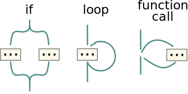
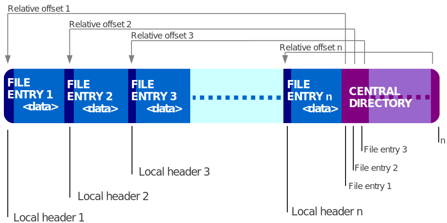

# Khung sườn

Khung sườn khóa luận kết thúc 6 năm luyện ngục của nvmnghia.

Độ dài yêu cầu: 40-50 trang.

---

## 0. Bìa & các mục liên quan

- Bìa
- Phụ bìa
- Cam đoan không sao chép
- Phê chuẩn của giảng viên hướng dẫn
- Lời cảm ơn
- Tóm tắt

    Nhờ Internet, truyền hình và điện ảnh, văn hóa truyện tranh đã trở nên phổ
    biến toàn cầu, đặc biệt là trong giới trẻ. Sự phát triển của truyện tranh
    trên trong thời đại số thúc đẩy sự phát triển của các trang web truyện
    tranh, thỏa mãn nhu cầu đọc sớm nhất có thể sau khi truyện được xuất bản.
    Tuy nhiên, nguồn truyện tranh của những trang web này có chất lượng không
    cao. Một bộ phận người đọc kĩ tính chọn đọc và lưu trữ những file truyện
    được số hóa chất lượng cao, thường ở dạng file nén đuôi `cbr` và `cbz`. Xuất
    phát từ yêu cầu này, tôi muốn viết ứng dụng yacv có thể đọc các file truyện
    nén trên điện thoại Android. Nội dung của khóa luận sẽ trình bày những đặc
    điểm cơ bản của kiến trúc ứng dụng Android - với cốt lõi là mẫu thiết kế
    MVVM - được khuyên dùng bởi Google, các tính năng trong yacv, và các ca sử
    dụng của phần mềm.

    Từ khóa: MVVM, Jetpack, Android, cbr, cbz, comic

- Mục lục
- Danh sách bảng
- Danh sách hình
- Danh sách kí hiệu, chữ viết tắt

    - MVC
    - MVP
    - MVVM
    - AOT
    - JIT
    - API
    - JS
    - ES6
    - RDBMS
    - ACID
    - ORM
    - SC

---

## 1. Chương 1: Giới thiệu <a name="P1-intro"></a>

### 1.1. Đặt vấn đề <a name="P1.1-background"></a>

<!-- Hint: Tại sao lại làm đồ án ntn (1-3 đoạn)? -->

Tại Đông Á và Đông Nam Á, văn hóa truyện tranh gốc Á, nhất là truyện tranh Nhật
(manga), được đón nhận khá tích cực, đặc biệt trong giới trẻ. Thế hệ những người
dưới 40 tuổi hiện nay được tiếp xúc với truyện tranh từ sớm, thông qua những
cuốn truyện truyền tay và phim hoạt hình dựa trên truyện tranh, và tiếp tục đọc
dù đã qua tuổi thiếu niên. Một số tác phẩm manga còn có lượng người đọc lớn trên
toàn cầu như Doraemon, One Piece. Ở bên kia bán cầu, với sự thành công của vũ
trụ điện ảnh Marvel và DC, truyện tranh phương Tây (comic) cũng được hồi sinh
phần nào sau một thập kỷ thiếu sáng tạo và suy giảm doanh số sách in. Các bộ
truyện siêu anh hùng, vốn trước đây chỉ phổ biến ở Hoa Kỳ, nay đang trên đường
trở thành một phần của văn hóa đại chúng như vị thế của manga. Có thể nói, văn
hóa truyện tranh nói chung đang ở thời kì phát triển mạnh, xét theo tiêu chí về
độ phổ biến và thái độ đón nhận của xã hội.

Hiện nay, hầu hết mọi người đọc truyện qua các trang web tổng hợp truyện tranh.
Những trang web này có hai ưu điểm chính:

- Số lượng: Mỗi trang cung cấp ít nhất hàng nghìn đầu truyện.
- Tốc độ: Tốc độ ra truyện rất nhanh. Với các bộ truyện nổi tiếng, thường chỉ
  trong vòng một vài giờ sau khi ra mắt, chương mới đã xuất hiện.

Tuy vậy, nhược điểm chính của những trang web này là chất lượng ảnh của truyện.
Để giảm thời gian tải và tránh tốn băng thông, hình ảnh của truyện thường được
nén khá nhiều, gây vỡ hình, mờ nhòe. Một bộ phận người đọc, hoặc kĩ tính, hoặc
muốn sưu tầm truyện, thường chọn đọc những tệp truyện chất lượng cao, thường có
đuôi `.cbz` hoặc `.cbr`. Bản chất tệp truyện này là các tệp nén zip bình thường,
bên trong có các tệp ảnh thông dụng như `.jpg`, `.png`. Tuy nhiên, do được tải
hẳn về máy rồi mới đọc, những tệp truyện này không bị giới hạn về băng thông hay
thời gian, do đó hình ảnh trong tệp có thể có chất lượng rất cao.

Trong khóa luận này, tôi viết một ứng dụng Android nhằm phục vụ số ít người dùng
có nhu cầu đọc truyện tranh chất lượng cao đã giới thiệu ở trên. Tên của ứng
dụng là "yacv", viết tắt của cụm từ tiếng Anh "Yet Another Comic Viewer", tạm
dịch là "Lại một ứng dụng xem truyện tranh nữa". Hai tính năng chính duy nhất
của ứng dụng là đọc và quản lí cơ bản (tìm kiếm, xóa) tệp truyện tranh có sẵn
trên điện thoại.

<!-- Một chi tiết nhỏ về tên nữa là ở chữ "comic", vì cộng đồng đọc "comic" (đặc biệt
là truyện siêu anh hùng của DC và Marvel) theo quan sát của tôi có nhu cầu cao
về metadata hơn cộng đồng đọc "manga", do sự rối rắm trong quá trình sáng tác
(sẽ được đề cập sau). -->

Cần chú ý rằng ứng dụng yacv chỉ bao gồm các tính năng liên quan đến đọc truyện
ngoại tuyến, đọc các tệp truyện có sẵn trên điện thoại người dùng. Ứng dụng
không phải là ứng dụng khách cho các trang đọc truyện hiện có, hay có máy chủ
tập trung riêng để cung cấp truyện.

### 1.2. Ứng dụng tương tự <a name="P1.2-similar-app"></a>

Hiện có nhiều ứng dụng đọc truyện tranh ngoại tuyến như yacv trên chợ ứng dụng
Google Play. Hai ứng dụng phổ biến nhất trong số này là [ComicScreen][1] và
[Astonishing Comic Reader][2]. ComicScreen là ứng dụng có nhiều người dùng hơn.
Các tính năng của ComicScreen giống với các tính năng của yacv, tuy nhiên
ComicScreen có thêm nhiều chức năng phụ, đáng kể nhất là khả năng đọc từ mạng
FTP/SMB và khả năng sửa ảnh trong file. Astonishing Comic Reader cũng có chức
năng tương tự yacv, không hơn, tuy nhiên giao diện khá trau chuốt. Cả hai đều
miễn phí và có quảng cáo, được cập nhật có thể nói là thường xuyên.

Một ngoại lệ đáng kể ở đây là ứng dụng mã nguồn mở [Tachiyomi][3]. Ứng dụng này
có hệ thống phần mở rộng, cho phép đọc truyện ở các trang web truyện tranh. Khi
web truyện tranh thay đổi, hoặc hỗ trợ thêm trang mới, chỉ cần tải về phần mở
rộng tương ứng ở dạng ứng dụng `.APK`. Tính năng này cùng mô hình mã nguồn mở
khiến Tachiyomi mạnh hơn, cập nhật nhanh hơn toàn bộ các ứng dụng đã có và sẽ
có. Tuy nhiên, Tachiyomi lại không thể được đưa lên Play Store, vì chính tính
năng phần mở rộng đã [vi phạm chính sách][4] của Play Store.

Một điểm khác biệt quan trọng của yacv với các ứng dụng có sẵn là việc hỗ trợ
metadata của tệp truyện tranh, do các ứng dụng có sẵn trên Play Store đa số bỏ
qua thông tin này trong tệp truyện. Một trong số rất ít những ứng dụng hỗ trợ
tính năng này là [Kuro Reader][5], tuy nhiên đây là một tính năng trả phí.

### 1.3. Kết quả đạt được <a name="P1.3-resulted-app"></a>

Ứng dụng có các tính năng đủ dùng theo mục đích đã đề ra:

- Đọc file truyện `.cbz`
- Tìm kiếm truyện theo metadata

Tính năng đọc tệp truyện `.cbr` hiện mới chỉ được cài đặt một phần, do khó khăn
trong việc tích hợp thư viện đọc định dạng này.

### 1.4. Cấu trúc khóa luận <a name="P1.4-outline"></a>

Các phần còn lại của khóa luận có cấu trúc như sau:

- [Chương 2  - Kiến thức nền tảng](#P2-fundamental): Giới thiệu sơ lược về ba
  nền tảng của ứng dụng, gồm hệ điều hành Android, ngôn ngữ lập trình Kotlin, và
  mẫu thiết kế MVVM; định dạng tệp nén `.zip` cũng được giới thiệu vì liên quan
  trực tiếp đến ứng dụng.
- [Chương 3 - Phân tích yêu cầu](#P3-specification): Phân tích nhu cầu và ca sử
  dụng để có đặc tả yêu cầu.
- [Chương 4 - Thiết kế](#P4-design): Thiết kế ứng dụng, gồm thiết kế cơ sở dữ
  liệu, giao diện, logic nghiệp vụ.
- [Chương 5 - Lập trình & Kiểm thử](#P5-implementation): Một số cài đặt và ca
  kiểm thử trong ứng dụng sẽ được nêu một cách có chọn lọc.
- [Chương 6 - Kết luận](#P6-comclusion): Kết thúc khóa luận.

---

## 2. Chương 2: Kiến thức nền tảng <a name="P2-fundamental"></a>

Chương này giới thiệu sơ qua về các nền tảng trong quá trình xây dựng ứng dụng.

- Hai nền tảng đầu tiên liên quan đến nhau, là tiền đề cho toàn bộ ứng dụng sẽ
  được giới thiệu trước, gồm hệ điều hành Android và ngôn ngữ lập trình Kotlin.
- Tiếp theo, lựa chọn về kiến trúc tổng quan, liên quan đến giao diện của ứng
  dụng được trình bày.
- Sau đó, cơ sở dữ liệu một số phần mở rộng của nó dùng trong ứng dụng sẽ được
  nhắc qua.
- Cuối cùng là thông tin về `.cbz` - định dạng tệp tin mà ứng dụng đọc, gồm hai
  phần: sơ lược về định dạng `.zip` mà `.cbz` dựa trên, và các trường metadata
  trong tệp tin `.cbz` - nguồn thông tin quan trọng để quản lí truyện.

<!-- Phần này sẽ được viết thẳng vào LaTeX, vì đa số là copypasta. -->

### 2.1. Hệ điều hành Android <a name="P2.1-android"></a>

Android là một hệ điều hành do Google phát triển cho thiết bị di động. Android
dùng nhân Linux và được thiết kế cho màn hình cảm ứng. Cùng với iOS của Apple,
Android trở thành một phần không thể thiếu của cuộc cách mạng di động bắt đầu
vào cuối những năm 2000.

Google mua lại phiên bản Android đầu của công ty khởi nghiệp cùng tên vào năm
2005, và phát triển hệ điều hành này từ đó. Ngoài Google, Android còn nhận đóng
góp lớn từ cộng đồng, do là một dự án mã nguồn mở (phần lớn mã nguồn dùng giấy
phép Apache); tên chính thức của dự án là Android Open Source Project. Dù vậy,
mọi thiết bị Android thương mại đều có ứng dụng độc quyền. Ví dụ đáng kể là bộ
Google Mobile Service, chứa những ứng dụng không thể thiếu như trình duyệt
Chrome hay chợ Play Store. Về mặt này, Android khá giống Chrome: thành phần cốt
lõi kĩ thuật được phát triển theo mô hình mã nguồn mở (AOSP và Chromium), còn
thành phần liên quan đến trải nghiệm người dùng được phát triển riêng.


Hình 1. Các phân lớp của hệ điều hành Android

Hệ điều hành Android được phân lớp như sau:

- Nhân Linux (Linux Kernel):

    Đây là tầng thấp nhất. Android dùng nhánh hỗ trợ dài hạn (LTS) của Linux.
    Không như kiểu phát triển distro trên máy tính (chủ yếu thay đổi ở ngoài
    nhân), Google sửa và thêm bớt nhiều thành phần vào nhân trước khi tích hợp.

- Lớp phần cứng trừu tượng (Hardware Abstraction Layer):

    Tầng này trừu tượng hóa các chi tiết phần cứng bằng cách đưa ra các giao
    diện chung cho một kiểu phần cứng nào đó, giúp các tầng trên không cần quan
    tâm đến chi tiết riêng của phần cứng.

- Android Runtime (ART):

    Ứng dụng Java cần thêm một ứng dụng để chuyển bytecode thành mã máy. Trên
    desktop, đó là các máy ảo Java (JVM). Trên Android, Android Runtime nhận
    nhiệm vụ này. Hai máy ảo này khác nhau ở chỗ ART *biên dịch* bytecode thành
    mã máy (trước khi chạy - AOT), còn JVM *thông dịch* bytecode thành mã máy
    (trong khi chạy).

    ART hiện hỗ trợ đa số tính năng của Java 8.

- Thư viện C/C++:

    Tầng thư viện native nằm ngang hàng với ART, phục vụ các tiến trình hệ thống
    và một số ứng dụng dùng NDK (tức gọi API C cấp thấp) như trò chơi điện tử.

- Khung phát triển ứng dụng (Java API Framework):

    Mọi ứng dụng Java được viết nhờ sử dụng các thành phần của tầng này thông
    qua API Java. Tầng này cung cấp toàn bộ tính năng của Android cho lập trình
    viên, bao gồm các yếu tố cơ bản như giao diện (View System), truy xuất,...

    Lập trình viên có quyền truy cập vào lớp này tương đương với ứng dụng hệ
    thống. Đây có thể coi là một cam kết tránh độc quyền công nghệ, tức đa số
    ứng dụng hệ thống không có khả năng đặc biệt, hay hiệu năng cao hơn ứng dụng
    bên thứ ba tương tự.

- Ứng dụng hệ thống (System Apps)

    Android đi kèm với một số ứng dụng hệ thống như ứng dụng SMS, trình duyệt,
    lịch,... Google cho phép thay thế đa số các ứng dụng này với ứng dụng bên
    thứ ba, tuy nhiên có những ngoại lệ như ứng dụng Cài đặt (Settings).

Gần như mọi ứng dụng Android cơ bản đều sử dụng thành phần View System trong
tầng Khung phát triển để viết giao diện, và yacv không là ngoại lệ. yacv còn sử
dụng thành phần Content Provider, cụ thể là bộ Storage Access Framework, và sẽ
được đề cập ở các phần sau.

#### 2.1.1. Android Jetpack <a name="P2.1.1-jetpack"></a>

Jetpack là bộ thư viện giúp viết ứng dụng Android nhanh gọn, ít lỗi hơn so với
việc tự viết những đoạn mã tương tự. Jetpack gồm hai thành phần:

- AndroidX: đưa API của phiên bản hệ điều hành mới lên máy cũ
- Architecture Component: đưa ra API hoàn toàn mới để giải quyết một vấn đề

Mô hình phát triển của Android (cho phép nhà sản xuất tùy biến) khiến thế giới
Android bị phân mảnh, hệ quả là việc cập nhật hệ điều hành khó khăn. Do đó,
Google viết Thư viện Hỗ trợ (Support Library) để đưa API hệ điều hành mới lên
máy cũ. AndroidX chính là Support Library đổi tên và được cập nhật đến nay.

Chú ý rằng Jetpack chỉ có ích cho lập trình viên (được dùng API mới tiện hơn,
thực ra là wrapper của API sẵn có), chứ không cập nhật tính năng hệ điều hành.

yacv sử dụng nhiều thành phần của Jetpack, trong đó đáng kể đến ba thư viện sau:

- LiveData: giúp giao diện luôn được cập nhật theo dữ liệu mới nhất
- ViewModel: giúp tách dữ liệu và giao diện
- Room: giúp việc lưu dữ liệu trong SQLite thuận tiện hơn

Room là một phần quan trọng của yacv, do đó sẽ được giới thiệu chi tiết hơn ở
[mục sau](#P2.4.2-room).

### 2.2. Ngôn ngữ lập trình Kotlin <a name="P2.2-kotlin"></a>

Java là ngôn ngữ lập trình đầu tiên được hỗ trợ trên Android, nhưng không phải
duy nhất. Từ 2019, Google khuyên lập trình viên viết ứng dụng trên Kotlin, một
ngôn ngữ mới do JetBrains phát triển. Giới thiệu lần đầu vào năm 2011, Kotlin
được định hướng trở thành lựa chọn thay thế cho Java. Điều đó thể hiện ở việc
Kotlin tương thích hoàn toàn với Java (từ Java gọi được Kotlin và ngược lại), do
cùng được biên dịch thành JVM bytecode.

Điểm mạnh của Kotlin so với Java là tính ngắn gọn. Do được phát triển mới,
Kotlin không cần tương thích với phiên bản cũ, cho phép dùng các cú pháp hiện
đại, gọn ghẽ. Ngoài ra, vì được một công ty tư nhân phát triển, Kotlin không cần
chờ đến các cuộc họp phức tạp để đạt đồng thuận về tính năng mới, giúp ngôn ngữ
liên tục được cải tiến. Đồng thời, công ty cũng mở mã nguồn của Kotlin và chương
trình dịch, giúp đẩy nhanh quá trình phát triển và tạo thiện cảm cộng đồng cho
một ngôn ngữ non trẻ.

Sau đây là tóm tắt một số đặc điểm kĩ thuật của Kotlin:

- Về mô hình, Kotlin hỗ trợ hướng đối tượng như Java, nhưng còn có hướng hàm,
  thể hiện ở tính năng hàm ẩn danh (lambda), và hàm được coi là first-class.
- Về hệ thống kiểu, Kotlin giống hệt Java:
    - Là kiểu tĩnh (statically typed), tức kiểu được kiểm tra khi biên dịch
      (thay vì khi chạy, như Python, JavaScript,...)
    - Là kiểu mạnh (strongly typed), tức không cho phép chuyển kiểu ngầm
- Về cú pháp, Kotlin có cú pháp gọn, hiện đại, ví dụ như bỏ dấu `;` cuối dòng,
  template literal,...
- Về lỗi, Kotlin luôn được quảng cáo về khả năng chống `NullPointerException`.
  Kotlin "né" lỗi này do buộc người viết đánh dấu cụ thể rằng một đối tượng có
  thể bị `null` hay không bằng hậu tố `?` ở khai báo kiểu. Từ đó, Kotlin biết
  chính xác đối tượng có thể là `null` hay không, và buộc xử lí nếu có.

Do Google khuyên dùng Kotlin khi viết ứng dụng Android, tôi cho rằng khóa luận
này là một cơ hội phù hợp để thử Kotlin thay vì dùng Java quen thuộc, và quyết
định chọn viết yacv bằng Kotlin.

#### 2.2.1. Coroutine <a name="P2.2.1-coroutine"></a>

##### 2.2.1.1. Giới thiệu chung

Một thư viện quan trọng của kotlin là *coroutine*. Coroutine giúp viết ứng dụng
có tính tương tranh (concurrency) và bất đồng bộ (asynchronous) một cách đơn
giản hơn.

Về cơ bản, coroutine giống với luồng (thread), nhưng nhẹ hơn. Coroutine luôn
dùng mô hình *đa nhiệm hợp tác* (cooperative multitasking), khác với luồng hay
dùng đa nhiệm ưu tiên (preemptive multitasking). Mấu chốt khác biệt của chúng là
đa nhiệm hợp tác có các "điểm dừng" do người viết tạo; khi chạy đến đó,
coroutine có thể dừng lại, chủ động nhả CPU cho việc khác, rồi tiếp tục việc
đang dở vào lúc thích hợp. Ngược lại, đa nhiệm ưu tiên có thể buộc một luồng
đang chạy ngừng lại bất kì lúc nào để ưu tiên chạy một luồng khác. Đây cũng là
điểm khiến coroutine nhẹ hơn: chi phí chuyển ngữ cảnh (context switching) được
kiểm soát và cắt giảm, do chuyển sang thực thi một coroutine khác chưa chắc đã
chuyển sang một luồng hệ điều hành khác.

Với những điều trên, coroutine chưa làm được nhiều. Roman Elizarov, trưởng dự án
Kotlin, hướng coroutine trong Kotlin theo một ý tưởng mới: *tương tranh có cấu
trúc* (structured concurrency, từ đây gọi tắt là SC). Ý tưởng này tiếp tục đơn
giản hóa việc viết những đoạn mã tương tranh bằng cách áp đặt một số giới hạn,
cấu trúc cơ bản. Kết quả là coroutine trong Kotlin hỗ trợ việc xử lí lỗi và
ngừng tác vụ bất đồng bộ tốt hơn việc dùng luồng, hay các thư viện tương tranh
như RxJava.

Coroutine được dùng để tăng tốc những đoạn mã chạy chậm trong yacv (sẽ được mô
tả sau). Ngoài cải thiện về hiệu năng, coroutine và tương tranh có cấu trúc còn
cho phép viết mã ngắn gọn, rõ ràng hơn. Do có tác động lớn, coroutine sẽ được
giới thiệu kĩ hơn ở phần này.

##### 2.2.1.2. Bài học từ quá khứ: lập trình có cấu trúc

<!-- Cite [10] -->
Để hiểu về SC, ta có thể so sánh nó với *lập trình có cấu trúc* (structured
programming). Để hiểu sơ về lập trình có cấu trúc, ta phải tìm về *lập trình phi
cấu trúc* (non-structured programming), với đặc điểm là lệnh nhảy `GOTO`. Trong
buổi đầu của máy tính, lệnh này được dùng nhiều vì hợp với cách máy tính chạy.


Hình 2: Lập trình phi cấu trúc với `GOTO`


Hình 3: Sự lộn xộn của lập trình phi cấu trúc

Vấn đề của lập trình phi cấu trúc, hay của `GOTO`, có thể tóm gọn như sau:

- Khó nắm bắt luồng chương trình

    Khi đã chạy `GOTO`, các lệnh phía sau nó không biết khi nào mới chạy, vì
    chương trình chuyển sang lệnh khác mà không trở lại. Luồng chạy trở thành
    một đống "mì trộn" như Hình 3, thay vì tuần tự từ trên xuống. Tệ hơn, tính
    trừu tượng bị phá vỡ: khi gọi hàm, thay vì có thể bỏ qua chi tiết bên trong,
    ta phải biết rõ để xem có lệnh nhảy bất ngờ nào không.

- Không cài đặt được các chức năng mới (ngoại lệ, quản lí tài nguyên tự động,...)

    Xét ví dụ Java sau về quản lí tài nguyên tự động:

    ```java
    try (Scanner scanner = new Scanner(new File("test.txt"))) {
        jumpSomewhere();    // Giả sử Java có GOTO, và hàm này dùng nó
    }
    ```

    Do không trả lại luồng điều khiển, việc đóng luồng nhập từ tệp cũng không
    chắc chắn xảy ra, dẫn đến rò rỉ tài nguyên, làm khối lệnh vô dụng.

    Điều gần tương tự cũng khiến việc xử lí ngoại lệ và nhiều tính năng khác trở
    nên rất khó đạt được, một khi ngôn ngữ cho phép `GOTO`.

Lập trình có cấu trúc đơn giản hóa luồng chạy bằng cách giới hạn các lệnh nhảy
còn `if`, `for` và gọi hàm. Khác biệt mấu chốt của ba lệnh này so với `GOTO` là
chúng *trả luồng điều khiển* về điểm gọi, thể hiện rõ ở Hình 4. Theo định nghĩa,
ba lệnh trên giải quyết được hậu quả đầu tiên. Đồng thời, các hậu quả số hai
cũng được giải quyết, do ngôn ngữ đã có cấu trúc (cụ thể là có call stack).



Hình 4: Ba cấu trúc cơ bản của lập trình có cấu trúc: rẽ nhánh `if`, lặp `for` và gọi hàm

Ngày nay, ba cấu trúc trên đã trở thành phần không thể thiếu trong mọi ngôn ngữ
lập trình, và `GOTO` chỉ còn dùng trong hợp ngữ. Quá khứ cho thấy nếu áp dụng
một số cấu trúc, giới hạn, ta có thể giải quyết vấn đề một cách tinh tế và gọn
gàng. Trong trường hợp này, SC có thể loại bỏ một số điểm yếu của các API tương
tranh/bất đồng bộ truyền thống, giống cách lập trình có cấu trúc đã làm.

##### 2.2.1.3. Áp dụng vào hiện tại: tương tranh có cấu trúc

Trước hết, ta xem xét hai kiểu API tương tranh hay dùng hiện nay:

| Tên | Giải thích | Ví dụ |
|:----|:-----------|:------|
| Tương tranh | Chạy một hàm theo cách tương tranh với luồng chạy hiện tại | `Thread(target=fn).start() # Python` |
| Bất đồng bộ | Chạy một hàm khi có sự kiện xảy ra (callback) | `element.onclick = cb; // JS` |

Bảng 2: Hai kiểu API tương tranh thường thấy.

Qua Hình 5, không khó để thấy rằng mọi vấn đề của lập trình phi cấu trúc đều lặp
lại với hai API trên:


Hình 5: Tương tranh phi cấu trúc với `goroutine` - API thuộc kiểu tương tranh.

- Ta xem lại ví dụ về quản lí tài nguyên tự động. Nếu có một luồng thực thi khác
  tương tranh với luồng chính, thì khi luồng chính đóng `Scanner`, có thể luồng
  kia vẫn đang đọc nó. Vấn đề giờ là đọc sau khi đóng. Do đó, tính năng này
  không thể hoạt động.
- Với tính năng bắt ngoại lệ, nếu có ngoại lệ ở luồng tương tranh, ta cũng không
  có cách nào để biết, và buộc phải kệ nó.

Trên thực tế, có cách để thực hiện một số chức năng trên với API hiện tại, tuy
vậy đó đều là cách xử lí riêng, do đó chưa thực sự thuận tiện khi dùng. Ví dụ,
ES6 có `catch()` để bắt ngoại lệ trong `Promise` mà không (thể) dùng cấu trúc
`try-catch` sẵn có. Với SC, các vấn đề này đều được giải quyết.

Ta xét một đoạn mã tương tranh dùng coroutine trong Kotlin, tức dùng SC (không
phải coroutine trong mọi ngôn ngữ đều dùng mô hình này):


Hình 6: Tương tranh có cấu trúc dùng coroutine trong Kotlin

Đoạn mã trong Hình 6 làm những việc sau:

- Hàm `launch()` tạo ra các coroutine:

    - `launch()` đầu tiên tạo ra coroutine *cha*
    - `launch()` thứ hai tạo ra coroutine *con*, chạy hàm `A()`
    - Tương tự, có một coroutine con chạy hàm `B()`

- 3 coroutine chạy "song song", chính xác hơn là tương tranh

Nguyên tắc của SC là: *coroutine cha chờ mọi coroutine con chạy xong*, kể cả khi
nó xong trước. Nguyên tắc này đảm bảo rằng khi một hàm kết thúc, không còn tác
vụ tương tranh nữa, và luồng điều khiển hợp nhất được trả về điểm gọi. Đột
nhiên, hai tính năng có vấn đề ở trên lại hoạt động:

- Quản lí tài nguyên tự động: do đảm bảo trả lại luồng điều khiển, tài nguyên
  đảm bảo được đóng; do không còn tác vụ con, tài nguyên không bị đọc sau đóng.
- Bắt ngoại lệ: do cấu trúc cha-con (khác với các API hiện tại cho rằng hai tác
  vụ tương tranh là ngang hàng), coroutine con có thể ném ngoại lệ để coroutine
  cha bắt.

Chú ý là các API hiện tại không phải không làm được nguyên tắc trên, vấn đề là
thực hiện một cách *tự động* và *đảm bảo*. Ví dụ, trong JS, để tuân theo nguyên
tắc này, ta cần `await` với mọi hàm `async`; nếu không, luồng chạy của hàm đó sẽ
tách biệt với luồng chương trình, như Hình 5 mô tả. Do không có ràng buộc chặt
chẽ kia, các tính năng ngôn ngữ mới cũng khó cài đặt như đã phân tích.

Do trong các ngôn ngữ khác, nguyên tắc trên chỉ là một ca sử dụng, việc ép buộc
viết theo ca sử dụng này đòi hỏi lập trình viên thay đổi suy nghĩ về mã tương
tranh. Đổi lại, chương trình trở nên sáng rõ, giống với những đoạn mã viết theo
kiểu tuần tự truyền thống.

Một khi vấn đề tương tranh được giải quyết hoặc đơn giản hóa, việc song song hóa
(paralellization) để tăng tốc ứng dụng chỉ còn là một chi tiết cài đặt.

##### 2.2.1.4. Tóm tắt

Coroutine với SC là một trong những tính năng quan trọng nhất của Kotlin, và
được dùng để tăng tốc những đoạn mã chạy chậm trong yacv. Mấu chốt của SC được
tóm gọn trong Hình 6. Dù khá mới (Martin Sústrik, tác giả của ZeroMQ, đưa ra ý
tưởng này năm 2016) và còn tranh cãi, mô hình này vẫn được cải thiện liên tục,
có thư viện ở nhiều ngôn ngữ như Java (Loom), Python (Trio),... Điều này cho
thấy ý tưởng có tiềm năng lớn, giúp đơn giản hóa tư duy về tương tranh.

### 2.3. Mẫu thiết kế MVVM và Kiến trúc Google khuyên dùng <a name="P2.3-mvvm"></a>

#### 2.3.1. Mẫu thiết kế MVVM <a name="P2.3.1-mvvm"></a>

Cũng như các tác vụ lập trình khác, lập trình giao diện sử dụng nguyên lý
Separation of Concern, hiểu đơn giản là chia tách chức năng. Nhiều năm kinh
nghiệm cho thấy giao diện nên được chia làm hai phần chính tách biệt nhau:

- Model: dữ liệu để hiển thị (trả lời câu hỏi "cái gì"); liên quan đến đối
  tượng, mảng,...
- View: cách để hiển thị dữ liệu đó (trả lời câu hỏi "như thế nào"); liên quan
  đến các yếu tố giao diện như nút, danh sách,...

Sự tách biệt thể hiện ở chỗ Model không được biết View. Khi này, giao diện và
nghiệp vụ có thể phát triển khá độc lập với nhau, giúp giảm thời gian phát
triển. Ngược lại, View có thể biết đến Model hay không là tùy vào cách triển
khai cụ thể. Có sự bất đối xứng này là do View thường có các mã liên quan chặt
chẽ đến framework vốn phức tạp để kiểm thử, còn Model thường có các mã đơn giản.

Khó khăn ở đây là làm sao để kết nối hai thành phần riêng biệt kia. Nhiều mô
hình cố giải quyết vấn đề này, tiêu biểu là MVC, MVP và MVVM. Ta lần lượt xem
xét chúng để thấy rằng MVVM phù hợp nhất với Android, do đó được chọn làm nền
tảng cho Kiến trúc Google khuyên dùng.

##### 2.3.1.1. MVC: Model - View - Controller

<!-- Cite [11] -->
Phương hướng đầu tiên được thử là MVC, vốn phổ biến vào thời điểm Android ra
đời. Do được phát minh từ lâu và mỗi framework lại có cách giải thích khác nhau,
nên không có một mô hình cụ thể về cách ba thành phần trên tương tác. Tuy vậy,
vẫn có vài điểm chung không đổi:

1. Controller nhận thao tác người dùng
2. Sau đó, controller cập nhật Model và View

Ngay ở đây, ta đã thấy điểm yếu của MVC khi áp dụng vào Android. Trong Android,
ứng dụng sử dụng Activity và Fragment để viết giao diện. Hai đối tượng này cũng
kiêm luôn việc nhận thao tác người dùng, tức chúng là *cả View và Controller*.
Mục đích tách ra ba đối tượng do đó không thể làm được.

Hiện nay, MVC trên Android được coi là lỗi thời, không phù hợp.

##### 2.3.1.2. MVP: Model - View - Presenter

<!-- Cite [13] -->
Năm 2012, Robert Martin "Uncle Bob" xuất bản một bài viết nổi tiếng về kiến trúc
phần mềm: Clean Architecture, tạo ra một trào lưu đưa Clean Architecture đi khắp
nơi. MVP, vốn được phát triển từ lâu, được đông đảo lập trình viên chọn để triển
khai Clean Architecture trên Android. Trước khi Google chọn MVVM, đây là hướng
đi mới, có kì vọng cao sau nhiều thất bại trong việc đưa MVC vào Android.

Nhiệm vụ của ba thành phần được chia như sau:

- Model: vẫn như trong MVC
- View: hiển thị dữ liệu; nhận tương tác người dùng để chuyển sang Presenter
- Presenter: trung gian giữa Model và View: nhận tương tác từ View, gọi/thay đổi
  Model, cập nhật View


<!-- Cite [14] -->
Hình 7: Kiến trúc MVP

Ở đây, ta thấy điểm yếu View-Controller nhập nhằng của MVC được khắc phục, khi
View kiêm luôn việc nhận tương tác. Đồng thời, Model và View hoàn toàn không
biết nhau, đúng theo nguyên lý tách lớp của Clean Architecture.

Ta xét một ứng dụng ToDo đơn giản, trong đó các công việc có thể được đánh dấu
đã hoàn thành. Trong ứng dụng, màn hình hiển thị số việc đã và chưa hoàn thành.
Trong màn hình đó, tương tác của MVP như sau:

1. Presenter lấy tất cả công việc trong Model
2. Presenter đếm số việc hoàn thành, chưa hoàn thành
3. Presenter gọi hàm của View, truyền hai số đếm được ở trên vào

Đến đây, thiết kế đã khá hoàn chỉnh. MVVM chỉ còn cải tiến thêm một điểm nữa.

##### 2.3.1.3. MVVM: Model - View - View Model


<!-- Cite [15] -->
Hình 8: Kiến trúc MVVM

Ta quay về chủ đề chính: MVVM. MVVM giống MVP ở chỗ View Model (từ đây gọi tắt
là VM) kết nối View và Model như Presenter. Điểm khác biệt là cách truyền dữ
liệu:

- Trong MVP, Presenter gọi hàm của View để truyền dữ liệu cho View
- Trong MVVM, VM dùng *data binding* để truyền dữ liệu cho View

Data binding là cơ chế để *tự động* đưa dữ liệu vào thành phần hiển thị. Quay
lại ví dụ ToDo ở trên, nếu dùng data binding để "gắn" (bind) danh sách công việc
vào View, thì khi danh sách thay đổi, View cũng tự động thay đổi theo.

Do dùng data binding thay vì gọi hàm thủ công, VM không cần có tham chiếu tới
View, khác với Presenter. Điều này giúp liên kết View - VM thêm *lỏng lẻo*
(loose coupling), giúp kiểm thử dễ dàng hơn. Phần còn lại của hai mô hình giống
nhau: View cần biết VM để chuyển tương tác; VM cần biết Model để lấy dữ liệu.

Do là mô hình phù hợp nhất trong cả ba với riêng Android, MVVM được chọn làm nền
tảng cho Kiến trúc Google khuyên dùng.

#### 2.3.2. Kiến trúc Google khuyên dùng <a name="P2.3.2-rec-architecture"></a>

Kiến trúc Google khuyên dùng có gốc là mô hình MVVM, có dạng như sau:


Hình 9: Kiến trúc Google khuyên dùng

- Repository là Model trong MVVM, giúp VM lấy dữ liệu mà không cần quan tâm dữ
  liệu lấy từ đâu: cơ sở dữ liệu, gọi API qua mạng,...
- LiveData là cơ chế data binding dùng luồng dữ liệu (stream)
- Activity/Fragment là View

Repository là một điểm được chi tiết hóa so với MVVM. Google cho rằng một ứng
dụng không nên hoàn toàn vô dụng nếu không có mạng. Do đó, cần có hai nguồn dữ
liệu: dữ liệu từ máy chủ, và dữ liệu đệm, ngoại tuyến. Khi có nhiều nguồn dữ
liệu, mẫu thiết kế Repository là lựa chọn hiển nhiên để trừu tượng hóa chúng.

yacv sử dụng kiến trúc này, dù không có tính năng liên quan đến mạng. Lý do là
yacv có tính năng quét truyện hoạt động chậm giống như giao tiếp mạng, nên cần
dữ liệu đệm và dữ liệu quét thực tế.

### 2.4. SQLite <a name="P2.4-sqlite"></a>

SQLite là một hệ quản trị cơ sở dữ liệu quan hệ (RDBMS). Từ "Lite" trong tên có
nghĩa là "nhỏ", thể hiện mục tiêu thiết kế chính của nó là nhỏ gọn. SQLite có
thể được nhúng vào phần mềm khác ở dạng thư viện, thay vì là một phần mềm riêng
với cấu trúc chủ-khách như MySQL,... Ngay từ những phiên bản đầu, Android đã
tích hợp SQLite, giúp lập trình viên không phải nhúng SQLite vào từng ứng dụng.

Để đạt mục tiêu, SQLite chỉ giữ các tính năng SQL cốt lõi (tạo/đọc/sửa/xóa),
giao dịch (có ACID), và chỉ tối ưu cho việc truy cập từ một ứng dụng cùng lúc.
Các tính năng thường có trong RDBMS cho máy chủ, như nhân bản (replication),
chia dữ liệu tự động (sharding), khóa dòng, đọc ghi nhiều luồng cùng lúc,...
được loại bỏ. Do đó, với nhu cầu lưu trữ đơn giản, SQLite vừa nhanh vừa gọn.

yacv dùng SQLite để lưu đệm thông tin truyện, tránh việc phải quét nhiều lần.

#### 2.4.1. Room <a name="P2.4.1-room"></a>

Room là một thư viện thuộc Jetpack, giúp lập trình viên dùng SQLite tốt hơn. Đây
có thể xem là một thư viện ORM đơn giản cho SQLite. Room tự động làm nhiều công
việc liên quan đến SQL:

- Tạo bảng: Lập trình viên chỉ cần khai báo các đối tượng dữ liệu như một lớp
  hướng đối tượng thông thường, rồi đánh dấu với Annotation và interface của
  Room. Sau đó, Room sinh các bảng tương ứng.
- Truy vấn: Lập trình viên chỉ cần viết câu lệnh SQL. Sau đó, Room sinh hàm truy
  vấn tương ứng, chuyển dữ liệu dạng đối tượng sang dạng để lưu trong bảng và
  ngược lại.
- Kiểm tra truy vấn khi biên dịch: lỗi lệnh SQL có thể được dò ra ngay khi biên
  dịch chứ không cần chờ đến khi chạy.
- Kiểm soát lược đồ (schema): Khi thêm/sửa/xóa bảng/cột, Room luôn phát hiện và
  ép lập trình viên viết cơ chế cập nhật. Do đó, ứng dụng dùng lược đồ cũ khi
  được cập nhật sẽ biết cách sửa cơ sở dữ liệu đến phiên bản lược đồ mới.
- Tương thích với LiveData: Room cho phép View cập nhật dữ liệu theo cơ sở dữ
  liệu chỉ bằng vài dòng mã dùng LiveData.

#### 2.4.2. Tìm kiếm văn bản <a name="P2.4.2-fts"></a>

<!-- Cite [17] -->
Tìm kiếm văn bản (full-text search, hay gọi tắt là FTS) là một trong số ít các
tính năng nâng cao được giữ lại trong SQLite. Cũng như các thư viện tìm kiếm
khác, SQLite cài đặt chức năng này bằng chỉ mục đảo (inverted index):

1. Khi dữ liệu văn bản được ghi, nó được tách thành các từ.
2. Các từ được đưa vào từ điển, với khóa là chính từ đó, còn giá trị là ID của
   hàng `rowid`.

FTS khác với đánh chỉ mục thường (cũng là chỉ mục đảo nhưng cho kiểu dữ liệu
thông thường) ở bước 1: *từng từ* được tách ra, còn chỉ mục thường dùng *cả* văn
bản. Do đó, khi tìm từ lẻ, FTS có thể tìm các hàng chứa từ đó rất nhanh. Điểm
yếu là ghi chậm, kích cỡ lớn hơn chỉ mục thường. Nếu bản thân dữ liệu văn bản
trong cột là một khối, ví dụ như email, chỉ mục thường đã đủ tốt, không cần FTS.

Trong SQLite, một số kĩ thuật xử lí ngôn ngữ tự nhiên cơ bản cũng được áp dụng
trong bước 1, như rút gọn từ (stemming, dùng thuật toán Porter, ví dụ khi tìm
"run" sẽ ra được cả "runs", "running", "ran"; tất nhiên chỉ đúng với tiếng Anh),
giúp kết quả tìm kiếm linh động hơn.

yacv có tính năng tìm kiếm liên quan đến tiêu đề, tên nhân vật,... đều là những
câu văn, đoạn văn. Do đó, FTS có vai trò không thể thiếu để tăng tốc tìm kiếm
trong ứng dụng.

### 2.5. Định dạng tệp nén `.zip` và `.cbz` <a name="P2.5-zip-cbz"></a>

Các tệp truyện mà yacv đọc có định dạng `.cbz`, về bản chất chính là tệp nén
`.zip` thông thường. Do yêu cầu của các phần sau, định dạng tệp `.zip` cũng cần
được trình bày ở mức cơ bản.

#### 2.5.1. Định dạng tệp nén `.zip`

ZIP là định dạng tệp nén không mất mát (lossless). Được phát minh vào năm 1989
bởi Phil Katz, ZIP đã trở thành định dạng nén tiêu chuẩn, được hỗ trợ trên gần
như mọi nền tảng, bao gồm Android.

ZIP thực chất là một định dạng chứa (container), chuyên chứa dữ liệu nén, chứ
không phải thuật toán nén; thuật toán nén hay dùng nhất trong ZIP là DEFLATE.
Một trong các mục tiêu của ZIP là giúp việc sửa tệp nén (thêm, sửa, xóa tệp con
trong tệp ZIP) nhanh nhất có thể. Mục tiêu đó thể hiện ở thiết kế sau:

- Thuật toán nén mỗi tệp gốc thành một tệp nhị phân, ở đây gọi là *tệp nén lẻ*
  (data trong Hình 10). Sau đó, các tệp nén lẻ này được nối thành tệp ZIP cuối
  cùng.
- Trước mỗi tệp nén lẻ là một header gọi là *File Entry* để lưu thông tin liên
  quan.
- Ở *cuối* tệp ZIP, sau khi đã nối các tệp nén lẻ và header lại, các header được
  gom lại, lưu một lần nữa vào một cấu trúc gọi là *Central Directory*. Có thể
  so sánh File Entry như các *đề mục*, còn Central Directory là *mục lục*.
- Hai thông tin quan trọng trong File Entry là tên tệp gốc và *vị trí bắt đầu*
  (offset), tức số byte tính từ đầu tệp ZIP đến tệp nén lẻ tương ứng.



Hình 10: Cấu trúc tệp nén ZIP

Ta phân tích kĩ hơn:

- Do từng tệp được nén riêng, có thể dùng thuật toán khác nhau cho hiệu quả tốt
  với từng tệp.
- Cũng do nén riêng, việc thêm/sửa/xóa (gọi chung là sửa) và giải nén có thể
  được thực hiện với từng tệp nén lẻ, thay vì phải giải nén, sửa, rồi nén lại
  toàn bộ.
- Nhờ mục lục (chứa vị trí tệp nén lẻ), việc sửa còn diễn ra nhanh do ứng dụng
  biết vị trí để đọc ghi dữ liệu.
- Mục lục đặt ở cuối là tối ưu:

    - Giả sử mục lục đặt ở đầu. Khi sửa, toàn bộ các tệp nén lẻ phải di chuyển
      để tạo chỗ cho mục lục mới (giống như thêm một phần tử vào mảng ở vị trí
      đầu: toàn bộ các phần tử sau bị đẩy lên để tạo chỗ trống).
    - Do mục lục nằm ở cuối tệp tin, khi sửa tệp nén, chỉ cần đẩy các tệp nén lẻ
      từ chỗ sửa. Đây có thể coi là một tối ưu nhỏ, nhưng trước đây là một điểm
      sáng. Do đĩa mềm - phương tiện chia sẻ chủ yếu thời đó - có dung lượng
      nhỏ, tệp ZIP có thể phải cắt ra cho vừa. Cách sửa tệp linh động này cho
      phép chỉ ghi lại dữ liệu ở một số đĩa mềm, thay vì ghi lại toàn bộ.
    - Hơn nữa, nếu mục lục ở đầu thì ngay trong khi nén, các tệp nén lẻ bị di
      chuyển như trên do mục lục liên tục được cập nhật.

<!-- Cite [19] -->
Tóm lại, cấu trúc tệp nén ZIP cho phép sửa và giải nén từng tệp gốc rất dễ dàng.
Nhiều định dạng tệp nén khác (TAR, 7z,...) không có tính năng này, do gộp toàn
bộ các tệp vào rồi nén một thể. Trong trường hợp đó, tệp nén được gọi là *đặc*
(solid), và rất khó để đọc/sửa tệp lẻ.

#### 2.5.2. Định dạng tệp truyện `.cbz`

Tệp truyện CBZ chỉ là một tệp nén ZIP thông thường, trong đó có:

- Các tệp ảnh trang truyện: Các tệp này có tên được đánh số tăng dần để biểu thị
  thứ tự trang.
- (Tùy chọn) Một tệp metadata: Có nhiều định dạng metadata. Hiện nay, yacv chấp
  nhận định dạng ComicInfo, được trình bày ở [Phụ lục 2](#P8.2-comicinfo.xsd).

---

## 3. Chương 3: Phân tích yêu cầu & Thiết kế <a name="P3-specification"></a>

<!-- Nếu C3 ngắn quá thì gộp Thiết kế vào, nhưng giờ chắc phải tách cmnr -->

Chương này phân tích yêu cầu để lập ra đặc tả yêu cầu, là bộ khung cho quá trình
phát triển ứng dụng.

### 3.1. Mô tả chung <a name="P3.1-overall"></a>

#### 3.1.1. Người dùng <a name="P3.1.1-users"></a>

Ứng dụng yacv tập trung vào một số ít người dùng, là một trong hai nhóm sau:

- Người dùng sưu tầm truyện
- Người dùng có yêu cầu đọc truyện với chất lượng hình ảnh cao

Cả hai nhóm có điểm chung là kĩ tính, yêu cầu cao về trải nghiệm đọc truyện, cụ
thể là về *chất lượng hình ảnh*. Cũng do kĩ tính, nên cả hai nhóm không cần
nhiều chức năng, tuy nhiên có yêu cầu cao về từng chức năng. Nhóm người dùng sưu
tầm truyện còn có yêu cầu về *xem thông tin (metadata)* của tệp truyện.

#### 3.1.2. Mục đích <a name="P3.1.2-objectives"></a>

Trước khi đi vào chi tiết yêu cầu ở mục tiếp theo, tôi muốn làm rõ mục đích của
sản phẩm đã nhắc ở [mục 1.1](#P1.1-background).

- Ứng dụng yacv chỉ bao gồm các tính năng liên quan đến đọc **truyện tranh**
  ngoại tuyến (tức đọc các tệp truyện có sẵn trên điện thoại người dùng).
- Ứng dụng *không phải* là ứng dụng khách cho các trang đọc truyện hiện có, hay
  có máy chủ tập trung riêng để cung cấp truyện.
- Ứng dụng *không có* khả năng đọc truyện đuôi `.pdf`, cùng với các định dạng
  truyện thiên về chữ khác như `.txt`, `.epub`.

Các giới hạn này nhằm tránh cho phần mềm quá phức tạp với tôi, đồng thời phù hợp
(không thừa thiếu chức năng) so với nhu cầu của nhóm người dùng mục tiêu đã nêu
ở [mục 3.1.1](#P3.1.1-users).

### 3.2. Yêu cầu đặt ra <a name="P3.2-requirements"></a>

#### 3.2.1. Yêu cầu chức năng <a name="P3.2.1-functional-requirements"></a>

Ứng dụng có các chức năng chính sau:

- Quét các tệp truyện trên thiết bị
- Hiển thị danh sách truyện
- Đọc truyện
- Xem metadata truyện
- Tìm kiếm truyện
- Xóa truyện

#### 3.2.2. Yêu cầu phi chức năng <a name="P3.2.2-non-functional-requirement"></a>

Ứng dụng cần đạt một số tiêu chí sau:

- Phản hồi nhanh: Các thao tác cần có thời gian phản hồi nhanh. Phản hồi nhanh
  không nhất thiết là thời gian thực thi ngắn, mà là luôn có các thông báo tiến
  độ cho người dùng.

    - Luôn hiện thông báo chờ khi làm việc gì đó lâu
    - Nếu có nhiều kết quả tìm kiếm, hiển thị từ từ, đưa kết quả đã biết lên
      trước

- Tốc độ xem truyện chấp nhận được: Đây là một phần của phản hồi nhanh, nhưng
  được tách riêng vì độ quan trọng của nó. Tốc độ xem truyện gồm hai tiêu chí:

    - Tốc độ mở truyện, tức tốc độ xem trang đầu (có thể so với first contentful
      paint trong lập trình web)
    - Tốc độ cuộn trang tới-lui

- Chiếm ít bộ nhớ: Bộ nhớ chiếm dụng của ứng dụng gồm hai phần: bộ nhớ RAM và bộ
  nhớ tạm, cả hai cần sử dụng ít dung lượng nhất có thể. Đây là một yêu cầu đáng
  cân nhắc, lí do vì kích cỡ từng tệp truyện thường rất lớn (từ vài chục đến hơn
  một trăm megabyte), tuy nhiên cần chú ý cân bằng yêu cầu này với yêu cầu về
  tốc độ (đánh đổi không gian-thời gian).
- Giao diện đơn giản, trực quan: Người dùng hướng đến có thể xếp vào nhóm người
  dùng "say mê" (enthusiast), do đó giao diện chỉ cần đơn giản rõ ràng, không
  màu mè, tập trung vào tính năng.

### 3.3 Phân tích yêu cầu <a name="P3.3-requirement-analysis"></a>

Mỗi yêu cầu đã xác định trong [mục 3.2.1.](#P3.2.1-functional-requirements) được
coi là một ca sử dụng, được trình bày trong các tiểu mục dưới đây.

*Người dùng duy nhất* trong các ca sử dụng là *người đọc*, do đó hai cụm từ này
sẽ được dùng hoán đổi cho nhau. Do ứng dụng hoàn toàn ngoại tuyến, người đọc
cũng không có tương tác với nhau.

Do ứng dụng đơn giản, các ca sử dụng tách biệt, nên mỗi ca sử dụng gắn với một
*màn hình*. Có tổng cộng năm màn hình sẽ được mô tả, gồm:

- Màn hình Thư viện
- Màn hình Thư mục
- Màn hình Đọc truyện
- Màn hình Metadata
- Màn hình Tìm kiếm

#### 3.3.1. Quét các tệp truyện trên thiết bị <a name="P3.3.1-scan"></a>

- **Mô tả**:

    Người đọc *chọn* một thư mục trong điện thoại làm thư mục gốc. Ứng dụng sẽ
    *quét* thư mục này và tìm các tệp truyện, rồi hiển thị những thư mục chứa
    tệp truyện cho người đọc chọn.

- **Luồng chính**:

    1. Người đọc bật ứng dụng (tức ở Màn hình Thư viện)
    2. Người đọc ấn vào nút thay đổi thư mục gốc.
    3. Trình chọn thư mục của Android hiện ra, cho phép người đọc chọn thư mục
       làm thư mục gốc.
    4. Màn hình Thư viện trở lại, quét và hiển thị các thư mục chứa truyện trong
       thư mục gốc.

- **Luồng thay thế**:

    Nếu người đọc đã chọn một thư mục gốc, ca sử dụng này *thay thế* thư mục gốc
    đã chọn bằng thư mục vừa chọn.

    Nếu người đọc không chọn thư mục, quay lại Màn hình Thư viện.

- **Luồng ngoại lệ**:

    Nếu có lỗi trong quá trình chọn thư mục, cần gợi ý người đọc chọn lại. Lỗi
    gồm:

    - Thiếu quyền
    - Không tìm được thư mục gốc
    - Thư mục gốc không có truyện

    Nếu có lỗi trong quá trình quét cần phải giảm thiểu và giấu khỏi người đọc.

- **Điều kiện**:

    - Tiền điều kiện: Ứng dụng ở Màn hình Thư viện
    - Hậu điều kiện: Ứng dụng ở Màn hình Thư viện

        - Hiển thị thư mục truyện quét được
        - Hiển thị lỗi nếu có (ba loại lỗi ở trên)

- **Yêu cầu phi chức năng**:

    Nếu đang quét, Màn hình Thư viện cần hiển thị danh sách thư mục theo tiến độ, ứng dụng quét
    đến đâu hiển thị đến đấy.

    Mỗi thư mục cần hiển thị:

    - Tên thư mục
    - Ảnh đại diện cho thư mục: bìa một truyện bất kì tìm được trong thư mục

Đây là ca sử dụng đầu tiên khi người đọc khởi động ứng dụng lần đầu. Các tệp
truyện sẽ được quét từ thư mục gốc, rồi được gom lại theo thư mục theo mô tả ở
[ca sử dụng tiếp theo](#P3.3.2-show-library).

Màn hình đầu tiên khi người đọc bật lên gọi là *Màn hình Thư viện* (Library
screen). Các thư mục chứa truyện, hoặc thông báo lỗi liên quan đến bản thân quá
trình chọn truyện (đã miêu tả trong bước 6 ở trên) sẽ được hiển thị ở màn hình
này.

Khi quét, ứng dụng phải đọc luôn cả metadata của tệp truyện nếu có. Các trường
trong metadata được giải thích chi tiết trong [Phụ lục 1](#P8.1-metadata). Hiện
nay, yacv chấp nhận định dạng metadata ComicInfo, là một tệp XML trong tệp
truyện. [Phụ lục 2](#P8.2-comicinfo.xsd) trình bày lược đồ XSD của định dạng
metadata này.

Một số metadata có thể được trích xuất ngay từ tên tệp truyện. Do không có quy
chuẩn trong việc đặt tên tệp, cách trích xuất này không ổn định, tuy nhiên cũng
không phải ý tưởng tồi.

```text
Wolverine 1982(1) #1
│         │       └─ Number/no (String): issue number, ~ chapter. Note that it is a String.
│         └─ Volume (Int): Several series can have the same name, so they are distinguished by either year or version.
└─Series (String): Name of the series.
Count (Int): number of issues (Not in the example).
```

Tới đây người đọc có thể thực hiện các ca sử dụng khác, trong đó quan trọng nhất
là duyệt theo thư mục rồi xem truyện.

#### 3.3.2. Hiển thị danh sách truyện <a name="P3.3.2-show-library"></a>

- **Mô tả**:

    Người đọc duyệt truyện theo thư mục, rồi chọn truyện và xem.

- **Luồng chính**:

    1. Người đọc bật ứng dụng (tức ở Màn hình Thư viện), có danh sách truyện
       (tức đã chọn thư mục gốc và quét được ít nhất một thư mục chứa truyện).
    2. Người đọc chọn một thư mục.
    3. Ứng dụng chuyển sang Màn hình Thư mục, hiển thị *danh sách truyện* trong
       thư mục đó cho người đọc xem và chọn.

- **Điều kiện**:

    - Tiền điều kiện:

        - Ứng dụng ở Màn hình Thư viện
        - Đã chọn thư mục gốc và đã quét được ít nhất một thư mục chứa truyện

    - Hậu điều kiện: Ứng dụng ở Màn hình Thư mục.

- **Yêu cầu phi chức năng**:

    Nếu đang quét, màn hình Thư mục cần hiển thị danh sách truyện theo tiến độ,
    ứng dụng quét đến đâu hiển thị đến đấy.

    Mỗi truyện cần hiển thị:

    - Tên truyện
    - Bìa truyện
    - Tiến độ đọc
    - Đánh giá yêu thích

Đây là một trong hai ca sử dụng chính của ứng dụng, bên cạnh (và là tiền điều
kiện cho) [ca sử dụng đọc truyện](#P3.3.3-read-comic) sẽ được miêu tả tiếp theo.

Màn hình khi người đọc chọn một thư mục gọi là *Màn hình Thư mục* (Directory
screen). Cũng giống như Màn hình Thư viện, ảnh bìa và tên của truyện được hiển
thị để người đọc chọn.

Trong yacv, truyện được quản lí và duyệt theo thư mục. Có hai lí do cho lựa chọn
thiết kế này:

- Giảm độ phức tạp khi lập trình
- Các phương pháp duyệt khác không trực quan

    - Các phương pháp duyệt khác chỉ bao gồm duyệt theo metadata, tức duyệt theo
      các thông tin đi kèm như Tác giả, Nhân vật, Bộ truyện,... thì yêu cầu
      truyện phải có đủ metadata. Trên thực tế, không phải tệp truyện nào cũng
      có đủ thông tin này, do vậy sẽ có trường hợp rất nhiều truyện bị gom vào
      mục "Không đủ thông tin". Hơn nữa, giả sử truyện có đi kèm metadata, ta
      xem xét tiếp trường hợp dưới.
    - Giả sử ta quản lí theo Nhân vật: Vậy để trực quan, yacv phải hiển thị ảnh
      nhân vật. Hiện nay, việc nhận diện và cắt đúng ảnh phần mặt nhân vật ra để
      tạo ảnh đại diện có thể nói là bất khả thi. Do vậy, khi duyệt theo Nhân
      vật, người đọc chỉ có thể thấy tên, không thấy một hình ảnh gợi ý nào
      khác, dẫn đến khó khăn khi sử dụng. Lập luận tương tự có thể dùng với các
      cách xếp khác.
    - Một cách xếp có thể nói là tốt là xếp theo Bộ truyện, tuy nhiên ta lại
      quay về vấn đề thiếu metada.

Hơn nữa, các thư mục cần được "làm phẳng". "Làm phẳng" có nghĩa là hiển thị thư
mục con (cháu,...) ngang hàng với thư mục gốc. Ví dụ sau cho thấy cách yacv làm
phẳng cây thư mục:

```text
| Cây thư mục gốc                   | yacv đã làm phẳng         |
|-----------------------------------|---------------------------|
| thư mục gốc                       | thư mục gốc               |
| ├── Original Sin #1.cbz           | └── Original Sin #1.cbz   |
| └── House of M                    | House of M                |
|     ├── House of M #1.cbz         | ├── House of M #1.cbz     |
|     ├── House of M #3.cbz         | └── House of M #3.cbz     |
|     └── Tie-ins                   | Tie-ins                   |
|         └── Black Panther #7.cbz  | └── Black Panther #7.cbz  |
```

Bảng 3: Cách yacv làm phẳng thư mục

Theo như cột phải Bảng 3, các màn hình trong yacv được tổ chức như sau:

- Màn hình Thư viện: có 3 thư mục:

    - thư mục gốc
    - House of M
    - Tie-ins

- Khi chọn "House of M": chuyển sang Màn hình Thư mục tương ứng, không có thư
  mục con, và có 2 tệp truyện:

    - House of M #1.cbz
    - House of M #3.cbz

- Tương tự với các thư mục khác.

 Có ba lí do cho lựa chọn thiết kế này:

- Giảm độ phức tạp khi lập trình.
- Người đọc không phải đi qua nhiều tầng thư mục để đến được tệp truyện cần đọc.
- Không có ca sử dụng có ý nghĩa cho thư mục lồng nhau:

    Trường hợp hợp lí nhất cho việc có thư mục lồng nhau là khi lưu các tệp
    truyện liên quan đến một bộ truyện (tie-ins), như cột trái Bảng 3:

    - Thư mục cha (House of M) chứa tệp truyện trong bộ truyện cùng tên và thư
      mục tie-ins.
    - Thư mục Tie-ins chứa các tệp truyện tie-in.

    Tuy nhiên, bản thân các tệp tie-in lại là tệp truyện thông thường trong một
    bộ truyện khác, do đó nếu tổ chức thư mục như thế này sẽ dẫn đến tình trạng
    lặp tệp truyện, là điều không mong muốn ngay cả với máy tính.

#### 3.3.3. Đọc truyện <a name="P3.3.3-read-comic"></a>

- **Mô tả**:

    Người đọc chọn một truyện để xem.

- **Luồng chính**:

    1. Người đọc bật ứng dụng, đã chọn thư mục gốc, đã quét được ít nhất một thư
       mục chứa truyện, đã chọn một thư mục (tức ở Màn hình Thư mục).
    2. Ứng dụng hiển thị danh sách truyện trong thư mục đó cho người đọc xem và
       chọn.
    3. Người đọc chọn một truyện và đọc.
    4. Màn hình Đọc truyện hiển thị trang truyện cho người đọc.
    5. Người đọc vuốt qua lại theo phương ngang để chuyển trang.
    <!-- 6. Người dùng có thể lưu trang truyện dưới dạng ảnh, có thể đánh dấu trang truyện. -->

- **Luồng thay thế**:

    Xem phần Màn hình Tìm kiếm. Màn hình Đọc truyện có thể được kích hoạt bằng
    cách ấn vào truyện hiển thị trong màn hình này.

- **Luồng ngoại lệ**:

    Nếu tệp truyện không tìm thấy được, báo cho người đọc và giữ nguyên ở Màn
    hình Thư mục.

- **Điều kiện**:

    - Tiền điều kiện: Ứng dụng ở Màn hình Thư mục.
    - Hậu điều kiện: Ứng dụng ở Màn hình Đọc truyện.

- **Yêu cầu phi chức năng**:

    - Nếu người đọc đã đọc truyện, ứng dụng cần đưa về chính trang truyện đang
      đọc dở. Nếu đã đọc đến trang cuối, tức đã đọc xong, ứng dụng cần đưa về
      trang đầu tiên.
    - Trải nghiệm cuộn trang mượt mà nhất có thể.

Đây là một trong hai ca sử dụng chính của ứng dụng, bên cạnh (và là mục đích
của) [ca sử dụng hiển thị danh sách truyện](#P3.3.2-show-library) đã được miêu
tả ở trên.

Màn hình khi người đọc đọc một truyện gọi là *Màn hình Đọc truyện*. Màn hình này
cho phép người đọc duyệt các trang truyện theo phương ngang. Mục tiêu là thiết
kế màn hình này sao cho có trải nghiệm gần giống nhất với ứng dụng Thư viện ảnh
(Gallery) tích hợp trong mọi điện thoại Android.

#### 3.3.4. Xem metadata truyện <a name="P3.3.4-view-metadata"></a>

- **Mô tả**:

    Trong Màn hình Đọc truyện, người đọc ấn nút để xem metadata.

- **Luồng chính**:

    1. Người đọc bật ứng dụng, chọn một truyện để vào đến Màn hình Đọc truyện.
    2. Người đọc ấn nút Xem metadata.
    3. Ứng dụng hiển thị mọi metadata, bao gồm cả những trường bị thiếu. Ảnh bìa
       của truyện cũng được hiển thị kèm.
    4. Người dùng có thể đánh giá truyện bằng nút Yêu thích trong màn hình này,
       hoặc ngược lại (bỏ đánh giá Yêu thích).

- **Điều kiện**:

    - Tiền điều kiện: Ứng dụng ở Màn hình Đọc truyện.
    - Hậu điều kiện: Ứng dụng ở Màn hình Metadata.

- **Yêu cầu phi chức năng**:

    - Màn hình Metadata phải hiển thị ảnh bìa, cùng các metadata của truyện
    - Những trường metadata trống phải ghi rõ "Trống", "Unknown",...

Đây là một ca sử dụng phụ, có thể được kích hoạt khi người dùng đang ở Màn hình
Đọc truyện.

Màn hình khi người đọc xem metadata gọi là *Màn hình Metadata*. Màn hình này có
thể có chức năng sửa metadata, tùy theo tiến độ khóa luận để xem xét có cài đặt
không.

<!-- TODO: make Love a separate use case -->
Hệ thống đánh giá của ứng dụng chỉ ở mức cơ bản, gồm duy nhất tính năng Yêu
thích. Tính năng này cũng chỉ phục vụ hai mục đích là thể hiện sự đánh giá của
người dùng và lọc nhanh truyện về mặt thị giác (đã nhắc đến trong phần Mô tả
từng bước của [ca sử dụng hiển thị danh sách truyện](#P3.3.2-show-library)).

Các tính năng nâng cao hơn như gợi ý không xuất hiện, do một số lí do sau:

- Giảm độ phức tạp khi lập trình.
- Người dùng không có nhu cầu: nhóm người dùng hướng đến có đặc điểm hiểu biết
  về truyện tranh, do đó việc gợi ý có thể coi là thừa thãi.
- Thiểu thông tin gợi ý: việc gợi ý chỉ có hiệu quả khi có một cơ sở dữ liệu về
  c��c bộ truyện liên quan, hoặc lựa chọn các truyện liên quan của cộng đồng
  người đọc, trong khi yacv là một ứng dụng hoàn toàn ngoại tuyến.

#### 3.3.5. Tìm kiếm truyện <a name="P3.3.5-search-comic"></a>

- **Mô tả**:

    Trong Màn hình Thư viện, người đọc ấn nút Tìm kiếm để tìm truyện.

- **Luồng chính**:

    1. Người đọc bật ứng dụng.
    2. Người đọc ấn nút Tìm kiếm, và gõ từ khóa cần tìm, và ấn nút Enter.
    3. Ứng dụng hiển thị kết quả tìm kiếm theo metadata và tên tệp truyện.

- **Luồng ngoại lệ**:

    Nếu không tìm thấy truyện, ứng dụng cần thông báo ở Màn hình Tìm kiếm.

- **Điều kiện**:

    - Tiền điều kiện: Ứng dụng ở Màn hình Thư viện.
    - Hậu điều kiện: Ứng dụng ở Màn hình Tìm kiếm.

- **Yêu cầu phi chức năng**:

    - Kết quả tìm kiểm cần được gom theo nhóm dựa vào trường metadata tìm thấy
      được. Nếu không có kết quả, phải báo cho người dùng.
    - Nếu có thể, hiển thị ảnh bìa của truyện.

Đây là một ca sử dụng phụ, có thể được kích hoạt khi người dùng đang ở Màn hình
Thư viện.

Màn hình khi người đọc *xem kết quả tìm kiếm* gọi là *Màn hình Tìm kiếm*. Màn
hình này chỉ hiện ra khi người dùng ấn nút Enter để chính thức tìm kiếm; cho đến
trước lúc đó, ứng dụng vẫn ở Màn hình Thư viện.

Màn hình kết quả phải nhóm kết quả theo trường metadata mà kết quả tìm thấy
được. Lấy ví dụ, người dùng tìm kiếm "Watchmen" sẽ nhận được Màn hình Tìm kiếm
gần như sau:

```text
Truyện
- Watchmen #1.cbz
- Watchmen #2.cbz
Bộ truyện
- Watchmen
```

Tương tác của người đọc với Màn hình Tìm kiếm trên diễn ra như sau:

- Khi ấn vào một mục trong danh sách "Truyện", người đọc được đưa đến thẳng Màn
  hình Đọc truyện của truyện đó (và hiển thị ở trang đọc dở như đã mô tả ở trong
  [ca sử dụng đọc truyện](#P3.3.3-read-comic)).
- Khi ấn vào một mục trong danh sách "Bộ truyện", người đọc được đưa đến màn
  hình chứa danh sách những truyện trong bộ truyện đã chọn. *Màn hình này cần
  giống với Màn hình Thư mục*. Sau đó, người dùng chọn một truyện để đọc như
  bình thường.

Đây chỉ là ví dụ về một từ khóa có kết quả khi tìm theo tên tệp truyện và bộ
truyện. Các trường metadata khác nếu có kết quả phù hợp cũng sẽ thể hiện theo
hình thức trên.

Chú ý rằng bìa truyện luôn được thể hiện khi có thể. Trong ví dụ trên, chắc chắn
phải có bìa truyện cho mọi mục con trong danh sách "Truyện". Còn mục con của "Bộ
truyện" thì không, lí do là không có đủ dữ liệu (không có dữ liệu cho logo,
banner,.. của bộ truyện). Tương ứng, không có dữ liệu hiển thị cho danh sách
"Nhân vật", "Tác giả",... Đây là một hạn chế quan trọng về giao diện mà hiện
chưa có cách thiết kế hợp lý.

Nếu không có kết quả, cần thể hiện rõ cho người dùng biết.

Khi người dùng gõ từ khóa để tìm kiếm, một số thông tin gợi ý tìm kiếm (từ khóa
cũ, từ khóa liên quan) có thể hiện ra; tính năng này tùy theo tiến độ khóa luận
để xem xét có cài đặt không. Chỉ khi người dùng ấn Enter, quá trình tìm kiếm mới
bắt đầu, và hiển thị kết quả, chứ không hiển thị kết quả theo quá trình người
dùng gõ phím. Lí do cho lựa chọn này như sau:

- Giảm độ phức tạp khi lập trình.
- Không quá cần thiết: ví dụ, bộ máy tìm kiếm của Google cũng chỉ hiện gợi ý khi
  người dùng nhập từ khóa tìm kiếm, phải đến khi ấn Enter thì quá trình tìm kiếm
  mới diễn ra và kết quả chi tiết được hiển thị.

Với độ phức tạp dự kiến của việc hiển thị ảnh bìa truyện, đây có thể được xem là
đánh đổi hợp lí để tăng hiệu năng ứng dụng.

#### 3.3.6. Xóa truyện <a name="P3.3.6-delete-comic"></a>

- **Mô tả**:

    Người dùng chọn một số truyện trong một màn hình chứa danh sách truyện để
    xóa.

- **Luồng chính**:

    1. Người dùng truy cập vào một màn hình chứa danh sách truyện (là Màn hình
       Thư mục hoặc Màn hình Tìm kiếm).
    2. Người dùng ấn và giữ vào một truyện.
    3. Màn hình đó sẽ chuyển sang chế độ xóa, báo hiệu bằng biểu tượng Thùng rác
       trên màn hình, và ô đánh dấu để xóa ở cạnh mỗi truyện. Truyện mà người
       dùng ấn giữ phải được đánh dấu xóa ngay.
    4. Người dùng có thể chọn thêm truyện để xóa nếu muốn.
    5. Người dùng ấn nút xóa để xóa truyện.
    6. Ứng dụng hiện ra hộp thoại xóa, ghi rõ rằng truyện sẽ được xóa khỏi bộ
       nhớ điện thoại, số truyện sẽ xóa, và hỏi người dùng có thực sự muốn xóa
       không.
    7. Nếu người dùng ấn vào nút Đồng ý xóa, truyện sẽ được xóa khỏi bộ nhớ điện
       thoại và tắt hộp thoại, nếu không thì tắt hộp thoại.
    8. Sau khi tắt hộp thoại, màn hình trở về chế độ ban đầu, biểu tượng thùng
       rác cũng biến mất, truyện được xóa cũng biến mất.

- **Điều kiện**

    Tiền và hậu điều kiện đều là màn hình chứa danh sách truyện, gồm:

    - Màn hình Thư mục
    - Màn hình Tìm kiếm

Ca sử dụng này không có màn hình riêng biệt, mà sử dụng một chế độ của các màn
hình hiển thị danh sách truyện.

---

## 4. Chương 4: Thiết kế <a name="P4-design"></a>

### 4.1. Thiết kế hướng đối tượng <a name="P4.1-class-design"></a>

<!-- UML, activity diagram, class diagram, sequence diagram -->

### 4.2. Thiết kế CSDL <a name="P4.2-db-design"></a>

### 4.3. Thiết kế giao diện <a name="P4.3-ui-design"></a>

### 4.4. Tối ưu <a name="P4.4-optimization"></a>

---

## 5. Chương 5: Lập trình & Kiểm thử <a name="P5-implementation"></a>

### 5.1. Lập trình <a name="P5.1-coding"></a>

<!-- Mô tả một số phần quan trọng trong source -->

### 5.2. Kiểm thử <a name="P5.2-testing"></a>

#### 5.2.1 Unit test. E2E test, auto + manual test <a name="P5.2.1-functional-test"></a>

#### 5.2.2 Kiểm thử phi chức năng <a name="P5.2.2-non-functional-test"></a>

<!-- Bench nhanh chậm -->

### 5.3 Đánh giá người dùng <a name="P5.3-user-reviews"></a>

<!-- Hình ảnh sản phẩm. -->

---

## 6. Chương 6: Kết luận <a name="P6-comclusion"></a>

<!-- 1-2 trang -->

---

## 7. Tài liệu tham khảo <a name="P7-references">

  [1]: https://play.google.com/store/apps/details?id=com.viewer.comicscreen&hl=en&gl=US
  [2]: https://play.google.com/store/apps/details?id=com.aerilys.acr.android&hl=en&gl=US
  [3]: https://github.com/tachiyomiorg/tachiyomi
  [4]: https://github.com/tachiyomiorg/tachiyomi/issues/1745
  [5]: https://play.google.com/store/apps/details?id=br.com.kurotoshiro.leitor_manga&hl=en&gl=US
  [6]: https://en.wikipedia.org/wiki/Android_(operating_system)
  [7]: https://gs.statcounter.com/os-market-share/mobile/worldwide
  [8]: https://www.statista.com/statistics/444476/google-play-annual-revenue/
  [9]: https://blog.mindorks.com/what-is-android-jetpack-and-why-should-we-use-it
  [10]: https://vorpus.org/blog/notes-on-structured-concurrency-or-go-statement-considered-harmful/#a-surprise-benefit-removing-goto-statements-enables-new-features
  [11]: https://250bpm.com/blog:71/
  [12]: https://folk.universitetetioslo.no/trygver/1979/mvc-2/1979-12-MVC.pdf
  [13]: https://blog.cleancoder.com/uncle-bob/2012/08/13/the-clean-architecture.html
  [14]: https://en.wikipedia.org/wiki/Model%E2%80%93view%E2%80%93presenter
  [15]: https://en.wikipedia.org/wiki/Model%E2%80%93view%E2%80%93viewmodel
  [16]: https://www.sqlite.org/index.html
  [17]: https://www.sqlite.org/fts3.html
  [18]: https://pkware.cachefly.net/webdocs/casestudies/APPNOTE.TXT
  [19]: https://en.wikipedia.org/wiki/Solid_compression

---

## 8. Phụ lục <a name="P8-appendix">

### 8.1. Phụ lục 1: Giải thích các trường metadata <a name="P8.1-metadata">

Mô hình xuất bản của truyện tranh siêu anh hùng phương Tây là phức tạp nhất. Lí
do là các nhân vật không đổi trong hàng chục năm xuất bản nhưng cốt truyện không
ngừng được thêm mới, hoặc thậm chí viết lại; khác với các truyện tranh khác luôn
đi đến hồi kết. Do đó, các thông tin của kiểu truyện tranh này được chọn để
thiết kế các định dạng metadata.

Ta xét một tập truyện `Wolverine 1982(1) #1`:

```text
Wolverine 1982(1) #1
│         │       └─ Tập truyện số (Number)
│         └─ Volume
└─ Bộ truyện (Series)
```

- Bộ truyện: Tên bộ truyện. Một bộ truyện gồm nhiều tập truyện.
- Tập truyện số: Thể hiện số thứ tự xuất bản của tệp truyện, tương tự như chương
  trong manga. Từng tập truyện lẻ còn có thể có tên riêng.
- Volume: Các bộ truyện có thể trùng tên, do đó cần con số này để phân biệt. Số
  này có thể là năm xuất bản hoặc lần xuất bản.

Số Volume cần thiết vì có rất nhiều bộ truyện cùng tên như sau:

- Có một bộ Wolverine ngắn gồm 4 tập, xuất bản năm 1982
- Có một bộ Wolverine gồm nhiều tập, xuất bản từ 1989 đến 2003
- Có một bộ Wolverine gồm nhiều tập, xuất bản từ 2003 đến 2010

Các bộ Wolverine trên đều có nội dung khác nhau, thậm chí cũng không cùng dòng
thời gian, không cùng tác giả để có thể gom lại. Nhưng chúng cùng dùng một tên
bộ truyện (là tên nhân vật chính), đều có những tập truyện số 1, 2, 3, 4. Số
Volume là cách duy nhất để phân biệt ba bộ truyện này.

Ngoài ra, một số metadata còn có số Count. Count là số tập truyện trong một bộ
truyện. Bộ Wolverine đầu tiên được gọi là "ngắn" (miniseries) vì nhà xuất bản
xác định và thông báo trước rằng chỉ có bốn tập truyện. Hai bộ còn lại được coi
là dài (on-going), do không xác định số tập truyện từ đầu.

### 8.2. Phụ lục 2: Lược đồ XSD ComicInfo <a name="P8.2-comicinfo.xsd">

Phụ lục này trình bày phiên bản rút gọn của lược đồ XSD của định dạng metadata
ComicInfo. Các trường nêu trong [Phụ lục 1](#P9.1-metadata) đều được chứa trong
định dạng này, ngoài ra còn có các trường về tác giả và nhân vật.

[ComicInfo.xsd](../assets/ComicInfo.xsd).
