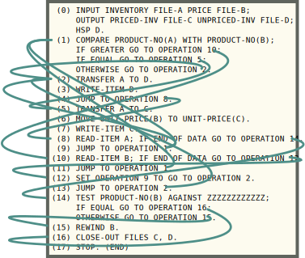
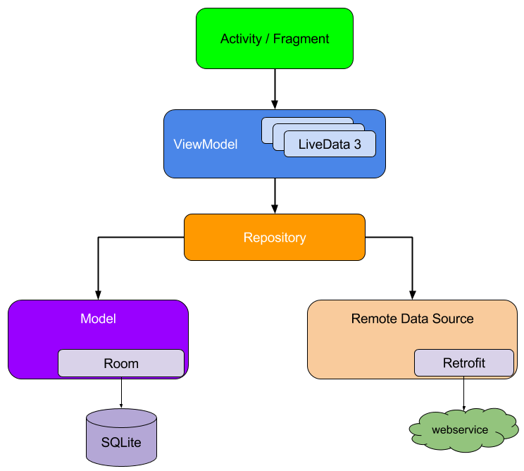
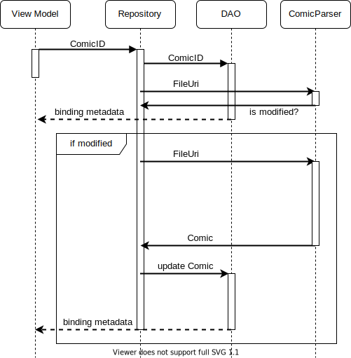
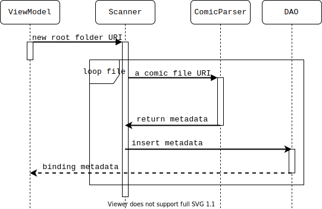

# Khung sườn

Khung sườn khóa luận kết thúc 6 năm luyện ngục của nvmnghia.

Độ dài yêu cầu: 40-50 trang.

---

## 0. Bìa & các mục liên quan

- Bìa
- Phụ bìa
- Cam đoan không sao chép
- Phê chuẩn của giảng viên hướng dẫn
- Lời cảm ơn
- Tóm tắt

    Nhờ Internet, truyền hình và điện ảnh, văn hóa truyện tranh đã trở nên phổ
    biến toàn cầu, nhất là trong giới trẻ. Nhu cầu tiêu thụ truyện tranh tăng
    cao thúc đẩy sự phát triển của các trang web truyện tranh với ưu điểm là
    thuận tiện, tốc độ cập nhật truyện nhanh. Tuy nhiên, nguồn truyện tranh của
    những trang web này có chất lượng không cao. Một bộ phận người đọc kĩ tính
    chọn đọc và lưu trữ những tệp truyện được số hóa chất lượng cao, thường ở
    dạng tệp nén đuôi `cbr` và `cbz`. Xuất phát từ nhu cầu này, tôi muốn viết
    ứng dụng *yacv* có thể đọc các tệp truyện nén trên điện thoại Android. Khóa
    luận sẽ trình bày một số nền tảng của yacv như Android và Kotlin; sau đó là
    các ca sử dụng chính cùng với thiết kế và cài đặt của ứng dụng.

    Từ khóa: Android, coroutine, zip, comic

- Mục lục
- Danh sách bảng
- Danh sách hình
- Danh sách kí hiệu, chữ viết tắt

    - MVC
    - MVP
    - MVVM
    - RDBMS
    - ORM
    - SC

---

## 1. Chương 1: Giới thiệu <a name="P1-intro"></a>

### 1.1. Đặt vấn đề <a name="P1.1-background"></a>

<!-- Hint: Tại sao lại làm đồ án ntn (1-3 đoạn)? -->

Tại Đông Á và Đông Nam Á, văn hóa truyện tranh gốc Á, nhất là truyện tranh Nhật
(manga), được đón nhận khá tích cực, đặc biệt trong giới trẻ. Thế hệ những người
dưới 40 tuổi hiện nay được tiếp xúc với truyện tranh từ sớm, thông qua những
cuốn truyện truyền tay và phim hoạt hình dựa trên truyện tranh, và tiếp tục đọc
dù đã qua tuổi thiếu niên. Một số tác phẩm manga còn có lượng người đọc lớn trên
toàn cầu như Doraemon, One Piece. Ở bên kia bán cầu, với sự thành công của vũ
trụ điện ảnh Marvel và DC, truyện tranh phương Tây (comic) cũng được hồi sinh
phần nào sau một thập kỷ thiếu sáng tạo và suy giảm doanh số sách in. Các bộ
truyện siêu anh hùng, vốn trước đây chỉ phổ biến ở Hoa Kỳ, nay đang trên đường
trở thành một phần của văn hóa đại chúng như vị thế của manga. Có thể nói, văn
hóa truyện tranh nói chung đang ở thời kì phát triển mạnh, xét theo tiêu chí về
độ phổ biến và thái độ đón nhận của xã hội.

Hiện nay, hầu hết mọi người đọc truyện qua các trang web tổng hợp truyện tranh.
Những trang web này có hai ưu điểm chính:

- Số lượng: Mỗi trang cung cấp ít nhất hàng nghìn đầu truyện.
- Tốc độ: Tốc độ ra truyện rất nhanh. Với các bộ truyện nổi tiếng, thường chỉ
  trong vòng một vài giờ sau khi ra mắt, chương mới đã xuất hiện.

Tuy vậy, nhược điểm chính của những trang web này là chất lượng ảnh của truyện.
Để giảm thời gian tải và tránh tốn băng thông, hình ảnh của truyện thường được
nén khá nhiều, gây vỡ hình, mờ nhòe. Một bộ phận người đọc, hoặc kĩ tính, hoặc
muốn sưu tầm truyện, thường chọn đọc những tệp truyện chất lượng cao, thường có
đuôi CBZ hoặc CBR. Bản chất tệp truyện này là các tệp nén zip bình thường, bên
trong có các tệp ảnh thông dụng như JPG, PNG. Tuy nhiên, do được tải hẳn về máy
rồi mới đọc, những tệp truyện này không bị giới hạn về băng thông hay thời gian,
do đó hình ảnh trong tệp có thể có chất lượng rất cao.

Trong khóa luận này, tôi viết một ứng dụng Android nhằm phục vụ số ít người dùng
có nhu cầu đọc truyện tranh chất lượng cao đã giới thiệu ở trên. Tên của ứng
dụng là "yacv", viết tắt của cụm từ tiếng Anh "Yet Another Comic Viewer", tạm
dịch là "Lại một ứng dụng xem truyện tranh nữa". Hai tính năng chính duy nhất
của ứng dụng là đọc và quản lí cơ bản (tìm kiếm, xóa) tệp truyện tranh có sẵn
trên điện thoại.

<!-- Một chi tiết nhỏ về tên nữa là ở chữ "comic", vì cộng đồng đọc "comic" (đặc biệt
là truyện siêu anh hùng của DC và Marvel) theo quan sát của tôi có nhu cầu cao
về metadata hơn cộng đồng đọc "manga", do sự rối rắm trong quá trình sáng tác
(sẽ được đề cập sau). -->

Cần chú ý rằng ứng dụng yacv chỉ bao gồm các tính năng liên quan đến đọc truyện
ngoại tuyến, đọc các tệp truyện có sẵn trên điện thoại người dùng. Ứng dụng
không phải là ứng dụng khách cho các trang đọc truyện hiện có, hay có máy chủ
tập trung riêng để cung cấp truyện.

### 1.2. Ứng dụng tương tự <a name="P1.2-similar-apps"></a>

Hiện có nhiều ứng dụng đọc truyện tranh ngoại tuyến như yacv trên chợ ứng dụng
Google Play. Hai ứng dụng phổ biến nhất trong số này là [ComicScreen][1] và
[Astonishing Comic Reader][2]. ComicScreen là ứng dụng có nhiều người dùng hơn.
Các tính năng của ComicScreen giống với các tính năng của yacv, tuy nhiên
ComicScreen có thêm nhiều chức năng phụ, đáng kể nhất là khả năng đọc từ mạng
FTP/SMB và khả năng sửa ảnh trong file. Astonishing Comic Reader cũng có chức
năng tương tự yacv, không hơn, tuy nhiên giao diện khá trau chuốt. Cả hai đều
miễn phí và có quảng cáo, được cập nhật có thể nói là thường xuyên.

Một ngoại lệ đáng kể ở đây là ứng dụng mã nguồn mở [Tachiyomi][3]. Ứng dụng này
có hệ thống phần mở rộng, cho phép đọc truyện ở các trang web truyện tranh. Khi
web truyện tranh thay đổi, hoặc hỗ trợ thêm trang mới, chỉ cần tải về phần mở
rộng tương ứng ở dạng ứng dụng APK. Tính năng này cùng mô hình mã nguồn mở khiến
Tachiyomi mạnh hơn, cập nhật nhanh hơn toàn bộ các ứng dụng đã có và sẽ có. Tuy
nhiên, Tachiyomi lại không thể được đưa lên Play Store, vì chính tính năng phần
mở rộng đã [vi phạm chính sách][4] của Play Store.

Một điểm khác biệt quan trọng của yacv với các ứng dụng có sẵn là việc hỗ trợ
metadata của tệp truyện tranh, do các ứng dụng có sẵn trên Play Store đa số bỏ
qua thông tin này trong tệp truyện. Một trong số rất ít những ứng dụng hỗ trợ
tính năng này là [Kuro Reader][5], tuy nhiên đây là một tính năng trả phí.

### 1.3. Kết quả đạt được <a name="P1.3-resulted-app"></a>

Ứng dụng có các tính năng đủ dùng theo mục đích đã đề ra:

- Đọc file truyện CBZ
- Tìm kiếm truyện theo metadata

Tính năng đọc tệp truyện CBR hiện mới chỉ được cài đặt một phần, do khó khăn
trong việc tích hợp thư viện đọc định dạng này.

### 1.4. Cấu trúc khóa luận <a name="P1.4-outline"></a>

Các phần còn lại của khóa luận có cấu trúc như sau:

- [Chương 2 - Kiến thức nền tảng](#P2-fundamental): Giới thiệu sơ lược về ba
  nền tảng của ứng dụng, gồm hệ điều hành Android, ngôn ngữ lập trình Kotlin, và
  mẫu thiết kế MVVM; định dạng tệp nén ZIP cũng được giới thiệu vì liên quan
  trực tiếp đến ứng dụng.
- [Chương 3 - Phân tích yêu cầu](#P3-requirements): Phân tích nhu cầu và ca sử
  dụng để có đặc tả yêu cầu.
- [Chương 4 - Thiết kế](#P4-design): Thiết kế ứng dụng, gồm thiết kế cơ sở dữ
  liệu, giao diện, logic nghiệp vụ.
- [Chương 5 - Lập trình & Kiểm thử](#P5-implementation): Một số cài đặt và ca
  kiểm thử trong ứng dụng sẽ được nêu một cách có chọn lọc.
- [Chương 6 - Kết luận](#P6-comclusion): Kết thúc khóa luận.

---

## 2. Chương 2: Kiến thức nền tảng <a name="P2-fundamental"></a>

Chương này giới thiệu sơ qua về các nền tảng trong quá trình xây dựng ứng dụng.

- Hai nền tảng đầu tiên liên quan đến nhau, là tiền đề cho toàn bộ ứng dụng sẽ
  được giới thiệu trước, gồm hệ điều hành Android và ngôn ngữ lập trình Kotlin.
- Tiếp theo, lựa chọn về kiến trúc tổng quan, liên quan đến giao diện của ứng
  dụng được trình bày.
- Sau đó, cơ sở dữ liệu một số phần mở rộng của nó dùng trong ứng dụng sẽ được
  nhắc qua.
- Cuối cùng là thông tin về CBZ - định dạng tệp tin mà ứng dụng đọc.

<!-- Phần này sẽ được viết thẳng vào LaTeX, vì đa số là copypasta. -->

### 2.1. Hệ điều hành Android <a name="P2.1-android"></a>

Android là một hệ điều hành di động do Google phát triển. Android dùng nhân
Linux và được thiết kế cho màn hình cảm ứng. Cùng với iOS của Apple, Android trở
thành một phần không thể thiếu của cuộc cách mạng di động bắt đầu vào cuối những
năm 2000.

Google mua lại phiên bản Android đầu của công ty khởi nghiệp cùng tên vào năm
2005, và phát triển nó từ đó. Ngoài Google, Android còn nhận đóng góp lớn từ
cộng đồng, do có mã nguồn mở (phần lớn dùng giấy phép Apache); tên chính thức
của dự án là Android Open Source Project. Dù vậy, mọi thiết bị Android thương
mại đều có ứng dụng độc quyền. Ví dụ đáng kể là bộ Google Mobile Services, chứa
những ứng dụng thiết yếu như trình duyệt Chrome hay chợ Play Store. Về mặt này,
Android khá giống Chrome: thành phần cốt lõi kĩ thuật được phát triển theo mô
hình mã nguồn mở (AOSP và Chromium), còn thành phần liên quan đến trải nghiệm
người dùng được phát triển riêng.


Hình 1: Các phân lớp của hệ điều hành Android

Android được phân lớp như sau:

- Nhân Linux (Linux Kernel):

    Android dùng nhánh hỗ trợ dài hạn (LTS) của Linux. Khác kiểu phát triển
    distro trên máy tính (chủ yếu thay đổi ở ngoài nhân), Google sửa nhân khá
    nhiều trước khi tích hợp.

- Lớp phần cứng trừu tượng (Hardware Abstraction Layer):

    Tầng này đưa ra giao diện chung cho mỗi kiểu phần cứng (máy ảnh, loa,...),
    giúp các tầng trên có thể dùng phần cứng mà không quan tâm đến chi tiết
    riêng.

- Android Runtime (ART):

    Ứng dụng Java cần thêm một ứng dụng để chuyển bytecode thành mã máy. Trên
    desktop, đó là các máy ảo Java (JVM). Trên Android, Android Runtime nhận
    nhiệm vụ này. Hai máy ảo này khác nhau ở chỗ ART *biên dịch* bytecode thành
    mã máy (trước khi chạy - AOT), còn JVM *thông dịch* bytecode thành mã máy
    (trong khi chạy).

- Thư viện C/C++:

    Tầng này phục vụ một số ứng dụng dùng NDK (từ Java gọi C) như trò chơi điện
    tử.

- Khung phát triển ứng dụng (Java API Framework):

    Mọi ứng dụng Java được viết nhờ sử dụng các thành phần của tầng này thông
    qua API Java. Tầng này cung cấp toàn bộ tính năng của Android cho lập trình
    viên, bao gồm các yếu tố cơ bản như giao diện (View System), truy xuất,...

    Lập trình viên có thể truy cập vào lớp này tương đương với ứng dụng hệ
    thống. Đây được coi là một cam kết tránh độc quyền công nghệ, tức đa số ứng
    dụng hệ thống không có khả năng đặc biệt hơn ứng dụng bên thứ ba tương tự.

- Ứng dụng hệ thống (System Apps)

    Android đi kèm với một số ứng dụng hệ thống như ứng dụng SMS, trình duyệt,
    lịch,... Google cho phép thay thế đa số các ứng dụng này với ứng dụng bên
    thứ ba, tuy nhiên có những ngoại lệ như ứng dụng Cài đặt (Settings).

Gần như mọi ứng dụng Android cơ bản đều dùng View System trong tầng Khung phát
triển để viết giao diện, và yacv không là ngoại lệ. yacv còn sử dụng thành phần
Content Provider, cụ thể là bộ Storage Access Framework, và sẽ được đề cập ở các
phần sau.

#### 2.1.1. Android Jetpack <a name="P2.1.1-jetpack"></a>

Jetpack là bộ thư viện giúp viết ứng dụng Android nhanh gọn, ít lỗi hơn so với
việc tự viết những đoạn mã tương tự. Jetpack gồm hai thành phần chính:

- AndroidX, trước gọi là Thư viện Hỗ trợ (Support Library): đưa *API* của hệ
  điều hành mới lên máy cũ
- Architecture Component: đưa ra *thư viện* hoàn toàn mới

Việc cập nhật Android rất khó khăn do phải chờ nhà sản xuất tối ưu. Do đó,
Jetpack, nhất là AndroidX, rất cần thiết. Chú ý rằng Jetpack chỉ có ích cho lập
trình viên (API mới tiện hơn thực ra là wrapper của API sẵn có), chứ không cập
nhật tính năng hệ thống.

yacv sử dụng nhiều thành phần của Jetpack, trong đó đáng kể đến ba thư viện sau:

- LiveData: giúp giao diện luôn được cập nhật theo dữ liệu mới nhất
- ViewModel: giúp tách dữ liệu và giao diện
- Room: đơn giản hóa việc lưu dữ liệu trong SQLite (sẽ được giới thiệu ở [mục
  sau](#P2.4.2-room))

### 2.2. Ngôn ngữ lập trình Kotlin <a name="P2.2-kotlin"></a>

Java là ngôn ngữ lập trình đầu tiên được hỗ trợ trên Android, nhưng không phải
duy nhất. Từ 2019, Google khuyên lập trình viên viết ứng dụng trên Kotlin, một
ngôn ngữ mới do JetBrains phát triển. Giới thiệu lần đầu vào năm 2011, Kotlin
được định hướng trở thành lựa chọn thay thế cho Java. Điều đó thể hiện ở việc
Kotlin tương thích hoàn toàn với Java (từ Java gọi được Kotlin và ngược lại), do
cùng được biên dịch thành JVM bytecode.

Kotlin hơn Java ở tính ngắn gọn. Do được phát triển mới, Kotlin không cần tương
thích ngược, cho phép dùng các cú pháp hiện đại, gọn ghẽ. Do được một công ty
phát triển, Kotlin không cần chờ các cuộc họp phức tạp để đạt đồng thuận về tính
năng mới. Đồng thời, công ty cũng mở mã nguồn của Kotlin và chương trình dịch,
giúp đẩy nhanh quá trình phát triển và tạo thiện cảm cộng đồng cho một ngôn ngữ
non trẻ.

Sau đây là tóm tắt một số đặc điểm kĩ thuật của Kotlin:

- Về mô hình, Kotlin hỗ trợ hướng đối tượng như Java, nhưng còn có hướng hàm,
  thể hiện ở tính năng hàm ẩn danh (lambda), và hàm được coi là first-class.
- Về hệ thống kiểu, Kotlin giống hệt Java:
    - Là kiểu tĩnh (statically typed), tức kiểu được kiểm tra khi biên dịch
      (thay vì khi chạy, như Python, JavaScript,...)
    - Là kiểu mạnh (strongly typed), tức không cho phép chuyển kiểu ngầm
- Về cú pháp, Kotlin gọn và hiện đại: bỏ dấu `;` cuối dòng, template literal,...
- Về chống lỗi, Kotlin "né" `NullPointerException` do buộc người viết đánh dấu
  rõ rằng một đối tượng có thể bị `null` bằng hậu tố `?` ở khai báo kiểu. Từ đó,
  Kotlin biết chính xác đối tượng có thể là `null` hay không, và buộc xử lí nếu
  có.

Do Google khuyên dùng Kotlin, tôi cho rằng khóa luận này là một cơ hội phù hợp
để thử Kotlin thay vì dùng Java quen thuộc, và quyết định chọn viết yacv bằng
Kotlin.

#### 2.2.1. Coroutine <a name="P2.2.1-coroutine"></a>

##### 2.2.1.1. Giới thiệu chung

Một thư viện quan trọng của kotlin là *coroutine*. Coroutine giúp viết ứng dụng
có tính tương tranh (concurrency) và bất đồng bộ (asynchronous) một cách đơn
giản hơn.

Về cơ bản, coroutine giống với luồng (thread), nhưng nhẹ hơn. Coroutine dùng mô
hình *đa nhiệm hợp tác* (cooperative multitasking), khác với luồng hay dùng đa
nhiệm ưu tiên (preemptive multitasking). Mấu chốt khác biệt của chúng là đa
nhiệm hợp tác có các "điểm dừng" do người viết tạo; khi chạy đến đó, coroutine
có thể dừng, nhả CPU cho việc khác, rồi tiếp tục việc đang dở sau. Ngược lại, đa
nhiệm ưu tiên có thể buộc luồng đang chạy ngừng lại bất kì lúc nào để ưu tiên
chạy luồng khác. Đây cũng là điểm làm¡ coroutine nhẹ hơn: việc chuyển ngữ cảnh
(context switching) được kiểm soát và cắt giảm, do chuyển sang coroutine khác
chưa chắc đã chuyển sang luồng hệ điều hành khác.

Với những điều trên, coroutine chưa làm được nhiều. Roman Elizarov, trưởng dự án
Kotlin, hướng coroutine trong Kotlin theo một ý tưởng mới: *tương tranh có cấu
trúc* (structured concurrency, từ đây gọi tắt là SC). Ý tưởng này tiếp tục đơn
giản hóa việc viết những đoạn mã tương tranh bằng cách áp đặt một số giới hạn,
cấu trúc cơ bản. Kết quả là coroutine trong Kotlin hỗ trợ việc xử lí lỗi và
ngừng tác vụ bất đồng bộ tốt hơn việc dùng luồng, hay các thư viện tương tranh
như RxJava.

Coroutine được dùng để tăng tốc những đoạn mã chạy chậm trong yacv (sẽ được mô
tả sau). Ngoài cải thiện hiệu năng, coroutine và SC còn cho phép viết mã ngắn,
rõ ràng hơn. Do có tác động lớn, cả hai sẽ được giới thiệu kĩ hơn ở phần này.

##### 2.2.1.2. Bài học từ quá khứ: lập trình cấu trúc

<!-- Cite [10] -->
Để hiểu SC, ta so sánh nó với *lập trình cấu trúc* (structured programming). Để
hiểu sơ lập trình cấu trúc, ta phải tìm về *lập trình phi cấu trúc*
(non-structured programming), với đặc điểm là lệnh nhảy `GOTO`. Trong buổi đầu
của máy tính, lệnh này được dùng nhiều vì hợp với cách máy tính chạy.


Hình 2: Lập trình phi cấu trúc với `GOTO`



Hình 3: Sự lộn xộn của lập trình phi cấu trúc

Vấn đề của lập trình phi cấu trúc, hay của `GOTO`, gồm:

1. Khó nắm bắt luồng chương trình

    Khi đã chạy `GOTO`, các lệnh phía sau nó không biết khi nào mới chạy, vì
    chương trình chuyển sang lệnh khác mà không trở lại. Luồng chạy trở thành
    một đống "mì trộn" như Hình 3, thay vì tuần tự từ trên xuống. Tệ hơn, tính
    trừu tượng bị phá vỡ: khi gọi hàm, thay vì có thể bỏ qua chi tiết bên trong,
    ta phải biết rõ để xem có lệnh nhảy bất ngờ nào không.

2. Không cài đặt được các chức năng mới (ngoại lệ, quản lí tài nguyên tự
  động,...)

    Xét ví dụ Java sau về quản lí tài nguyên tự động:

    ```java
    try (Scanner scanner = new Scanner(new File("f.txt"))) {
        goto(SOMEWHERE);    // Giả sử Java có GOTO
    }
    ```

    Do không trả lại luồng điều khiển, việc đóng luồng nhập từ tệp cũng không
    chắc chắn xảy ra, dẫn đến rò rỉ tài nguyên, làm khối lệnh vô dụng.

    Điều gần tương tự cũng khiến việc xử lí ngoại lệ và nhiều tính năng khác trở
    nên rất khó đạt được, một khi ngôn ngữ cho phép `GOTO`.

Lập trình cấu trúc đơn giản hóa luồng chạy bằng cách giới hạn các lệnh nhảy còn
`if`, `for` và gọi hàm. Khác biệt mấu chốt so với `GOTO` là chúng *trả luồng
điều khiển* về điểm gọi, thể hiện rõ ở Hình 4. Theo định nghĩa, ba lệnh trên
giải quyết được hậu quả 1. Đồng thời, hậu quả 2 cũng được giải quyết, do ngôn
ngữ đã có cấu trúc (cụ thể là có call stack).


Hình 4: Ba cấu trúc cơ bản: rẽ nhánh `if`, lặp `for` và gọi hàm

Ngày nay, ba cấu trúc trên là phần không thể thiếu trong mọi ngôn ngữ lập trình,
còn `GOTO` chỉ dùng trong hợp ngữ. Quá khứ cho thấy nếu áp dụng một số cấu trúc,
giới hạn, ta có thể giải quyết vấn đề một cách tinh tế và gọn gàng. Trong trường
hợp này, SC có thể loại bỏ một số điểm yếu của các API tương tranh/bất đồng bộ
truyền thống, giống cách lập trình cấu trúc đã làm.

##### 2.2.1.3. Áp dụng vào hiện tại: tương tranh cấu trúc

Trước hết, ta xem xét hai kiểu API tương tranh hay dùng hiện nay:

| Tên | Giải thích | Ví dụ |
|:----|:-----------|:------|
| Tương tranh | Chạy một hàm theo cách tương tranh với luồng chạy hiện tại | `Thread(target=fn).start() # Python` |
| Bất đồng bộ | Chạy một hàm khi có sự kiện xảy ra (callback) | `element.onclick = cb; // JS` |

Bảng 1: Hai kiểu API tương tranh thường thấy.

Qua Hình 5, không khó để thấy rằng mọi vấn đề của lập trình phi cấu trúc đều lặp
lại với hai API trên:


Hình 5: Tương tranh phi cấu trúc với `goroutine` - API kiểu tương tranh.

- Ta xem lại ví dụ quản lí tài nguyên tự động. Nếu có một luồng thực thi khác
  tương tranh với luồng chính, thì khi luồng chính đóng `Scanner`, có thể luồng
  kia vẫn đang đọc nó. Vấn đề giờ là đọc sau khi đóng. Do đó, tính năng này
  không thể hoạt động.
- Với tính năng bắt ngoại lệ, nếu có ngoại lệ ở luồng tương tranh, ta cũng không
  có cách nào để biết, và buộc phải kệ nó.

Trên thực tế, có thể cài đặt chức năng trên với API hiện tại, tuy vậy đó đều là
cách xử lí riêng, bất tiện. Ví dụ, ES6 có `catch()` để bắt ngoại lệ trong
`Promise` mà không (thể) dùng cấu trúc `try-catch` sẵn có. Với SC, các vấn đề
này đều được giải quyết.

Ta xét một đoạn mã tương tranh dùng coroutine trong Kotlin, tức dùng SC (không
phải coroutine trong mọi ngôn ngữ đều dùng mô hình này):


Hình 6: Tương tranh cấu trúc dùng coroutine trong Kotlin

Đoạn mã trong Hình 6 làm những việc sau:

- Hàm `launch()` tạo ra các coroutine:

    - `launch()` đầu tiên tạo ra coroutine *cha*
    - `launch()` thứ hai tạo ra coroutine *con*, chạy hàm `A()`
    - Tương tự, có một coroutine con chạy hàm `B()`

- 3 coroutine chạy "song song", chính xác hơn là tương tranh

Nguyên tắc của SC là: *coroutine cha chờ mọi coroutine con chạy xong*, kể cả khi
nó xong trước. Nguyên tắc này đảm bảo rằng khi một hàm kết thúc, không còn tác
vụ tương tranh nữa, và luồng điều khiển hợp nhất được trả về điểm gọi. Đột
nhiên, hai tính năng có vấn đề ở trên lại hoạt động:

- Quản lí tài nguyên tự động: do đảm bảo trả luồng điều khiển, tài nguyên đảm
  bảo được đóng; do không còn tác vụ con, tài nguyên không bị đọc sau đóng.
- Bắt ngoại lệ: do cấu trúc cha-con (khác với các API hiện tại cho rằng hai tác
  vụ tương tranh là ngang hàng), coroutine con có thể ném ngoại lệ để coroutine
  cha bắt.

Chú ý là các API hiện tại không phải không làm được nguyên tắc trên, vấn đề là
thực hiện một cách *tự động* và *đảm bảo*. Ví dụ, trong JS, để tuân theo SC, ta
phải nhớ `await` với mọi hàm `async`. Do không có ràng buộc chặt chẽ này, các
tính năng ngôn ngữ mới cũng khó cài đặt như đã phân tích.

Do trong các ngôn ngữ khác, nguyên tắc trên chỉ là một ca sử dụng, việc ép buộc
viết theo ca sử dụng này đòi hỏi lập trình viên thay đổi suy nghĩ về tương
tranh. Đổi lại, chương trình trở nên sáng rõ, giống những đoạn mã viết theo kiểu
tuần tự truyền thống.

Một khi vấn đề tương tranh được giải quyết hoặc đơn giản hóa, việc song song hóa
(paralellization) để tăng tốc ứng dụng chỉ còn là một chi tiết cài đặt.

##### 2.2.1.4. Tóm tắt

Coroutine với SC là một trong những tính năng quan trọng nhất của Kotlin, giúp
tăng tốc những đoạn mã chạy chậm trong yacv. Mấu chốt của SC được tóm gọn trong
Hình 6. Dù khá mới (Martin Sústrik, tác giả của ZeroMQ, nêu ý tưởng này năm
2016), mô hình này được cải thiện liên tục, có thư viện ở nhiều ngôn ngữ như
Java (Loom), Python (Trio),... Điều này cho thấy ý tưởng có ý nghĩa lớn, giúp
đơn giản hóa tư duy về tương tranh.

### 2.3. Mẫu thiết kế MVVM và Kiến trúc khuyên dùng <a name="P2.3-mvvm-app-arch"></a>

#### 2.3.1. Mẫu thiết kế MVVM <a name="P2.3.1-mvvm"></a>

Cũng như các tác vụ lập trình khác, lập trình giao diện sử dụng nguyên lý
Separation of Concern, hiểu đơn giản là chia tách chức năng. Nhiều năm kinh
nghiệm cho thấy giao diện nên được chia làm hai phần chính tách biệt nhau:

- Model: dữ liệu để hiển thị (trả lời câu hỏi "cái gì"); liên quan đến đối
  tượng, mảng,...
- View: cách để hiển thị dữ liệu đó (trả lời câu hỏi "như thế nào"); liên quan
  đến các yếu tố giao diện như nút, danh sách,...

Sự tách biệt thể hiện ở chỗ Model không được biết View. Khi này, giao diện và
nghiệp vụ có thể phát triển khá độc lập với nhau, giúp giảm thời gian phát
triển. Ngược lại, View có biết Model không là tùy vào cách triển khai cụ thể. Có
sự bất đối xứng này là do View luôn liên quan chặt chẽ đến framework, khác với
Model thường đơn giản.

Khó khăn ở đây là làm sao để kết nối hai thành phần riêng biệt kia. Nhiều mô
hình cố giải quyết vấn đề này, tiêu biểu là MVC, MVP và MVVM. Ta lần lượt xem
xét chúng để thấy rằng MVVM phù hợp nhất với Android, do đó được chọn làm nền
tảng cho Kiến trúc Google khuyên dùng.

##### 2.3.1.1. MVC: Model - View - Controller

<!-- Cite [11] -->
Phương hướng đầu tiên được thử là MVC, vốn phổ biến vào thời điểm Android ra
đời. Do được phát minh từ lâu và mỗi framework lại có cách giải thích khác nhau,
nên không có một mô hình cụ thể về cách ba thành phần trên tương tác. Tuy vậy,
vẫn có vài điểm chung không đổi:

1. Controller nhận thao tác người dùng
2. Sau đó, controller cập nhật Model và View

Ngay ở đây, ta đã thấy điểm yếu của MVC khi áp dụng vào Android. Trong Android,
ứng dụng sử dụng Activity và Fragment để viết giao diện. Hai đối tượng này cũng
kiêm luôn việc nhận thao tác người dùng, tức chúng là *cả View và Controller*.
Mục đích tách ra ba đối tượng do đó không thể làm được.

Hiện nay, MVC trên Android được coi là lỗi thời, không phù hợp.

##### 2.3.1.2. MVP: Model - View - Presenter

<!-- Cite [13] -->
Năm 2012, Robert Martin "Uncle Bob" xuất bản một bài viết nổi tiếng về kiến trúc
phần mềm: Clean Architecture. MVP, vốn được phát triển từ lâu, được đông đảo lập
trình viên chọn để triển khai Clean Architecture trên Android. Trước khi Google
chọn MVVM, đây là hướng đi mới, có kì vọng cao sau nhiều thất bại trong việc đưa
MVC vào Android.

Nhiệm vụ của ba thành phần như sau:

- Model: vẫn như trong MVC
- View: hiển thị dữ liệu; nhận tương tác người dùng để chuyển sang Presenter
- Presenter: trung gian giữa Model và View: nhận tương tác từ View, gọi/thay đổi
  Model, cập nhật View


<!-- Cite [14] -->
Hình 7: Kiến trúc MVP

Ta thấy điểm yếu View-Controller nhập nhằng được khắc phục, khi View kiêm luôn
việc nhận tương tác. Đồng thời, Model và View hoàn toàn không biết nhau, đúng
theo nguyên lý tách lớp của Clean Architecture.

Ta xét một ứng dụng ToDo đơn giản, trong đó các công việc có thể được đánh dấu
đã hoàn thành. Trong ứng dụng, màn hình hiển thị số việc đã và chưa hoàn thành.
Trong màn hình đó, tương tác của MVP như sau:

1. Presenter lấy tất cả công việc trong Model
2. Presenter đếm số việc hoàn thành, chưa hoàn thành
3. Presenter gọi hàm của View, truyền hai số đếm được ở trên vào

Đến đây, thiết kế đã khá hoàn chỉnh và phù hợp với Android.

##### 2.3.1.3. MVVM: Model - View - View Model


<!-- Cite [15] -->
Hình 8: Kiến trúc MVVM

Ta quay về chủ đề chính: MVVM. MVVM giống MVP ở chỗ View Model (từ đây gọi tắt
là VM) kết nối View và Model như Presenter. Điểm khác biệt là cách truyền dữ
liệu:

- Trong MVP, Presenter gọi hàm của View để truyền dữ liệu cho View
- Trong MVVM, VM dùng *data binding* để truyền dữ liệu cho View

Data binding là cơ chế để *tự động* đưa dữ liệu vào thành phần hiển thị. Quay
lại ví dụ ToDo ở trên, nếu dùng data binding để "gắn" (bind) danh sách công việc
vào View, thì khi danh sách thay đổi, View cũng tự động thay đổi theo.

Do dùng data binding thay vì gọi hàm thủ công, VM không cần có tham chiếu tới
View, khác với Presenter. Điều này giúp liên kết View - VM thêm *lỏng lẻo*
(loose coupling), giúp kiểm thử dễ dàng hơn. Phần còn lại của hai mô hình giống
nhau: View cần biết VM để chuyển tương tác; VM cần biết Model để lấy dữ liệu.

Do là mô hình phù hợp nhất trong cả ba với riêng Android, MVVM được chọn làm nền
tảng cho Kiến trúc Google khuyên dùng.

#### 2.3.2. Kiến trúc Google khuyên dùng <a name="P2.3.2-app-arch"></a>

Kiến trúc Google khuyên dùng có gốc là mô hình MVVM, có dạng như Hình 9:



Hình 9: Kiến trúc Google khuyên dùng

- Repository là Model trong MVVM, giúp VM lấy dữ liệu mà không cần quan tâm dữ
  liệu lấy từ đâu: cơ sở dữ liệu, gọi API qua mạng,...
- LiveData là cơ chế data binding dùng luồng dữ liệu (stream)
- Activity/Fragment là View

Repository là một điểm được chi tiết hóa so với MVVM. Google cho rằng một ứng
dụng không nên hoàn toàn vô dụng nếu không có mạng. Do đó, cần có hai nguồn dữ
liệu: dữ liệu từ máy chủ, và dữ liệu đệm, ngoại tuyến. Khi có nhiều nguồn dữ
liệu, mẫu thiết kế Repository là lựa chọn hiển nhiên để trừu tượng hóa chúng.

yacv sử dụng kiến trúc này, dù không có tính năng liên quan đến mạng. Lý do là
yacv có tính năng quét truyện hoạt động chậm giống như giao tiếp mạng, nên cần
dữ liệu đệm và dữ liệu quét thực tế.

### 2.4. Cơ sở dữ liệu SQLite <a name="P2.4-sqlite"></a>

SQLite là một hệ quản trị cơ sở dữ liệu quan hệ (RDBMS). Từ "Lite" trong tên có
nghĩa là "nhỏ", thể hiện mục tiêu thiết kế chính của nó là nhỏ gọn. SQLite có
thể được nhúng vào phần mềm khác ở dạng thư viện, thay vì là một phần mềm riêng
với cấu trúc chủ-khách như MySQL,... Ngay từ những phiên bản đầu, Android đã
tích hợp SQLite, giúp lập trình viên không phải nhúng SQLite vào từng ứng dụng.

Để đạt mục tiêu, SQLite chỉ giữ các tính năng SQL cốt lõi (tạo/đọc/sửa/xóa),
giao dịch (có ACID), và chỉ tối ưu cho việc truy cập từ một ứng dụng cùng lúc.
Các tính năng thường có trong RDBMS cho máy chủ, như nhân bản (replication),
chia dữ liệu tự động (sharding), khóa dòng, đọc ghi nhiều luồng cùng lúc,...
được loại bỏ. Do đó, với nhu cầu lưu trữ đơn giản, SQLite vừa nhanh vừa gọn.

yacv dùng SQLite để lưu đệm thông tin truyện, tránh quét nhiều lần.

#### 2.4.1. Thư viện ORM Room <a name="P2.4.1-room"></a>

Room là một thư viện thuộc Jetpack. Đây có thể xem là một thư viện ORM đơn giản
cho SQLite. Room tự động làm nhiều công việc liên quan đến SQL:

- Tạo bảng: Người viết chỉ cần khai báo các đối tượng dữ liệu như một lớp
  (class) thông thường, rồi đánh dấu với Annotation và interface của Room. Sau
  đó, Room sinh các bảng tương ứng.
- Truy vấn: Người viết chỉ cần viết lệnh SQL. Sau đó, Room sinh hàm truy vấn
  tương ứng, chuyển dữ liệu dạng đối tượng sang dạng để lưu trong bảng và ngược
  lại.
- Kiểm tra truy vấn khi biên dịch: Dò lỗi lệnh SQL mà không cần chờ đến khi
  chạy.
- Kiểm soát lược đồ (schema): Khi thêm/sửa/xóa bảng/cột, Room luôn phát hiện và
  ép viết cơ chế cập nhật. Do đó, ứng dụng dùng lược đồ cũ khi được cập nhật sẽ
  biết cách sửa cơ sở dữ liệu đến phiên bản lược đồ mới.
- Tương thích với LiveData: Giúp View cập nhật theo cơ sở dữ liệu.

#### 2.4.2. Tìm kiếm văn bản <a name="P2.4.2-fts"></a>

<!-- Cite [17] -->
Tìm kiếm văn bản (full-text search, hay gọi tắt là FTS) là một trong số ít các
tính năng nâng cao được giữ lại trong SQLite. Cũng như các thư viện tìm kiếm
khác, SQLite cài đặt chức năng này bằng chỉ mục đảo (inverted index) - một cấu
trúc giống từ điển:

1. Khi dữ liệu văn bản được ghi, nó được tách thành các từ.
2. Các từ được đưa vào chỉ mục đảo: khóa là từ đó, giá trị là khóa đại diện
   `rowid`.

FTS khác với đánh chỉ mục thường (cũng là chỉ mục đảo nhưng cho kiểu dữ liệu
thông thường) ở bước 1: *từng từ* được tách ra, còn chỉ mục thường dùng *cả* văn
bản. Do đó, khi tìm từ lẻ, FTS có thể tìm hàng có từ đó rất nhanh. Điểm yếu là
ghi chậm, kích cỡ lớn hơn chỉ mục thường. Nếu bản thân dữ liệu văn bản trong cột
là một khối, ví dụ như email, chỉ mục thường đã đủ tốt, không cần FTS. Ngoài ra,
nếu muốn, ở bước này có thể dùng kĩ thuật rút gọn từ (stemming; chỉ đúng với
tiếng Anh), giúp tìm kiếm linh động hơn.

Trong SQLite, một số kĩ thuật xử lí ngôn ngữ tự nhiên cơ bản cũng được áp dụng
trong bước 1, như rút gọn từ (stemming, dùng thuật toán Porter, ví dụ khi tìm
"run" sẽ ra được cả "runs", "running", "ran"; tất nhiên chỉ đúng với tiếng Anh),
giúp kết quả tìm kiếm linh động hơn.

yacv có tính năng tìm kiếm tiêu đề, tên nhân vật,... đều là những câu văn, đoạn
văn. Do đó, FTS có vai trò không thể thiếu để tăng tốc tìm kiếm trong ứng dụng.

### 2.5. Định dạng tệp nén ZIP và CBZ <a name="P2.5-zip-cbz"></a>

Các tệp truyện mà yacv đọc có định dạng CBZ, bản chất chính là tệp nén ZIP. Do
yêu cầu của các phần sau, định dạng tệp ZIP cũng cần được trình bày ở mức cơ
bản.

#### 2.5.1. Định dạng tệp nén ZIP <a name="P2.5.1-zip"></a>

ZIP là một định dạng tệp nén không mất mát (lossless). Được phát minh vào năm
1989 bởi Phil Katz, ZIP đã trở thành định dạng nén tiêu chuẩn, được hỗ trợ trên
gần như mọi nền tảng, bao gồm Android.

ZIP thực chất là một định dạng chứa (container), chuyên chứa dữ liệu nén, chứ
không phải thuật toán nén; thuật toán nén hay dùng nhất trong ZIP là DEFLATE.
Một trong các mục tiêu của ZIP là giúp việc sửa tệp nén (thêm, sửa, xóa tệp con
trong tệp ZIP) nhanh nhất có thể. Mục tiêu đó dẫn đến thiết kế sau, được thể
hiện trong Hình 10:

- Thuật toán nén mỗi tệp gốc thành một tệp nhị phân, ở đây gọi là *tệp nén lẻ*
  (data trong Hình 10). Sau đó, các tệp nén lẻ này được nối thành tệp ZIP cuối
  cùng.
- Ở đầu mỗi tệp nén lẻ là một header gọi là *File Entry* để lưu thông tin liên
  quan, trong đó có *tên tệp gốc* và *vị trí bắt đầu* (offset), tức số byte tính
  từ đầu tệp ZIP đến tệp nén lẻ tương ứng.
- Ở *cuối* tệp ZIP, sau khi đã nối các tệp nén lẻ cùng header lại, các header
  được gom lại, lưu một lần nữa vào một cấu trúc gọi là *Central Directory*. Có
  thể so sánh File Entry như các *đề mục*, còn Central Directory là *mục lục*.
- Hai thông tin quan trọng trong File Entry là tên tệp gốc và *vị trí bắt đầu*
  (offset), tức số byte tính từ đầu tệp ZIP đến tệp nén lẻ tương ứng.


Hình 10: Cấu trúc tệp nén ZIP

Ta phân tích kĩ hơn:

- Do nén riêng từng tệp, có thể dùng thuật toán khác nhau tối ưu với từng tệp.
- Cũng do nén riêng và có mục lục, việc thêm/sửa/xóa (gọi chung là sửa) và
  đọc có thể được thực hiện với từng tệp lẻ, thay vì phải giải nén, sửa, rồi nén
  lại toàn bộ.
- Nhờ mục lục (chứa vị trí tệp nén lẻ), việc sửa còn diễn ra nhanh do ứng dụng
  biết vị trí để đọc ghi dữ liệu.
- Mục lục đặt ở cuối là tối ưu:

    - Giả sử mục lục đặt ở đầu. Khi sửa, toàn bộ các tệp nén lẻ phải di chuyển
      để tạo chỗ cho mục lục mới (giống như thêm một phần tử vào mảng ở vị trí
      đầu: toàn bộ các phần tử sau bị đẩy lên để tạo chỗ trống).
    - Do mục lục nằm ở cuối tệp ZIP, nên khi sửa chỉ cần đẩy các tệp nén lẻ từ
      chỗ sửa. Trước đây tối ưu này rất quan trọng. Do đĩa mềm - phương tiện
      chia sẻ chủ yếu thời đó - có dung lượng nhỏ, tệp ZIP có thể phải cắt ra
      cho vừa. Thiết kế này cho phép chỉ sửa lại dữ liệu ở một số đĩa, thay vì
      toàn bộ.
    - Hơn nữa, nếu mục lục ở đầu thì ngay trong khi nén, các tệp nén lẻ bị di
      chuyển như trên do mục lục liên tục được cập nhật.

<!-- Cite [19] -->
Tóm lại, cấu trúc tệp nén ZIP cho phép sửa và giải nén từng tệp gốc rất dễ dàng.
Nhiều định dạng tệp nén khác (TAR, 7z,...) không có tính năng này, do gộp toàn
bộ các tệp vào rồi nén một thể. Trong trường hợp đó, tệp nén được gọi là *đặc*
(solid), và rất khó để đọc/sửa tệp lẻ.

#### 2.5.2. Định dạng tệp truyện CBZ <a name="P2.5.2-cbz"></a>

Tệp truyện CBZ chỉ là một tệp nén ZIP thông thường, trong đó có:

- Các tệp ảnh trang truyện: Các tệp này là tệp ảnh JPEG, PNG,... thông thường.
  Tên tệp được đánh số tăng dần để biểu thị thứ tự trang. Tuy nhiên, không có
  một cấu trúc/định dạng tên tệp nào được thống nhất.
- (Tùy chọn) Một tệp metadata: Có nhiều định dạng metadata. Hiện nay, yacv chấp
  nhận định dạng ComicInfo, được trình bày ở [Phụ lục 2](#P8.2-comicinfo.xsd).
  Định dạng này lưu trong một tệp có tên `ComicInfo.xml`.

---

## 3. Chương 3: Phân tích yêu cầu <a name="P3-requirements"></a>

Chương này tìm hiểu đối tượng người dùng nhắm tới để tìm ra *Nhu cầu* của họ.
Nhu cầu này sau đó được phân tích thành các *Yêu cầu chức năng* và *phi chức
năng*. Cuối cùng, các chức năng được mổ xẻ, mô tả kĩ để được *Đặc tả ca sử
dụng*, là bộ khung cho quá trình phát triển ứng dụng.

### 3.1. Mô tả chung <a name="P3.1-overview"></a>

#### 3.1.1. Người dùng <a name="P3.1.1-users"></a>

Ứng dụng yacv tập trung vào một số ít người dùng, là một trong hai nhóm sau:

- Người dùng sưu tầm truyện
- Người dùng có yêu cầu đọc truyện với chất lượng hình ảnh cao

Cả hai nhóm có điểm chung là kĩ tính, yêu cầu cao về trải nghiệm đọc truyện, cụ
thể là về *chất lượng hình ảnh*. Cũng do kĩ tính, nên cả hai nhóm không cần
nhiều chức năng, tuy nhiên từng chức năng cần hoàn thiện. Nhóm người dùng sưu
tầm truyện còn có yêu cầu *xem thông tin (metadata)* của tệp truyện.

Tóm lại, ta thu được hai *Nhu cầu* của nhóm người dùng hướng đến:

- Đọc truyện trong tệp truyện
- Xem metadata

#### 3.1.2. Mục đích <a name="P3.1.2-objectives"></a>

Trước khi đi vào chi tiết yêu cầu ở mục tiếp theo, tôi muốn làm rõ mục đích của
sản phẩm đã nhắc ở [mục 1.1](#P1.1-background).

- Ứng dụng yacv chỉ gồm các tính năng liên quan đến đọc **truyện tranh** và là
  ứng dụng **ngoại tuyến** (tức đọc các tệp truyện có sẵn trên điện thoại).
- Ứng dụng *không phải* là ứng dụng khách cho các trang đọc truyện hiện có, hay
  có máy chủ tập trung riêng để cung cấp truyện.
- Ứng dụng *không có* khả năng đọc truyện đuôi PDF, cùng với các định dạng
  truyện thiên về chữ khác như TXT, EPUB.

Các giới hạn này nhằm tránh cho phần mềm quá phức tạp với tôi, đồng thời phù hợp
(không thừa thiếu chức năng) so với nhu cầu của nhóm người dùng mục tiêu đã nêu
ở [mục 3.1.1](#P3.1.1-users).

### 3.2. Yêu cầu đặt ra <a name="P3.2-requirements"></a>

#### 3.2.1. Yêu cầu chức năng <a name="P3.2.1-functional-requirements"></a>

Ứng dụng có các chức năng chính sau:

- Quét các tệp truyện trên thiết bị
- Hiển thị danh sách truyện
- Đọc truyện
- Xem metadata truyện
- Tìm kiếm truyện
- Xóa truyện

#### 3.2.2. Yêu cầu phi chức năng <a name="P3.2.2-non-functional-requirements"></a>

Ứng dụng cần đạt một số tiêu chí sau:

- *Không trói buộc người dùng* (vendor lock-in): Đây là một tiêu chí quan trọng
  (trên thực tế nó có ảnh hưởng lớn đến thiết kế kĩ thuật của yacv). Điểm thể
  hiện rõ tiêu chí này là truyện phải được lưu trong *phân vùng chung*, để ứng
  dụng nào cũng có thể đọc, thay vì lưu trong phân vùng của riêng yacv. Do đó,
  người dùng có thể xóa, đổi ứng dụng bất kì lúc nào.
- Phản hồi nhanh: Các thao tác cần có thời gian phản hồi nhanh. Phản hồi nhanh
  không nhất thiết là thời gian thực thi ngắn, mà là luôn có các thông báo tiến
  độ cho người dùng.

    - Luôn hiện thông báo chờ khi làm việc gì đó lâu
    - Nếu có nhiều kết quả tìm kiếm, hiển thị từ từ, đưa kết quả đã biết lên
      trước

- Tốc độ xem truyện chấp nhận được: Đây là một phần của phản hồi nhanh, nhưng
  được tách riêng vì độ quan trọng của nó. Tốc độ xem truyện gồm hai tiêu chí:

    - Tốc độ mở truyện, tức tốc độ xem trang đầu (có thể so với first contentful
      paint trong lập trình web)
    - Tốc độ cuộn trang tới-lui

- Chiếm ít bộ nhớ: Bộ nhớ chiếm dụng của ứng dụng gồm hai phần: bộ nhớ RAM và bộ
  nhớ tạm, cả hai cần sử dụng ít dung lượng nhất có thể. Đây là một yêu cầu đáng
  cân nhắc, lí do vì kích cỡ từng tệp truyện thường rất lớn (từ vài chục đến hơn
  một trăm megabyte), tuy nhiên cần chú ý cân bằng yêu cầu này với yêu cầu về
  tốc độ (đánh đổi không gian-thời gian).
- Giao diện đơn giản, trực quan: Người dùng hướng đến có thể xếp vào nhóm người
  dùng "say mê" (enthusiast), do đó giao diện chỉ cần đơn giản rõ ràng, không
  màu mè, tập trung vào tính năng.

### 3.3 Phân tích yêu cầu <a name="P3.3-analysis"></a>

Mỗi yêu cầu đã xác định trong [mục 3.2.1.](#P3.2.1-functional-requirements) được
coi là một ca sử dụng, được trình bày trong các tiểu mục dưới đây.

*Người dùng duy nhất* trong các ca sử dụng là *người đọc*, do đó hai cụm từ này
sẽ được dùng hoán đổi cho nhau. Do ứng dụng hoàn toàn ngoại tuyến, người đọc
cũng không có tương tác với nhau.

Do ứng dụng đơn giản, các ca sử dụng tách biệt, nên mỗi ca sử dụng gắn với một
*màn hình*. Có tổng cộng năm màn hình sẽ được mô tả, gồm:

- Màn hình Thư viện
- Màn hình Thư mục
- Màn hình Đọc truyện
- Màn hình Metadata
- Màn hình Tìm kiếm

#### 3.3.1. Quét các tệp truyện trên thiết bị <a name="P3.3.1-scan"></a>

- **Mô tả**:

    Người đọc *chọn* một thư mục trong điện thoại làm thư mục gốc. Ứng dụng sẽ
    *quét* thư mục này và tìm các tệp truyện, rồi hiển thị những thư mục chứa
    tệp truyện cho người đọc chọn.

- **Luồng chính**:

    1. Người đọc bật ứng dụng (tức ở Màn hình Thư viện)
    2. Người đọc ấn vào nút thay đổi thư mục gốc.
    3. Trình chọn thư mục của Android hiện ra, cho phép người đọc chọn thư mục
       làm thư mục gốc.
    4. Màn hình Thư viện trở lại, quét và hiển thị các thư mục chứa truyện trong
       thư mục gốc, đồng thời lưu kết quả quét vào cơ sở dữ liệu.

        Nếu người đọc đã chọn một thư mục gốc, ca sử dụng này *thay thế* thư mục
        gốc đã chọn bằng thư mục vừa chọn.

- **Luồng thay thế**:

    Khi người dùng bật ứng dụng, và đã chọn một thư mục gốc từ lần sử dụng trước
    đó, tức ứng dụng cần *quét lại*, khác với Luồng chính là *quét mới*:

    - Người đọc bật ứng dụng (tức ở Màn hình Thư viện).
    - Ứng dụng quét lại truyện trong thư mục gốc, và cập nhật các thay đổi vào
      cơ sở dữ liệu.

- **Luồng ngoại lệ**:

    Nếu người đọc không chọn thư mục nào, quay lại Màn hình Thư viện và không
    thay đổi gì.

    Nếu có lỗi trong quá trình chọn thư mục, cần gợi ý người đọc chọn lại. Lỗi
    gồm:

    - Thiếu quyền đọc
    - Không tìm được thư mục gốc
    - Thư mục gốc không có truyện

    Nếu có lỗi trong quá trình quét cần phải giảm thiểu và giấu khỏi người đọc.

- **Kích hoạt khi**:

    Người dùng ấn vào nút thay đổi thư mục gốc.

- **Điều kiện**:

    - Tiền điều kiện:

        - Ứng dụng ở Màn hình Thư viện
        - Nếu là quét lại, cần có thư mục gốc

    - Hậu điều kiện: Ứng dụng ở Màn hình Thư viện

        - Lưu truyện quét được vào cơ sở dữ liệu. Nếu là quét mới, cần xóa hẳn
          cơ sở dữ liệu cũ. Quét lại thì phải giữ cơ sở dữ liệu sẵn có.
        - Hiển thị thư mục truyện quét được
        - Hiển thị lỗi nếu có (ba loại lỗi ở trên), và gợi ý xử lí

- **Yêu cầu phi chức năng**:

    Nếu đang quét, Màn hình Thư viện cần hiển thị danh sách thư mục theo tiến
    độ, ứng dụng quét đến đâu hiển thị đến đấy.

Đây là ca sử dụng đầu tiên khi người đọc chạy ứng dụng lần đầu. Các tệp truyện
sẽ được quét từ thư mục gốc, rồi được gom lại theo thư mục như mô tả ở [ca sử
dụng kế tiếp](#P3.3.2-browsing).

Màn hình đầu tiên khi người đọc bật lên gọi là *Màn hình Thư viện* (Library
screen). Các thư mục chứa truyện, hoặc thông báo lỗi liên quan đến bản thân quá
trình chọn truyện (đã miêu tả trong bước 6 ở trên) sẽ được hiển thị ở màn hình
này.

Ca sử dụng này có luồng thay thế là trường hợp quét tự động chạy mỗi khi khi
chạy ứng dụng mà không cần người dùng kích hoạt.

Khi quét, ứng dụng phải đọc luôn cả metadata của tệp truyện nếu có. Các trường
trong metadata được giải thích chi tiết trong [Phụ lục 1](#P8.1-metadata). Hiện
nay, yacv chấp nhận định dạng metadata ComicInfo, là một tệp XML trong tệp
truyện. [Phụ lục 2](#P8.2-comicinfo.xsd) trình bày lược đồ XSD của định dạng
metadata này.

Một số metadata có thể được trích xuất ngay từ tên tệp truyện. Do không có quy
chuẩn trong việc đặt tên tệp, cách trích xuất này không ổn định, tuy nhiên cũng
không phải ý tưởng tồi. Nếu có thể, dựa vào [Phụ lục 1](#P8.1-metadata) để thử
trích xuất từ tên tệp truyện.

Tới đây người đọc có thể thực hiện các ca sử dụng khác, trong đó quan trọng nhất
là duyệt theo thư mục rồi xem truyện.

#### 3.3.2. Duyệt truyện <a name="P3.3.2-browsing"></a>

- **Mô tả**:

    Ứng dụng hiển thị những thư mục chứa tệp truyện, khi ấn vào sẽ hiển thị tệp
    truyện trong thư mục đó.

- **Luồng chính**:

    1. Người đọc bật ứng dụng (tức ở Màn hình Thư viện).
    2. Người đọc duyệt danh sách thư mục truyện, và chọn một thư mục.
    3. Người đọc duyệt danh sách truyện trong thư mục.

- **Kích hoạt khi**:

    Người dùng bật ứng dụng.

- **Điều kiện**:

    - Tiền điều kiện: Ứng dụng đã quét được ít nhất một thư mục chứa truyện.
    - Hậu điều kiện: Ứng dụng ở Màn hình Thư mục.

- **Yêu cầu phi chức năng**:

    Nếu đang quét, Màn hình Thư viện cần hiển thị danh sách thư mục theo tiến
    độ, ứng dụng quét đến đâu hiển thị đến đấy.

    Mỗi thư mục cần hiển thị:

    - Tên thư mục
    - Ảnh đại diện cho thư mục: bìa một truyện bất kì tìm được trong thư mục

    Mỗi tệp truyện cần hiển thị:

    - Tên truyện
    - Bìa truyện
    - Tiến độ đọc
    - Đánh giá yêu thích

Đây là ca sử dụng đầu tiên cho phép người dùng duyệt truyện, là một trong hai ca
sử dụng mặc định khi người dùng mở ứng dụng (cùng với ca sử dụng quét lại). Ca
sử dụng này liên quan đến hai màn hình.

Màn hình đầu tiên khi người đọc bật lên gọi là \emph{Màn hình Thư viện} (Library
screen). Màn hình này hiển thị các thư mục chứa truyện, hoặc thông báo lỗi nếu
có của quá trình quét truyện (đã mô tả ở Luồng ngoại lệ của [mục
trước](#P3.3.1-scan)).

Màn hình khi người đọc chọn một thư mục gọi là \emph{Màn hình Thư mục}
(Directory screen). Màn hình này hiển thị các tệp truyện trong thư mục đó.

Trong yacv, truyện được quản lí và duyệt theo thư mục. Lí do cho lựa chọn thiết
kế này là vì các phương pháp duyệt khác không trực quan:

- Các phương pháp duyệt khác chỉ bao gồm duyệt theo metadata, tức duyệt theo
  các thông tin đi kèm như Tác giả, Nhân vật, Bộ truyện,... thì yêu cầu
  truyện phải có đủ metadata. Trên thực tế, không phải tệp truyện nào cũng
  có đủ thông tin này, do vậy sẽ có trường hợp rất nhiều truyện bị gom vào
  mục "Không đủ thông tin". Hơn nữa, giả sử truyện có đi kèm metadata, ta
  xem xét tiếp trường hợp dưới.
- Giả sử ta quản lí theo Nhân vật: Vậy để trực quan, yacv phải hiển thị ảnh
  nhân vật. Hiện nay, việc nhận diện và cắt đúng ảnh phần mặt nhân vật ra để
  tạo ảnh đại diện có thể nói là bất khả thi. Do vậy, khi duyệt theo Nhân
  vật, người đọc chỉ có thể thấy tên, không thấy một hình ảnh gợi ý nào
  khác, dẫn đến khó khăn khi sử dụng. Lập luận tương tự có thể dùng với các
  cách xếp khác.
- Một cách xếp có thể nói là tốt là xếp theo Bộ truyện, tuy nhiên ta lại
  quay về vấn đề thiếu metada.

Hơn nữa, các thư mục cần được "làm phẳng", tức là hiển thị thư mục con
(cháu,...) ngang hàng với thư mục gốc. Ví dụ sau cho thấy cách yacv làm phẳng
cây thư mục:

```text
| Cây thư mục gốc                   | yacv đã làm phẳng         |
|-----------------------------------|---------------------------|
| thư mục gốc                       | thư mục gốc               |
| ├── Original Sin #1.cbz           | └── Original Sin #1.cbz   |
| └── House of M                    | House of M                |
|     ├── House of M #1.cbz         | ├── House of M #1.cbz     |
|     ├── House of M #3.cbz         | └── House of M #3.cbz     |
|     └── Tie-ins                   | Tie-ins                   |
|         └── Black Panther #7.cbz  | └── Black Panther #7.cbz  |
```

Bảng 2: Cách yacv làm phẳng thư mục

Theo như bảng trên, các màn hình trong yacv được tổ chức như sau:

- Màn hình Thư viện: có 3 thư mục:

    - thư mục gốc
    - House of M
    - Tie-ins

- Khi chọn "House of M": chuyển sang Màn hình Thư mục tương ứng, không có thư
  mục con, và có 2 tệp truyện:

    - House of M #1.cbz
    - House of M #3.cbz

- Tương tự với các thư mục khác.

 Có ba lí do cho lựa chọn thiết kế này:

- Giảm độ phức tạp khi lập trình.
- Người đọc không phải đi qua nhiều tầng thư mục để đến được tệp truyện cần đọc.
- Không có ca sử dụng có ý nghĩa cho thư mục lồng nhau:

    Trường hợp hợp lí nhất cho việc có thư mục lồng nhau là khi lưu các tệp
    truyện liên quan đến một bộ truyện (tie-ins), như cột trái Bảng 2:

    - Thư mục cha (House of M) chứa tệp truyện trong bộ truyện cùng tên và thư
      mục tie-ins.
    - Thư mục Tie-ins chứa các tệp truyện tie-in.

    Tuy nhiên, bản thân các tệp tie-in lại là tệp truyện thông thường trong một
    bộ truyện khác, do đó nếu tổ chức thư mục như thế này sẽ dẫn đến tình trạng
    lặp tệp truyện, là điều không mong muốn ngay cả với máy tính.

#### 3.3.3. Đọc truyện <a name="P3.3.3-read-comic"></a>

- **Mô tả**:

    Người đọc chọn một truyện để xem.

- **Luồng chính**:

    1. Người đọc bật ứng dụng, đã chọn thư mục gốc, đã quét được ít nhất một thư
       mục chứa truyện, đã chọn một thư mục (tức ở Màn hình Thư mục).
    2. Ứng dụng hiển thị danh sách truyện trong thư mục đó cho người đọc xem và
       chọn.
    3. Người đọc chọn một truyện và đọc.
    4. Màn hình Đọc truyện hiển thị trang truyện cho người đọc.
    5. Người đọc vuốt qua lại theo phương ngang để chuyển trang.
    <!-- 6. Người dùng có thể lưu trang truyện dưới dạng ảnh, có thể đánh dấu trang truyện. -->

- **Luồng thay thế**:

    Xem phần Màn hình Tìm kiếm. Màn hình Đọc truyện có thể được kích hoạt bằng
    cách ấn vào truyện hiển thị trong màn hình này.

- **Luồng ngoại lệ**:

    Nếu tệp truyện không tìm thấy được, báo cho người đọc và giữ nguyên ở Màn
    hình Thư mục.

- **Điều kiện**:

    - Tiền điều kiện: Ứng dụng ở Màn hình Thư mục.
    - Hậu điều kiện: Ứng dụng ở Màn hình Đọc truyện.

- **Yêu cầu phi chức năng**:

    - Nếu người đọc đã đọc truyện, ứng dụng cần đưa về chính trang truyện đang
      đọc dở. Nếu đã đọc đến trang cuối, tức đã đọc xong, ứng dụng cần đưa về
      trang đầu tiên.
    - Trải nghiệm cuộn trang mượt mà nhất có thể.

Đây là một trong hai ca sử dụng chính của ứng dụng, bên cạnh (và là mục đích
của) [ca sử dụng duyệt truyện](#P3.3.2-browsing) đã được miêu tả ở trên.

Màn hình khi người đọc đọc một truyện gọi là *Màn hình Đọc truyện*. Màn hình này
cho phép người đọc duyệt các trang truyện theo phương ngang. Mục tiêu là thiết
kế màn hình này sao cho có trải nghiệm gần giống nhất với ứng dụng Thư viện ảnh
(Gallery) tích hợp trong mọi điện thoại Android.

#### 3.3.4. Xem metadata truyện <a name="P3.3.4-view-metadata"></a>

- **Mô tả**:

    Trong Màn hình Đọc truyện, người đọc ấn nút để xem metadata.

- **Luồng chính**:

    1. Người đọc bật ứng dụng, chọn một truyện để vào đến Màn hình Đọc truyện.
    2. Người đọc ấn nút Xem metadata.
    3. Ứng dụng hiển thị mọi metadata, bao gồm cả những trường bị thiếu. Ảnh bìa
       của truyện cũng được hiển thị kèm.
    4. Người dùng có thể đánh giá truyện bằng nút Yêu thích trong màn hình này,
       hoặc ngược lại (bỏ đánh giá Yêu thích).

- **Kích hoạt khi**:

    Người dùng ấn vào nút Xem metadata trong Màn hình Đọc truyện.

- **Điều kiện**:

    - Tiền điều kiện: Ứng dụng ở Màn hình Đọc truyện.
    - Hậu điều kiện: Ứng dụng ở Màn hình Metadata.

- **Yêu cầu phi chức năng**:

    - Màn hình Metadata phải hiển thị ảnh bìa, cùng các metadata của truyện
    - Những trường metadata trống phải ghi rõ "Trống", "Unknown",...

Đây là một ca sử dụng phụ, có thể được kích hoạt khi người dùng đang ở Màn hình
Đọc truyện.

Màn hình khi người đọc xem metadata gọi là *Màn hình Metadata*. Màn hình này có
thể có chức năng sửa metadata, tùy theo tiến độ khóa luận để xem xét có cài đặt
không.

<!-- TODO: make Love a separate use case -->
Hệ thống đánh giá của ứng dụng chỉ ở mức cơ bản, gồm duy nhất tính năng Yêu
thích. Tính năng này cũng chỉ phục vụ hai mục đích là thể hiện sự đánh giá của
người dùng và lọc nhanh truyện về mặt thị giác (đã nhắc đến trong phần Mô tả
từng bước của [ca sử dụng duyệt truyện](#P3.3.2-browsing)).

Các tính năng nâng cao hơn như gợi ý không xuất hiện, do một số lí do sau:

- Giảm độ phức tạp khi lập trình.
- Người dùng không có nhu cầu: nhóm người dùng hướng đến có đặc điểm hiểu biết
  về truyện tranh, do đó việc gợi ý có thể coi là thừa thãi.
- Thiếu thông tin gợi ý: việc gợi ý chỉ có hiệu quả khi có một cơ sở dữ liệu về
  các bộ truyện liên quan, hoặc lựa chọn các truyện liên quan của cộng đồng
  người đọc, trong khi yacv là một ứng dụng hoàn toàn ngoại tuyến.

#### 3.3.5. Tìm kiếm truyện <a name="P3.3.5-search-comic"></a>

- **Mô tả**:

    Trong Màn hình Thư viện, người đọc ấn nút Tìm kiếm để tìm truyện.

- **Luồng chính**:

    1. Người đọc bật ứng dụng.
    2. Người đọc ấn nút Tìm kiếm, và gõ từ khóa cần tìm, và ấn nút Enter.
    3. Ứng dụng hiển thị kết quả tìm kiếm theo metadata và tên tệp truyện.

- **Luồng ngoại lệ**:

    Nếu không tìm thấy truyện, ứng dụng cần thông báo ở Màn hình Tìm kiếm.

- **Kích hoạt khi**:

    Người dùng ấn nút Tìm kiếm trong Màn hình Thư viện.

- **Điều kiện**:

    - Tiền điều kiện: Ứng dụng ở Màn hình Thư viện.
    - Hậu điều kiện: Ứng dụng ở Màn hình Tìm kiếm.

- **Yêu cầu phi chức năng**:

    - Kết quả tìm kiểm cần được gom theo nhóm dựa vào trường metadata tìm thấy
      được. Nếu không có kết quả, phải báo cho người dùng.
    - Nếu có thể, hiển thị ảnh bìa của truyện.

Đây là một ca sử dụng phụ, có thể được kích hoạt khi người dùng đang ở Màn hình
Thư viện.

Màn hình khi người đọc *xem kết quả tìm kiếm* gọi là *Màn hình Tìm kiếm*. Màn
hình này chỉ hiện ra khi người dùng ấn nút Enter để chính thức tìm kiếm; cho đến
trước lúc đó, ứng dụng vẫn ở Màn hình Thư viện.

Màn hình Tìm kiếm phải nhóm kết quả theo trường metadata mà kết quả tìm thấy
được. Lấy ví dụ, người dùng tìm kiếm "Watchmen" sẽ nhận được Màn hình Tìm kiếm
gần như sau:

```text
Truyện                     | Watchmen
- Watchmen #1.cbz          | Watchmen Ultimate
- Watchmen #2.cbz          |
- Watchmen Ultimate #1.cbz |
Bộ truyện                  |
- Watchmen                 |
- Xem thêm...              |
```

Hình 11: Mô tả Màn hình Tìm kiếm

Tương tác của người đọc với Màn hình Tìm kiếm trên diễn ra như sau:

- Khi ấn vào một mục trong danh sách "Truyện", người đọc được đưa đến thẳng Màn
  hình Đọc truyện của truyện đó (và hiển thị ở trang đọc dở như đã mô tả trong
  [ca sử dụng đọc truyện](#P3.3.3-read-comic)).
- Khi ấn vào một mục trong danh sách "Bộ truyện", người đọc được đưa đến màn
  hình chứa danh sách truyện trong bộ truyện đã chọn. *Màn hình này cần giống
  với Màn hình Thư mục*. Sau đó, người dùng chọn một truyện để đọc như bình
  thường.
- Khi ấn vào nút "Xem thêm", người đọc được đưa đến màn hình chứa danh sách két
  quả đầy đủ của kiểu kết quả đó.

    Ví dụ, nếu ấn vào "Xem thêm" trong màn hình trên, người dùng sẽ thấy một màn
    hình khác hiển thị đủ các bộ truyện tìm thấy được (`Watchmen` và `Watchmen
    Ultimate`). Tiếp tục ấn vào một kết quả sẽ ra màn hình danh sách truyện như
    trên.

Đây chỉ là ví dụ về một từ khóa có kết quả khi tìm theo tên tệp truyện và bộ
truyện. Các trường metadata khác nếu có kết quả phù hợp cũng sẽ thể hiện theo
hình thức trên.

Chú ý rằng bìa truyện luôn được thể hiện khi có thể. Trong ví dụ trên, chắc chắn
phải có bìa truyện cho mọi mục con trong danh sách "Truyện". Còn mục con của "Bộ
truyện" thì không, lí do là không có đủ dữ liệu (không có dữ liệu cho logo,
banner,... của bộ truyện). Tương ứng, không có dữ liệu hiển thị cho danh sách
"Nhân vật", "Tác giả",... Đây là một hạn chế quan trọng về giao diện mà hiện
chưa có cách thiết kế hợp lý.

Nếu không có kết quả, cần thể hiện rõ cho người dùng biết.

Khi người dùng gõ từ khóa để tìm kiếm, một số thông tin gợi ý tìm kiếm (từ khóa
cũ, từ khóa liên quan) có thể hiện ra; tính năng này tùy theo tiến độ khóa luận
để xem xét có cài đặt không. Chỉ khi người dùng ấn Enter, quá trình tìm kiếm mới
bắt đầu, và hiển thị kết quả, chứ không hiển thị kết quả theo quá trình người
dùng gõ phím. Lí do cho lựa chọn này như sau:

- Giảm độ phức tạp khi lập trình.
- Không quá cần thiết: ví dụ, bộ máy tìm kiếm của Google cũng chỉ hiện gợi ý khi
  người dùng nhập từ khóa tìm kiếm, phải đến khi ấn Enter thì quá trình tìm kiếm
  mới diễn ra và kết quả chi tiết được hiển thị.

Với độ phức tạp dự kiến của việc hiển thị ảnh bìa truyện, đây có thể được xem là
đánh đổi hợp lí để tăng hiệu năng ứng dụng.

#### 3.3.6. Xóa truyện <a name="P3.3.6-delete-comic"></a>

- **Mô tả**:

    Người dùng chọn một số truyện trong một màn hình chứa danh sách truyện để
    xóa.

- **Luồng chính**:

    1. Người dùng truy cập vào một màn hình chứa danh sách truyện (là Màn hình
       Thư mục hoặc Màn hình Tìm kiếm).
    2. Người dùng ấn và giữ vào một truyện.
    3. Màn hình đó sẽ chuyển sang chế độ xóa, báo hiệu bằng biểu tượng Thùng rác
       trên màn hình, và ô đánh dấu để xóa ở cạnh mỗi truyện. Truyện mà người
       dùng ấn giữ phải được đánh dấu xóa ngay.
    4. Người dùng có thể chọn thêm truyện để xóa nếu muốn.
    5. Người dùng ấn nút xóa để xóa truyện.
    6. Ứng dụng hiện ra hộp thoại xóa, ghi rõ rằng truyện sẽ được xóa khỏi bộ
       nhớ điện thoại, số truyện sẽ xóa, và hỏi người dùng có thực sự muốn xóa
       không.
    7. Nếu người dùng ấn vào nút Đồng ý xóa, truyện sẽ được xóa khỏi bộ nhớ điện
       thoại và tắt hộp thoại, nếu không thì tắt hộp thoại.
    8. Sau khi tắt hộp thoại, màn hình trở về chế độ ban đầu, biểu tượng thùng
       rác cũng biến mất, truyện được xóa cũng biến mất.

- **Kích hoạt khi**:

    Người dùng ấn giữ một tệp truyện trong màn hình chứa danh sách truyện.

- **Điều kiện**

    - Tiền điều kiện: Màn hình chứa danh sách truyện
    - Hậu điều kiện:

        - Màn hình chứa danh sách truyện
        - Nếu người dùng đồng ý xóa, truyện được xóa khỏi bộ nhớ và cơ sở dữ
          liệu

Ca sử dụng này không có màn hình riêng biệt, mà sử dụng một chế độ của các màn
hình hiển thị danh sách truyện.

---

## 4. Chương 4: Thiết kế <a name="P4-design"></a>

Chương này tập trung vào thiết kế của ứng dụng, là triển khai cụ thể của [Chương
3](#P3-specification).

Kiến trúc tổng quan của yacv rất đơn giản, gồm 4 module như hình:

1. yacv *quét* metadata tệp truyện bằng module **Parser & Scanner**
2. và lưu kết quả quét vào *cơ sở dữ liệu*, tức module **Database**
3. Các *Màn hình* trong module **View** hiển thị dữ liệu cho người dùng
4. Khi người dùng đọc truyện, yacv trích xuất và lưu đệm tệp ảnh bằng module
   **Image Loader**
5. Khi người dùng xem metadata, yacv trích xuất và hiển thị thông tin tệp truyện
   lên Màn hình bằng data binding với module **Database**


Hình 1: Kiến trúc tổng quan của yacv

Ở Chương 2, trong phần về MVVM, yacv được giới thiệu là có sử dụng kiến trúc
này. Tuy nhiên, MVVM chỉ là một phần nhỏ của ứng dụng, chủ yếu liên quan đến
việc hiển thị dữ liệu nên chỉ có ý nghĩa khi xét đến các thành phần trong module
**View**.

yacv chỉ thiết kế cho *một người dùng*, do đó có rất ít tương tác, dẫn đến kiến
trúc tối giản và rời rạc như trên. Các tiểu mục sau sẽ đi sâu vào các module
này.

### 4.1. Module Database <a name="P4.2-db-module"></a>

Thông thường mục này được tách riêng ra, xếp vào mục *Thiết kế cơ sở dữ liệu*,
ngang hàng với mục Thiết kế hướng đối tượng. Tuy nhiên, yacv còn cần xử lí dữ
liệu khác quan trọng không kém là dữ liệu ảnh. Do không còn có vai trò trung
tâm, duy nhất, phần cơ sở dữ liệu chỉ được coi là một module trong thiết kế
hướng đối tượng của ứng dụng.

yacv chọn SQLite vì đây là một cơ sở dữ liệu gọn nhẹ nhúng sẵn trong Android.
SQLite sử dụng mô hình quan hệ, do đó thiết kế bảng cần đảm bảo được chuẩn hóa
(normalization).

Do không cần quản lí người dùng, cơ sở dữ liệu của yacv chỉ dùng để *lưu thông
tin metadata*, cho phép ứng dụng quét dữ liệu ít lần hơn và tìm kiếm truyện.
Theo như yêu cầu về metadata ở hai Phụ lục, và sau khi chuẩn hóa, ta có lược đồ
cơ sở dữ liệu như sau:


Hình 2: Lược đồ cơ sở dữ liệu của yacv

Các bảng thực thể gồm:

- `Comic`: lưu thông tin *tập truyện lẻ*, là bảng trung tâm
- `Series`: lưu thông tin *bộ truyện*
- `Author`: lưu tên tác giả
- `Role`: lưu vai trò của tác giả trong một tập truyện
- `Character`: lưu tên nhân vật
- `Genre`: lưu tên thể loại truyện

Một hạn chế quan trọng của các bảng `Character` và `Author` là chúng chỉ lưu
thông tin tên, và chỉ phân biệt với nhau bằng tên. Nếu có hai tác giả/nhân vật
trùng tên, yacv không thể phát hiện và hiển thị riêng.

Xét bảng trung tâm `Comic`. Bảng này có một số trường không phải metadata mà
dùng để lưu thông tin của riêng ứng dụng, gồm:

- `CurrentPage`: lưu trang đang đọc
- `Love`: lưu trạng thái Yêu thích
- `ReadCount`: lưu số lần đọc

Trong lược đồ, có nhiều trường nhìn qua không cần thiết nhưng thực tế có ích, do
thư viện SAF đã mô tả ở Chương 2:

- Trường `FileUri` trong `Comic`: Lưu đường dẫn của tệp truyện ở dạng URI.
- Trường `FolderUri` trong `Folder`: Lưu đường dẫn của thư mục ở dạng URI.
- Trường `Name` trong `Folder`: Tên thư mục. Thông thường nếu có đường dẫn, có
  thể tìm ra tên thư mục rất nhanh, tuy nhiên cũng do SAF mà việc này trở nên
  khó khăn, nên cần lưu riêng trường này.

Các trường URI đều cần có ràng buộc `UNIQUE`, do mỗi URI trỏ đích danh đến một
đối tượng.

Ta xem xét đến các bảng nối:

- `ComicCharacterJoin`:
    - Mỗi tập truyện có thể có nhiều nhân vật và ngược lại, do đó `Comic` và
       `Character` có quan hệ Nhiều - Nhiều.
    - Chú ý rằng các nhân vật có quan hệ với tập truyện chứ không phải bộ
      truyện, vì có nhân vật phụ (không xuất hiện trong mọi tập truyện).
- `ComicAuthorJoin`:
    - Mỗi tập truyện có thể có nhiều tác giả và ngược lại, do đó `Comic` và
      `Author` có quan hệ Nhiều - Nhiều.
    - Chú ý rằng các tác giả có quan hệ với tập truyện chứ không phải bộ truyện,
      vì mô hình xuất bản nhiều truyện tranh là nhà xuất bản sở hữu nhân vật và
      thuê người viết.
    - Đồng thời, một tác giả có thể giữ vai trò khác nhau trong các bộ truyện
      khác nhau, do đó bảng này còn nối với bảng `Role`.
- `ComicGenreJoin`: Mỗi tập truyện có thể có nhiều thể loại khác nhau và ngược
  lại, do đó `Comic` và `Genre` có quan hệ Nhiều - Nhiều.

Do dùng Room, mỗi bảng ứng với một lớp. Các truy vấn với bảng cần đóng gói dữ
liệu vào các lớp này, trước khi gửi đến hoặc nhận về từ *DAO* (Data Access
Object). Mỗi câu lệnh lại được chuyển thành một hàm trong DAO.

### 4.2. Module View <a name="P4.2-view-module></a>

Phần này tập trung vào các Màn hình, và phân tích chúng theo hướng MVVM.

Trong phần này có dùng nhiều biểu đồ tuần tự (sequence diagram) để minh họa
tương tác của ba thành phần MVVM (cùng với một số thành phần liên quan) trong
các ca sử dụng. Có một số điểm chung về các biểu đồ này:

- Trừ khi cần thiết, thành phần View sẽ được lược bỏ cho ngắn gọn.
- Đường thẳng nét đứt thể hiện tính năng data binding (tự động cập nhật View),
  và thường trỏ về ViewModel. Đáng ra, mũi tên này phải trỏ về View, nhưng do
  View bị ẩn đi, nên nó trỏ về ViewModel. Mặc dù không được đề cập đến trong
  phần giới thiệu về MVVM, đây thực ra là một chi tiết đúng về mặt kĩ thuật:
  ViewModel hoàn toàn đọc được luồng dữ liệu gửi đến View (hoặc ít nhất là đúng
  trong cách viết ứng dụng Android thông thường).

Các biểu đồ trạng thái cũng có một số chi tiết chung:

- Trừ khi nêu rõ, mọi trạng thái đều có thể là trạng thái bắt đầu (trạng thái
  khi mở ứng dụng) hoặc kết thúc (khi đóng ứng dụng).
- Mũi tên chuyển trạng thái tương ứng với *tương tác của người dùng*, do vậy
  thường được ánh xạ đến một phương thức trong View.
- Kí hiệu hình tròn đen chỉ dùng để tả trạng thái đầu *khi lần đầu dùng* yacv.

Biểu đồ lớp thường có một phương thức chung là "Get InputStream from ID". Cách
truy cập để lấy `InputStream` của ảnh từ `ComicID` có thể tham khảo từ Màn hình
Đọc truyện.

#### 4.2.1. Nguồn dữ liệu - Repository - DAO - ComicParser <a name="P4.2.1-mvvm-design">

Như đã đề cập ở Chương 2, yacv sử dụng Kiến trúc Google khuyên dùng, vốn dựa
trên MVVM. Phần này nêu rõ hơn cách triển khai MVVM của yacv trong phần nguồn dữ
liệu (Model/Repository).

Dựa vào Hình 9, ta thiết kế được 3 nguồn dữ liệu (model) sau:

|             | Thành phần tương đương | Mục đích                                                |
|:------------|:-----------------------|:--------------------------------------------------------|
| ComicParser | Remote Data Source     | Quét tệp để lấy metadata cập nhật nhất                  |
| DAO         | Model                  | Lấy metadata từ cơ sở dữ liệu để tránh quét đi quét lại |
| Repository  | Repository             | Tổng hợp hai nguồn trên                                 |

Bảng 3: Ba nguồn dữ liệu tương đương với Hình 9

Cụ thể hơn, *ComicParser* là bộ quét metadata tệp truyện (thuộc module Parser &
Scanner, sẽ được mô tả sau). Lớp này nhận vào URI rồi trả về metadata của tệp
truyện tương ứng dưới dạng đối tượng `Comic`.

Khi cần đọc dữ liệu metadata từ tệp truyện, ba thành phần này tương tác như sau:



Hình 11: Tương tác của ba nguồn dữ liệu, mũi tên gạch đứt thể hiện tính năng data binding

Mấu chốt ở đây là ComicParser dù có dữ liệu chính xác (trong trường hợp một ứng
dụng khác sửa metadata tệp truyện) nhưng tốc độ rất chậm, còn cơ sở dữ liệu
không chính xác nhưng rất nhanh, do đó *cơ sở dữ liệu làm bộ đệm cho parser*.

Repository làm nhiệm vụ gọi cả hai nguồn dữ liệu trên và cập nhật cơ sở dữ liệu
(nếu cần) thay cho View/ViewModel. Hiện tại, Repository có thể không làm được
nhiều, tuy nhiên nó giúp ích cho *khả năng mở rộng* của ứng dụng. Ví dụ, trong
tương lai yacv có thể liên kết với một bên thứ ba cung cấp metadata cho truyện,
khi đó để tích hợp API thì chỉ cần sửa phần Repository.

Cũng cần chú ý rằng việc đọc metadata từ tệp tin không phải là yêu cầu của mọi
màn hình (cụ thể chỉ Màn hình Metadata cần), do đó trong đa số các ca sử dụng,
*DAO đóng vai trò Model*, thay cho Repository. Tương tác trong Hình 11 vẫn được
duy trì, tuy không có cả Repository lẫn ComicParser.

##### 4.2.2. Màn hình Quyền đọc <a name="P4.2.2-permission-design">

Do sự phức tạp trong việc xin quyền của Android, một màn hình riêng để xin quyền
đọc dữ liệu được tách ra khỏi Màn hình Thư viện, gọi là *Màn hình Quyền đọc*.
Màn hình này sẽ là *màn hình đầu tiên* hiển thị khi dùng ứng dụng.

- Nếu có quyền đọc: chuyển ngay sang Màn hình Thư viện
- Nếu không: nêu lí do cần quyền, gợi ý người dùng cấp quyền

Hình 12 mô tả trạng thái cấp quyền đọc của yacv (cũng như mọi quyền của một ứng
dụng Android cơ bản nói chung).


Hình 12: Trạng thái cấp quyền của yacv

Dựa theo Hình 12, ta có biểu đồ lớp của ViewModel và View như sau:


Hình 12: Biểu đồ lớp của Màn hình Quyền đọc

##### 4.2.3. Màn hình Thư viện <a name="P4.2.3-library-design">

Màn hình Thư viện là một trong hai màn hình của ca sử dụng Duyệt truyện, bên
cạnh Màn hình Thư mục.

Như đã phân tích ở [mục 3.3.2](#P3.3.2-show-library), Màn hình Thư viện cần hiển
thị cả lỗi và gợi ý, bên cạnh việc hiển thị danh sách thư mục và chọn thư mục
gốc. Do đó, phần này chia ra làm hai phần con tương ứng.

###### 4.2.3.1. Chọn thư mục gốc và hiển thị danh sách thư mục

Để chọn thư mục gốc, người dùng ấn nút Đổi thư mục gốc để kích hoạt hộp thoại
Chọn thư mục (picker), rồi chọn một thư mục trong đó. Luồng chạy của yacv như
sau (trường hợp ngoại lệ sẽ được nêu trong phần kế tiếp):



Hình 13: Quét tệp truyện khi thay đổi thư mục gốc và hiển thị

*Scanner* là đối tượng để quét dữ liệu. Scanner nhận vào URI của thư mục gốc,
rồi lặp qua từng tệp con, cháu,... Nếu đó là tệp truyện, nó gọi Parser để lấy
metadata, rồi lưu vào cơ sở dữ liệu qua DAO.

Quá trình quét tệp này giống như duyệt cây, do đó có hai cách cơ bản:

- Duyệt theo độ sâu (depth-first search, gọi tắt là DFS)
- Duyệt theo độ rộng (breadth-first search, gọi tắt là BFS)

Trong trường hợp cụ thể này, DFS được chọn. Lý do cho lựa chọn này là DFS có thể
phát hiện *thư mục* nhanh hơn nhiều so với BFS. Mỗi khi gặp thư mục, DFS xử lí
(đi xuống các thư mục con) ngay, thay vì thêm vào hàng đợi. Do phát hiện được
thư mục nhanh hơn BFS, Màn hình Thư viện, vốn hiển thị danh sách các *thư mục*,
cũng hiển thị sớm hơn. Dù thời gian quét tổng thể không thay đổi, người dùng
được thấy thư mục sớm hơn giúp tạo cảm giác ứng dụng khá nhanh.

###### 4.2.3.2. Ngoại lệ trong Màn hình Thư viện

Ngoại lệ ở đây chỉ cả trường hợp không tìm thấy thư mục, lẫn trường hợp không
quét được thư mục vì các lí do đã nêu trong [mục 3.1](#P3.3.1-scan). Khi này,
ứng dụng hiển thị một hàng chữ để gợi ý về việc nên làm.

Hình sau là biểu đồ trạng thái, cũng là mô tả về nội dung gợi ý. Riêng trạng
thái "Có truyện" là trạng thái hiển thị danh sách thư mục trong luồng cơ bản đã
nêu trên, tức thư mục được hiển thị đầy đủ thay vì chỉ hiện thông báo lỗi.


Hình 14: Trạng thái của Màn hình Thư viện

Tổng hợp lại, ta có biểu đồ lớp của Màn hình Thư viện như sau:


Hình 15: Biểu đồ lớp của Màn hình Thư viện

Nhắc lại, cách truy cập để lấy `InputStream` của ảnh từ `ComicID` có thể tham
khảo từ Màn hình Đọc truyện.

##### 4.2.4. Màn hình Thư mục <a name="P4.2.4-folder-design">

Màn hình Thư mục là một trong hai màn hình của ca sử dụng Duyệt truyện, bên cạnh
Màn hình Thư viện.

Trong khi phân tích yêu cầu, ta đã phân tích được rằng màn hình hiển thị danh
sách truyện - một phần trong [ca sử dụng tìm kiếm](#P3.3.5-search-comic) - phải
có giao diện giống Màn hình Thư mục, vì đều hiển thị danh sách truyện. Do đó,
hai màn hình này được gộp lại, gọi chung là *Màn hình Danh sách truyện*, và sẽ
được mô tả sau.

##### 4.2.5. Màn hình Đọc truyện <a name="P4.2.5-reader-design">

Để hiển thị các trang truyện, Màn hình Đọc truyện cần nhận `ComicID` (hoặc một
đối tượng `Comic` hoàn chỉnh, tuy nhiên cốt yếu vẫn là thông tin `ComicID`) của
một tệp truyện, sau đó đưa cho `ComicParser` để lấy luồng đọc cho từng trang
truyện. Biểu đồ luồng của màn hình này là như sau:


Hình 16: Biểu đồ tuần tự của Màn hình Đọc truyện

Ta cũng có biểu đồ lớp tương ứng:


Hình 17: Biểu đồ lớp của Màn hình Đọc truyện

##### 4.2.6. Màn hình Metadata <a name="P4.2.6-metadata-design">

Màn hình Metadata tuân theo biểu đồ tuần tự đã nêu ở Hình 11. Biểu đồ lớp tương
ứng của màn hình này như sau:


Hình 18: Biểu đồ lớp của Màn hình Metadata

##### 4.2.7. Màn hình Tìm kiếm <a name="P4.2.7-search-design">

Màn hình Tìm kiếm là hai trong ba màn hình của [ca sử dụng tìm kiếm
truyện](#P3.3.5-search-comic), bên cạnh Màn hình Danh sách truyện (là tổng quát
hóa của Màn hình Thư mục, đã nhắc ở trên). Màn hình Danh sách truyện sẽ được
thiết kế ở ngay mục sau, còn mục này tập trung vào Màn hình Tìm kiếm.

Không khó để thấy thực ra Màn hình Tìm kiếm Tổng quan và Màn hình Tìm kiếm Chi
tiết thực ra là một màn hình, về mặt thị giác:

- Điểm giống:

    - Cả hai cùng hiển thị danh sách.
    - Các phần tử cùng loại trong hai màn hình có cách hiển thị giống nhau,
      chuyển đến các màn hình giống nhau.

- Điểm khác: Danh sách trong Màn hình Tìm kiếm Tổng quan có *thêm*:

    - Hiển thị bìa với một số kết quả
    - Có thanh ngăn cách
    - Có nút "Xem thêm"

Do vậy, nếu thiết kế phù hợp, hoàn toàn có thể gộp hai màn hình này. Tôi quyết
định gộp lại, và gọi chung là Màn hình Tìm kiếm. Thiết kế sau giúp thỏa mãn việc
gộp hai màn hình:

- Màn hình nhận vào một tham số chứa *câu truy vấn*. Tham số này thuộc một trong
  hai kiểu:

    - `QuerySingleType`: chứa câu truy vấn và *một* bảng để tìm kiếm
    - `QueryMultipleTypes`: chứa câu truy vấn và một *danh sách* bảng để tìm
      kiếm

    "Bảng để tìm kiếm" thực ra là một số quy định trước, ví dụ nếu là số `0` thì
    bảng được tìm là `Comic`,...

- ViewModel tìm kiếm dựa vào tham số truy vấn

    - Nếu tham số là `QuerySingleType`: truy vấn và hiển thị kết quả như thông
      thường
    - Nếu tham số là `QueryMultipleTypes`: truy vấn các bảng, gộp kết quả lại và
      thêm kiểu kết quả đặc biệt là *Placeholder* và *SeeMore* vào vị trí phù
      hợp để hiển thị lần lượt nhóm kết quả và nút "Xem thêm"

- Các kết quả, bao gồm hai dạng kết quả đặc biệt ở trên, cài đặt chung giao diện
  `Metadata`, để có thể được gộp thành một danh sách

Nói ngắn gọn, hai màn hình cùng hiển thị một danh sách, danh sách này có một số
phần tử đánh dấu đặc biệt. Ta dùng lại ví dụ về truy vấn `Watchmen` ở Chương 3
để minh họa:

- Truy vấn `QueryMultipleTypes` được gửi đến Màn hình Tìm kiếm. Câu truy vấn là
  `Watchmen`, các bảng cần tìm là mọi bảng.
- ViewModel tìm `Watchmen` trong mọi bảng, tìm được:

    - 3 tệp truyện trong bảng `Comic`
    - 2 bộ truyện trong bảng `Series`

- Màn hình hiển thị:

    1. Dòng `Truyện`, rồi 3 tệp truyện (cùng với ảnh bìa)
    2. Dòng `Bộ truyện`, 1 bộ truyện, rồi dòng `Xem thêm`

- Khi ấn vào:

    - Một trong ba tệp truyện: Đưa đến Màn hình Đọc truyện tương ứng.
    - Một bộ truyện: Chuyển đến Màn hình Danh sách truyện, chứa các truyện trong
      bộ đó.
    - Nút `Xem thêm`: Chuyển đến Màn hình Tìm kiếm, lần này tham số là một
      `QuerySingleType`, với câu truy vấn là `Watchmen`, còn bảng để tìm là
      `Series`. Hai bộ truyện kết quả được hiển thị đầy đủ. Chọn một bộ truyện
      lúc này giống với chọn bộ truyện ở trên (sang Màn hình Danh sách truyện).

Biểu đồ lớp của các đối tượng liên quan như sau:

| Hình 19a: Biểu đồ lớp `Query`          | Hình 19b: Biểu đồ lớp `Metadata`             |
|:---------------------------------------|:---------------------------------------------|
|  |  |

Hình 19: Biểu đồ các lớp liên quan đến Màn hình Tìm kiếm

Biểu đồ lớp của bản thân Màn hình Tìm kiếm như sau:


Hình 20: Biểu đồ lớp của Màn hình Tìm kiếm

Do mỗi DAO trả kết quả của bảng tương ứng về ở dạng danh sách, nên khi dùng
`QueryMultipleTypes`, các danh sách kết quả lẻ này tổng hợp, và thêm hai kiểu
kết quả đặc biệt. Hàm `TransformSearchMultiple()` là để "làm phẳng" mảng kết quả
hai chiều như trên.

##### 4.2.8. Màn hình Danh sách truyện <a name="P4.2.5-list-comic-design">

Màn hình này là màn hình thứ ba trong chuỗi các màn hình liên quan đến ca sử
dụng tìm kiếm, đồng thời đóng vai trò của Màn hình Thư mục (do là phiên bản tổng
quát hơn của nó).

Màn hình này nhận vào một tham số kiểu `Metadata` thay vì một `Query`, và trả về
danh sách các *tệp truyện* - `Comic` - có liên kết với tham số đầu vào.

Biểu đồ lớp của Màn hình Danh sách truyện như sau:


Hình 21: Biểu đồ lớp của Màn hình Danh sách truyện

### 4.3. Module Parser & Scanner <a name="P4.3-parser-scanner-module></a>

#### 4.3.1. `ComicParser` <a name="P4.3.1-comic-parser></a>

`ComicParser` là một trong các thành phần trung tâm của yacv. Lớp này nhận vào
URI trỏ đến một tệp truyện, và đọc nội dung tệp truyện đó ra. Cần gọi đủ tên là
`ComicParser`, vì phải phân biệt với hai parser (bộ đọc/giải mã) khác nhưng tích
hợp trong nó:

|         | Parser cho tệp nén | Parser cho metadata |
|:--------|:-------------------|:--------------------|
| Đầu vào | Tệp nén            | Tệp metadata        |
| Đầu ra  | Các tệp con hoặc tương đương (ví dụ như luồng đọc đến tệp con) | Đối tượng `Comic` |

Bảng 4: Hai kiểu parser trong `ComicParser`

`ComicParser` được thiết kế theo kiểu "lười", có nghĩa là không có thông tin nào
được đọc ra cho đến khi thực sự cần. Lý do vẫn là vấn đề về hiệu năng, vì gần
như mọi thao tác đọc trong SAF - hệ thống đọc ghi tệp của Android - đều rất
chậm.

##### 4.3.1.1. Parser cho tệp nén

Parser cho tệp nén hiện gồm một giao diện và hai lớp

- `ArchiveParser`: giao diện chung cho mọi parser tệp nén
- `CBZParser`: parser riêng cho tệp CBZ
- `ArchiveParserFactory`: giúp khởi tạo các parser

`ArchiveParser` là một giao diện (interface), định nghĩa một số phương thức
chung mọi parser cho tệp nén đều phải có. Do hiện tại yacv mới hỗ trợ định dạng
CBZ, chỉ có lớp `CBZParser` cài đặt giao diện này.

Trong `ArchiveParser`, có hai phương thức quan trọng:

- `getEntryOffsets()`: Phương thức này trả về một từ điển như sau:

    - Khóa: tên tệp lẻ
    - Giá trị: offset tệp lẻ, tức vị trí tệp lẻ trong tệp nén

- `readEntryAtOffset()`: Phương thức này nhận vào một offset, và trả về luồng
  đọc tương ứng với tệp lẻ ở offset đó bằng cách "nhảy cóc" đến đúng chỗ và đọc.

`ArchiveParserFactory` là một lớp theo mẫu thiết kế factory, nhận vào URI của
tệp truyện và trả về `ArchiveParser` để đọc loại tệp truyện đó (ví dụ, nếu URI
có đuôi CBZ thì trả về một đối tượng `CBZParser`). Do `ArchiveParser` cần một số
cài đặt khởi tạo riêng, nên mới cần một lớp riêng để tạo parser. Chữ "Factory"
thể hiện lớp này sử dụng mẫu thiết kế factory.

##### 4.3.1.2. Parser cho metadata

yacv hiện hỗ trợ định dạng ComicRack, được giới thiệu chi tiết trong Phụ lục 2.
Định dạng này là một tệp tin XML, do đó được đọc đơn giản bằng các thư viện XML
sẵn có.

Để mở rộng định dạng tệp đọc, có thể dùng mẫu thiết kế factory như đã dùng với
parser cho tệp. Theo cách này, các parser cần có hàm `parse()` trả về một đối
tượng `Comic` và nhận hai tham số:

- Nội dung tệp metadata: ở dạng chuỗi thông thường
- Tên tệp metadata: tên tệp giúp phân biệt các định dạng tệp với nhau

#### 4.3.2. `CBZParser` <a name="P4.3.2-cbzparser></a>

`CBZParser` là lớp cài đặt giao diện `ArchiveParser`. Như đã phân tích ở Chương
2, hệ thống đọc ghi tệp SAF của Android chỉ cho phép đọc ghi tuần tự. Việc tạo
ra mảng offset không đơn giản, do phần mục lục của tệp ZIP nằm ở cuối, và có
nhiều thao tác cần dò ngược từ cuối lên.

Để giải quyết vấn đề danh sách offset, có hai cách đơn giản nhất:

- Chép toàn bộ tệp truyện vào phần bộ nhớ riêng của ứng dụng

    - Ưu: Phần bộ nhớ này vẫn được dùng API File của Java, do đó có thể đọc ghi
      ngẫu nhiên, cho phép đọc mục lục rất nhanh.

    - Nhược: Tệp truyện rất nặng (vài chục đến vài trăm MB) dẫn đến tốn cả dung
      lượng đĩa lẫn băng thông đọc/ghi. Ghi xóa liên tục cũng có hại cho bộ nhớ
      thể rắn của điện thoại.

- Đọc tệp ZIP ở chế độ đọc tuần tự

    - Ưu: Dùng ngay được với cơ chế đọc qua `InputStream` của SAF
    - Nhược: Do không có mục lục, dữ liệu phải được "dò" từ từ để đọc từng tệp
      lẻ một. Hậu quả là phương pháp này vừa tốn băng thông đọc, vừa tốn CPU để
      giải nén những tệp không cần thiết.

`CBZParse` giải quyết vấn đề này bằng cách làm giả một luồng đọc ngẫu nhiên,
được miêu tả rõ hơn trong Phụ lục 3. Cách làm đó có thể được tóm tắt như sau:

- Hai phần đầu tệp nén được lưu đệm trong RAM, do là hai phần có nhiều truy cập
  nhất trong khi đọc mục lục
- Các phần còn lại được đọc xuôi khi cần theo luồng nhập `InputStream`, nếu đọc
  ngược sẽ phải tạo mới luồng nhập

Kết quả là mục lục đọc được mà chỉ cần:

- Trung bình hai lần đọc tuần tự theo `InputStream`
- Không phải ghi ra đĩa
- Không phải giải nén những tệp không cần thiết

#### 4.3.3. Tổng hợp lại `ComicParser` <a name="P4.3.3-comic-parser-revisited></a>

Tương tác trong một ca sử dụng hiển thị của `ComicParser` được mô tả như sau:


Hình 22: `ComicParser` và các thành phần của nó

Ở đây cần làm rõ chi tiết về việc sắp xếp tệp theo tên. Không có quy chuẩn cho
tên trang truyện, tuy nhiên đa số các tệp truyện đặt tên theo định dạng sau:

```text
X-Men Vol 40 1.jpg
|     |      |
|     |      Trang truyện số
|     Số Volume, Number,...
Tên tệp truyện
```

Vấn đề với định dạng này xuất hiện khi truyện có nhiều hơn 10 trang. Khi sắp
xếp tệp ảnh theo ABC, các trang sẽ có thứ tự như sau:

```text
X-Men Vol 40 1.jpg
X-Men Vol 40 10.jpg
X-Men Vol 40 11.jpg
...
X-Men Vol 40 19.jpg
X-Men Vol 40 2.jpg
...
```

Ta thấy ngay rằng thứ tự tệp ảnh bị đảo lộn. Để giải quyết vấn đề này, cần viết
hàm so sánh riêng cho tên tệp ảnh. Ý tưởng ở đây là gom những kí tự số liên tiếp
với nhau thành một "kí tự" rồi mới so sánh. Đoạn mã giả sau trình bày thuật toán:

```text
def compare(str1, str2):
    arrs = []

    for str in [str1, str2]:
        arrtmp = []
        acc = []

        for char in str:
            if is_number(char):
                acc.append(char)
            else:
                if len(acc) != 0:
                    acc = ''.join(acc)
                    acc = to_num(acc)
                    arrtmp.append(acc)
                    acc = 0
                arrtmp.append(to_codepoint(char))

    return compare_left_to_right(arrs[0], arrs[1])
```

#### 4.3.4. Scanner <a name="P4.3.4-scanner></a>

Đây là lớp phục vụ cho tính năng quét truyện trong yacv. Biểu đồ luồng của ca sử
dụng *quét mới* là như sau:


Hình 23: Biểu đồ tuần tự của ca sử dụng quét mới tệp truyện

Một chi tiết mới trong biểu đồ này là lớp `ImageCache`, sẽ được giới thiệu ở mục
về cache ảnh.

Ca sử dụng quét lại cũng có thiết kế gần tương tự, trong đó bỏ bước xóa dữ liệu,
và thêm một bước quét cơ sở dữ liệu sau cùng để xóa truyện không còn trong bộ
nhớ. Việc cập nhật và thêm truyện mới được thực hiện trong vòng lặp lớn bình
thường.

### 4.4. Module Image Loader <a name="P4.4-image-loader-module></a>

Module Image Loader chịu trách nhiệm trích xuất và lưu đệm (cache) tệp ảnh.
Module này gồm hai phần như sau:

#### 4.4.1. Image Extractor <a name="P4.4.1-image-extractor></a>

Đây thực chất là một lớp đóng gói quanh `ComicParser`. Bản thân chức năng trích
xuất được thực hiện trong `ComicParser` (qua các đối tượng `ArchiveParser`), tuy
nhiên Image Extractor thực hiện một số tối ưu giúp việc hiển thị ảnh nhanh chóng
hơn.

Ở các mục trước, ta đã tệp lẻ trang truyện không được lưu theo thứ tự đọc. Do
đó, cần mục lục tệp nén để có thể nhảy cóc đến trang truyện theo yêu cầu. Tuy
nhiên, việc tải ảnh còn có thể tối ưu hơn nữa. Ta xét ví dụ sau:

| Thứ tự trong tệp nén | Tên tệp ảnh | Dung lượng |
|:---------------------|:------------|:-----------|
| 1                    | `7.jpg`     | 100KB      |
| 2                    | `6.jpg`     | 100KB      |
| 3                    | `8.jpg`     | 100KB      |
| 4                    | `1.jpg`     | 100KB      |
| 5                    | `3.jpg`     | 100KB      |
| 6                    | `4.jpg`     | 100KB      |
| 7                    | `2.jpg`     | 100KB      |
| 8                    | `5.jpg`     | 100KB      |

Bảng 3: Danh sách các tệp ảnh trong một tệp truyện nén

Hiển nhiên, thứ tự ảnh cần xem là từ tệp `1.jpg` đến tệp `8.jpg`. Ta xem xét và
cải tiến các chiến lược tải ảnh qua các tiểu mục tiếp theo.

##### 4.4.1.1. Tải theo yêu cầu

Ảnh được tải theo đúng yêu cầu ngay lúc đó. Quá trình đọc tệp tin như sau:

- Đọc `1.jpg`: 100KB (bản thân ảnh) + 300KB (do trước khi đọc được `1.jpg` cần
  đi qua 3 ảnh `7.jpg`, `6.jpg`, `8.jpg`)
- Đọc `2.jpg`: 100KB + 600KB
- ...

Vậy để đọc hết truyện, cần đọc 4500KB. Chưa hết, luồng đọc phải được tạo mới mỗi
lần đọc (tức bằng số trang truyện), gây ra nhiều overhead. Lý do là bản thân SAF
là một Content Provider, do đó nó nằm ở một tiến trình (process) riêng, và cần
cơ chế liên lạc xuyên tiến trình (IPC) - vốn đắt đỏ về mặt tính toán trên mọi hệ
điều hành - để gọi.

Nguyên nhân của cả hai điểm yếu trên là việc không sử dụng lại luồng đọc (mỗi
luồng chỉ đọc một ảnh). Phương án tiếp theo cần xử lí được điểm yếu này.

##### 4.4.1.2. Tối thiểu hóa số luồng đọc

Để giảm số luồng đọc, ta cần kiểm soát một vài luồng đọc, và phân mỗi trang
truyện cho một luồng đọc cụ thể. Để tối thiểu hóa số luồng đọc, ta cần dùng thêm
thuật toán *chuỗi con tăng dài nhất* (longest increasing subsequence). Thuật
toán cuối cùng thể hiện bằng mã giả như sau:

```text
def minStream(pages):
    stream_count = 0
    map_idx_to_stream = []    # Từ điển ánh xạ số trang - số luồng

    while len(pages) != 0:
        # Dây trang tiến lên
        lis = longest_increasing_subsequence(pages)

        for page in lis:
            pages.remove_at(page)    # Bỏ trang trong dây khỏi danh sách
            map_idx_to_stream[page] = stream_count    # Gán số luồng hiện tại

        stream_count += 1

    return map_idx_to_stream
```

Thuật toán nhận vào một mảng `pages` là *thứ tự trong tệp nén* của từng trang
truyện. Thuật toán trả về một từ điển như sau:

- Khóa: trang truyện số (bắt đầu từ trang 1)
- Giá trị: số luồng

Ta nhận thấy thuật toán hiển nhiên cho (xấp xỉ) số luồng ít nhất có thể, vì mỗi
lần chia trang cho các luồng, ta chọn một bộ trang tăng dần dài nhất lúc đó.

Áp dụng vào ví dụ đang dùng, ta có:

- Luồng 0: đọc trang 1, 3, 4, 5
- Luồng 1: đọc trang 7, 8
- Luồng 2: đọc trang 6
- Luồng 3: đọc trang 2

Vậy để đọc hết truyện, cần đọc 2000KB, và 4 lần tạo mới luồng đọc, khá tốt so
với phương pháp đầu. Tới đây chỉ cần một số chỉnh sửa nhỏ:

- Giới hạn số luồng đọc: Trường hợp xấu nhất là thứ tự trong tệp ZIP ngược với
  thứ tự đọc, do đó có nhiều luồng mà mỗi luồng chỉ phục vụ một trang truyện.
  yacv tránh điều này bằng cách giới hạn chỉ có 4 luồng đọc cùng lúc. Những
  trang không ở trong phạm vi của các luồng này quay về cách đọc nhảy cóc thông
  thường, không dùng lại luồng đọc chờ sẵn.

#### 4.4.2. Image Cache <a name="P4.4.2-image-cache></a>

Bản thân Image Cache *không* phải là một đoạn mã, đối tượng, mà chỉ là một thư
mục. yacv có 2 loại/thư mục cache, cho hai trường hợp hiển thị:

- Cache ảnh bìa
- Cache trang truyện

Lý do cần đến hai bộ cache khác nhau là vì dung lượng lớn của truyện. Các thư
viện cache ảnh chọn mốc 100-200MB cho thư mục cache ảnh, đồng thời dùng cố định
phương pháp thay thế LRU (nếu cache đầy sẽ xóa ảnh lâu nhất không được dùng).
Khi đọc một bộ truyện dung lượng lớn hơn mốc này, toàn bộ ảnh trong cache sẽ sớm
bị thay thế bởi ảnh của trang truyện. Sau khi đọc, quay về các màn hình, ảnh bìa
dùng để hiển thị trong hai màn hình duyệt truyện bị mất, gây suy giảm trải
nghiệm người dùng. Do đó, cần phải tách hai thư mục cache này ra để tránh ảnh
hưởng đến cache trang bìa.

##### 4.4.2.1. Cache trang truyện

Cache trang truyện có liên quan chặt chẽ đến Image Extractor. Khi đọc một trang
truyện, 3 trang kế và 1 trang trước được đảm bảo nằm sẵn trong cache.

yacv chọn mốc 200MB để cache trang truyện. Android có thể xóa thư mục cache này
khi nào cần thêm dung lượng bộ nhớ.

Thư mục cache này được quản lí bởi thư viện hiển thị ảnh. Thư viện đó nhận luồng
đọc ảnh (từ Image Loader), ghi vào thư mục cache này, và xóa ảnh để giải phóng
dung lượng khi cần.

##### 4.4.2.2. Cache trang bìa

Khác với cache trang truyện, cache trang bìa *không* có liên quan tới Image
Loader. Thực ra ảnh bìa thì cũng được trích xuất bởi `ComicParser`, tuy nhiên
với mỗi tệp truyện chỉ cần trích ra một ảnh bìa, do đó không cần cơ chế tái sử
dụng luồng đọc phức tạp của Image Loader.

Cache trang bìa lại gồm 2 thư mục cache:

1. Cache ảnh hiển thị thực tế

    Cache ảnh được hiển thị bởi `ImageView`. Ảnh này là ảnh bìa đã được cắt (xem
    phần thiết kế màn hình duyệt truyện) và được thu phóng về chính xác kích cỡ
    khung nhìn. Dung lượng cache là 100MB.

    Cùng một bìa có hai kiểu hiển thị

    Thư mục cache này được quản lí bởi thư viện hiển thị ảnh. Thư viện đó nhận
    luồng đọc ảnh (từ `ComicParser`), ghi vào thư mục cache này, và xóa ảnh để
    giải phóng dung lượng khi cần.

2. Cache ảnh bìa thu nhỏ

    Cache ảnh bìa thu nhỏ, khoảng 50KB mỗi ảnh, chưa bị cắt. Dung lượng cache là
    10MB.

Lí do riêng phần bìa cần hai thư mục cache là vì cache ảnh hiển thị thực tế,
giống với cache trang truyện, có thể bị xóa bất cứ lúc nào. Do đó cần có một
cache rất nhỏ gọn, nằm ở thư mục riêng mà Android không xóa được, chứa ảnh bìa
chất lượng thấp, để khi ảnh bìa bị xóa vẫn có một bản bìa nhỏ để hiển thị trong
khi chờ ảnh bìa chất lượng cao, có cắt cúp phù hợp được sinh lại.

Trong Hình 23, có một lớp `ImageCache` nhận `InputStream` của ảnh bìa và cache
ảnh, đó chính là lớp quản lí và sinh ảnh bìa thu nhỏ.


---

## 5. Chương 5: Lập trình & Kiểm thử <a name="P5-implementation"></a>

### 5.1. Lập trình <a name="P5.1-coding"></a>

<!-- Mô tả một số phần quan trọng trong source -->

### 5.2. Kiểm thử <a name="P5.2-testing"></a>

#### 5.2.1 Unit test. E2E test, auto + manual test <a name="P5.2.1-functional-test"></a>

#### 5.2.2 Kiểm thử phi chức năng <a name="P5.2.2-non-functional-test"></a>

<!-- Bench nhanh chậm -->

### 5.3 Đánh giá người dùng <a name="P5.3-user-reviews"></a>

<!-- Hình ảnh sản phẩm. -->

---

## 6. Chương 6: Kết luận <a name="P6-comclusion"></a>

<!-- 1-2 trang -->

---

## 7. Tài liệu tham khảo <a name="P7-references">

  [1]: https://play.google.com/store/apps/details?id=com.viewer.comicscreen&hl=en&gl=US
  [2]: https://play.google.com/store/apps/details?id=com.aerilys.acr.android&hl=en&gl=US
  [3]: https://github.com/tachiyomiorg/tachiyomi
  [4]: https://github.com/tachiyomiorg/tachiyomi/issues/1745
  [5]: https://play.google.com/store/apps/details?id=br.com.kurotoshiro.leitor_manga&hl=en&gl=US
  [6]: https://en.wikipedia.org/wiki/Android_(operating_system)
  [7]: https://gs.statcounter.com/os-market-share/mobile/worldwide
  [8]: https://www.statista.com/statistics/444476/google-play-annual-revenue/
  [9]: https://blog.mindorks.com/what-is-android-jetpack-and-why-should-we-use-it
  [10]: https://vorpus.org/blog/notes-on-structured-concurrency-or-go-statement-considered-harmful/#a-surprise-benefit-removing-goto-statements-enables-new-features
  [11]: https://250bpm.com/blog:71/
  [12]: https://folk.universitetetioslo.no/trygver/1979/mvc-2/1979-12-MVC.pdf
  [13]: https://blog.cleancoder.com/uncle-bob/2012/08/13/the-clean-architecture.html
  [14]: https://en.wikipedia.org/wiki/Model%E2%80%93view%E2%80%93presenter
  [15]: https://en.wikipedia.org/wiki/Model%E2%80%93view%E2%80%93viewmodel
  [16]: https://www.sqlite.org/index.html
  [17]: https://www.sqlite.org/fts3.html
  [18]: https://pkware.cachefly.net/webdocs/casestudies/APPNOTE.TXT
  [19]: https://en.wikipedia.org/wiki/Solid_compression

---

## 8. Phụ lục <a name="P8-appendix">

### 8.1. Phụ lục 1: Giải thích các trường metadata <a name="P8.1-metadata">

Mô hình xuất bản của truyện tranh siêu anh hùng phương Tây là phức tạp nhất. Lí
do là các nhân vật không đổi trong hàng chục năm xuất bản nhưng cốt truyện không
ngừng được thêm mới, hoặc thậm chí viết lại; khác với các truyện tranh khác luôn
đi đến hồi kết. Do đó, các thông tin của kiểu truyện tranh này được chọn để
thiết kế các định dạng metadata.

Ta xét một tập truyện `Wolverine 1982(1) #1`:

```text
Wolverine 1982(1) #1
│         │       └─ Tập truyện số (Number)
│         └─ Volume
└─ Bộ truyện (Series)
```

- Bộ truyện: Tên bộ truyện. Một bộ truyện gồm nhiều tập truyện.
- Tập truyện số: Thể hiện số thứ tự xuất bản của tệp truyện, tương tự như chương
  trong manga. Từng tập truyện lẻ còn có thể có tên riêng.
- Volume: Các bộ truyện có thể trùng tên, do đó cần con số này để phân biệt. Số
  này có thể là năm xuất bản hoặc lần xuất bản.

Số Volume cần thiết vì có rất nhiều bộ truyện cùng tên như sau:

- Có một bộ Wolverine ngắn gồm 4 tập, xuất bản năm 1982
- Có một bộ Wolverine gồm nhiều tập, xuất bản từ 1989 đến 2003
- Có một bộ Wolverine gồm nhiều tập, xuất bản từ 2003 đến 2010

Các bộ Wolverine trên đều có nội dung khác nhau, thậm chí cũng không cùng dòng
thời gian, không cùng tác giả để có thể gom lại. Nhưng chúng cùng dùng một tên
bộ truyện (là tên nhân vật chính), đều có những tập truyện số 1, 2, 3, 4. Số
Volume là cách duy nhất để phân biệt ba bộ truyện này.

Ngoài ra, một số định dạng metadata còn có số Count, chỉ số tập truyện trong một
bộ truyện.

- Bộ Wolverine đầu tiên được gọi là "ngắn" (miniseries) vì nhà xuất bản xác định
  và thông báo trước rằng chỉ có bốn tập truyện. Do đó, số Count là 4.
- Hai bộ còn lại được coi là dài (on-going), do không xác định số tập truyện từ
  đầu. Do đó, số Count có thể để trống.

### 8.2. Phụ lục 2: Lược đồ XSD ComicInfo <a name="P8.2-comicinfo.xsd">

Phụ lục này trình bày phiên bản rút gọn của lược đồ XSD của định dạng metadata
ComicInfo. Định dạng này được lưu trong một tệp có tên `ComicInfo.xml`. Các
trường nêu trong [Phụ lục 1](#P9.1-metadata) đều được chứa trong định dạng này,
ngoài ra còn có các trường về tác giả và nhân vật.

[ComicInfo.xsd](../assets/ComicInfo.xsd).
