# Khung sườn

Khung sườn khóa luận kết thúc 6 năm luyện ngục của nvmnghia.

Độ dài yêu cầu: 40-50 trang.

## 0. Bìa & các mục liên quan

- Bìa
- Phụ bìa
- Cam đoan không sao chép
- Phê chuẩn của giảng viên hướng dẫn
- Lời cảm ơn
- Tóm tắt

    Nhờ Internet, truyền hình và điện ảnh, văn hóa truyện tranh đã trở nên phổ
    biến toàn cầu, đặc biệt là trong giới trẻ. Sự phát triển của truyện tranh
    trên trong thời đại số thúc đẩy sự phát triển của các trang web truyện
    tranh, thỏa mãn nhu cầu đọc sớm nhất có thể sau khi truyện được xuất bản.
    Tuy nhiên, nguồn truyện tranh của những trang web này có chất lượng không
    cao. Một bộ phận người đọc kĩ tính chọn đọc và lưu trữ những file truyện
    được số hóa chất lượng cao, thường ở dạng file nén đuôi `cbr` và `cbz`. Xuất
    phát từ yêu cầu này, tôi muốn viết ứng dụng yacv có thể đọc các file truyện
    nén trên điện thoại Android. Nội dung của khóa luận sẽ trình bày những đặc
    điểm cơ bản của kiến trúc ứng dụng Android - với cốt lõi là mẫu thiết kế
    MVVM - được khuyên dùng bởi Google, các tính năng trong yacv, và các ca sử
    dụng của phần mềm.

    Từ khóa: MVVM, Jetpack, Android, cbr, cbz, comic

- Mục lục
- Danh sách bảng
- Danh sách hình
- Danh sách kí hiệu, chữ viết tắt
    - MVVM

## 1. Chương 1: Giới thiệu <a name="P1-intro"></a>

### 1.1. Đặt vấn đề <a name="P1.1-background"></a>

<!-- Hint: Tại sao lại làm đồ án ntn (1-3 đoạn)? -->

Tại Đông Á và Đông Nam Á, văn hóa truyện tranh gốc Á, nhất là truyện tranh Nhật
(manga), được đón nhận khá tích cực, đặc biệt trong giới trẻ. Thế hệ những người
dưới 40 tuổi hiện nay được tiếp xúc với truyện tranh từ sớm, thông qua những
cuốn truyện truyền tay và phim hoạt hình dựa trên truyện tranh, và tiếp tục đọc
dù đã qua tuổi thiếu niên. Một số tác phẩm manga còn có lượng người đọc lớn trên
toàn cầu như Doraemon, One Piece. Ở bên kia bán cầu, với sự thành công của vũ
trụ điện ảnh Marvel và DC, truyện tranh phương Tây (comic) cũng được hồi sinh
phần nào sau một thập kỷ thiếu sáng tạo và suy giảm doanh số sách in. Các bộ
truyện siêu anh hùng, vốn trước đây chỉ phổ biến ở Hoa Kỳ, nay đang trên đường
trở thành một phần của văn hóa đại chúng như vị thế của manga. Có thể nói, văn
hóa truyện tranh nói chung đang ở thời kì phát triển nhất, xét theo tiêu chí về
độ phổ biến và thái độ đón nhận của xã hội.

Hiện nay, hầu hết mọi người đọc truyện qua các trang web tổng hợp truyện tranh.
Những trang web này có hai ưu điểm chính:

- Số lượng: chỉ cần truy cập một trang là có thể đọc ít nhất hàng nghìn đầu
  truyện.
- Tốc độ: tốc độ ra truyện rất nhanh. Với các bộ truyện nổi tiếng, thường chỉ
  trong vòng một vài giờ sau khi chương mới ra mắt, bản dịch đã xuất hiện.

Tuy vậy, nhược điểm chính của những trang web này là chất lượng ảnh của truyện.
Để giảm thời gian tải và tránh tốn băng thông, hình ảnh của truyện thường được
nén khá nhiều, gây vỡ hình, mờ nhòe. Một bộ phận người đọc, hoặc kĩ tính, hoặc
muốn sưu tầm truyện, thường chọn đọc những tệp truyện chất lượng cao, thường có
đuôi `.cbz` hoặc `.cbr`. Bản chất tệp truyện này là các tệp nén zip bình thường,
bên trong có các tệp ảnh thông dụng như `.jpg`, `.png`. Tuy nhiên, do được tải
hẳn về máy rồi mới đọc, những tệp truyện này không bị giới hạn về băng thông hay
thời gian, do đó hình ảnh trong tệp có thể có chất lượng rất cao.

Trong khóa luận này, tôi viết một ứng dụng Android nhằm phục vụ số ít người dùng
có nhu cầu đọc truyện tranh chất lượng cao đã giới thiệu ở trên. Tên của ứng
dụng là "yacv", viết tắt của cụm từ tiếng Anh "Yet Another Comic Viewer", tạm
dịch là "Lại một ứng dụng xem truyện tranh nữa". Hai tính năng chính duy nhất
của ứng dụng là đọc và quản lí cơ bản (tìm kiếm, xóa) tệp truyện tranh có sẵn
trên điện thoại.

<!-- Một chi tiết nhỏ về tên nữa là ở chữ "comic", vì cộng đồng đọc "comic" (đặc biệt
là truyện siêu anh hùng của DC và Marvel) theo quan sát của tôi có nhu cầu cao
về metadata hơn cộng đồng đọc "manga", do sự rối rắm trong quá trình sáng tác
(sẽ được đề cập sau). -->

Cần chú ý rằng ứng dụng yacv chỉ bao gồm các tính năng liên quan đến đọc truyện
ngoại tuyến, đọc các tệp truyện có sẵn trên điện thoại người dùng. Ứng dụng
không phải là ứng dụng khách cho các trang đọc truyện hiện có, hay có máy chủ
tập trung riêng để cung cấp truyện.

### 1.2. Ứng dụng tương tự <a name="P1.2-similar-app"></a>

Hiện có nhiều ứng dụng đọc truyện tranh ngoại tuyến như yacv trên chợ ứng dụng
Google Play. Hai ứng dụng phổ biến nhất trong số này là [ComicScreen][1] và
[Astonishing Comic Reader][2]. ComicScreen là ứng dụng nổi tiếng hơn. Các tính
năng của ComicScreen giống với các tính năng của yacv, tuy nhiên ComicScreen có
thêm nhiều chức năng phụ, đáng kể nhất là khả năng đọc từ mạng FTP/SMB và khả
năng sửa ảnh trong file. Astonishing Comic Reader cũng có chức năng tương tự
yacv, không hơn, tuy nhiên giao diện khá trau chuốt. Cả hai đều miễn phí và có
quảng cáo, được cập nhật có thể nói là thường xuyên.

Một ngoại lệ đáng kể ở đây là ứng dụng mã nguồn mở [Tachiyomi][3]. Ứng dụng này
có hệ thống phần mở rộng, cho phép đọc truyện ở các trang web truyện tranh. Khi
web truyện tranh thay đổi, hoặc hỗ trợ thêm trang mới, chỉ cần tải về phần mở
rộng tương ứng ở dạng ứng dụng `.APK`. Tính năng này cùng với mô hình mã nguồn
mở khiến Tachiyomi mạnh hơn, và chau chuốt hơn, cập nhật nhanh hơn toàn bộ các
ứng dụng đã có và sẽ có. Tuy nhiên, Tachiyomi lại không thể được đưa lên Play
Store, vì chính tính năng phần mở rộng đã [vi phạm chính sách][4] của Play
Store.

Một điểm khác biệt quan trọng của yacv với các ứng dụng có sẵn là việc hỗ trợ
tìm kiếm metadata của tệp truyện tranh, do các ứng dụng có sẵn trên Play Store
đa số bỏ qua thông tin này trong tệp truyện. Một trong số rất ít những ứng dụng
hỗ trợ tính năng này là [Kuro Reader][5], tuy nhiên đây là một tính năng trả
phí.

### 1.3. Kết quả đạt được <a name="P1.3-resulted-app"></a>

Ứng dụng có các tính năng đủ dùng theo mục đích đã đề ra:

- Đọc file truyện `.cbz`
- Tìm kiếm truyện theo metadata

Tính năng đọc tệp truyện `.cbr` hiện mới chỉ được cài đặt một phần, do khó khăn
trong việc tích hợp thư viện đọc định dạng này.

### 1.4. Cấu trúc khóa luận <a name="P1.4-outline"></a>

Các phần còn lại của khóa luận có cấu trúc như sau:

- Chương 2 - Kiến thức nền tảng: giới thiệu sơ lược về ba nền tảng của ứng dụng,
  gồm hệ điều hành Android, ngôn ngữ lập trình Kotlin, và mẫu thiết kế MVVM;
  định dạng tệp nén `.zip` cũng được giới thiệu vì liên quan trực tiếp đến ứng
  dụng.
- Chương 3 - Phân tích yêu cầu: phân tích nhu cầu và ca sử dụng để có đặc tả yêu
  cầu.
- Chương 4 - Lập trình & Kiểm thử: một số cài đặt và ca kiểm thử trong ứng dụng
  sẽ được nêu một cách có chọn lọc.
- Chương 5 - Kết luận: kết thúc khóa luận.

## 2. Chương 2: Kiến thức nền tảng <a name="P2.-fundamental"></a>

Chương này giới thiệu sơ qua về các nền tảng trong quá trình xây dựng ứng dụng.

- Hai nền tảng đầu tiên liên quan đến nhau, là tiền đề cho toàn bộ ứng dụng sẽ
  được giới thiệu trước, gồm hệ điều hành Android và ngôn ngữ lập trình Kotlin.
- Tiếp theo, lựa chọn về kiến trúc tổng quan, liên quan đến giao diện của ứng
  dụng được trình bày.
- Sau đó, cơ sở dữ liệu một số phần mở rộng của nó dùng trong ứng dụng sẽ được
  nhắc qua.
- Cuối cùng là thông tin về `.cbz` - định dạng tệp tin mà ứng dụng đọc, gồm hai
  phần: sơ lược về định dạng `.zip` mà `.cbz` dựa trên, và các trường metadata
  trong tệp tin `.cbz` - nguồn thông tin quan trọng để quản lí truyện.

<!-- Phần này sẽ được viết thẳng vào LaTeX, vì đa số là copypasta. -->

### 2.1. Hệ điều hành Android <a name="P2.1-android"></a>

#### 2.1.1. Android Jetpack <a name="P2.1.1-jetpack"></a>

### 2.2. Ngôn ngữ lập trình Kotlin <a name="P2.2-kotlin"></a>

#### 2.2.1. Coroutine <a name="P2.2.1-coroutine"></a>

### 2.3. Mẫu thiết kế MVVM và Kiến trúc khuyên dùng bởi Google <a name="P2.3-mvvm"></a>

### 2.4. SQLite <a name="P2.4-sqlite"></a>

#### 2.4.1. Full-text Search <a name="P2.4.1-fts"></a>

#### 2.4.2. Room <a name="P2.4.2-room"></a>

### 2.5. Định dạng tệp nén `.zip` và `.cbz` <a name="P2.5-zip-cbz"></a>

#### 2.5.1. Định dạng tệp nén `.zip`

#### 2.5.2. Định dạng tệp nén `.cbz`

## 3. Chương 3: Phân tích yêu cầu & Thiết kế <a name="P3-specification"></a>

<!-- Nếu C3 ngắn quá thì gộp Thiết kế vào, nhưng giờ chắc phải tách cmnr -->

Chương này phân tích yêu cầu để lập ra đặc tả yêu cầu, là bộ khung cho quá trình
phát triển ứng dụng.

### 3.1. Mô tả chung <a name="P3.1-overall"></a>

#### 3.1.1. Người dùng <a name="P3.1.1-users"></a>

Ứng dụng yacv tập trung vào một số ít người dùng, là một trong hai nhóm sau:

- Người dùng sưu tầm truyện
- Người dùng có yêu cầu đọc truyện với chất lượng hình ảnh cao

Cả hai nhóm có điểm chung là kĩ tính, yêu cầu cao về trải nghiệm đọc truyện.
Cũng do kĩ tính, nên cả hai nhóm không cần nhiều chức năng, tuy nhiên có yêu cầu
cao về từng chức năng. Nhóm người dùng sưu tầm truyện còn có yêu cầu về xem
thông tin (metadata) của tệp truyện.

#### 3.1.2. Mục đích <a name="P3.1.2-objectives"></a>

Trước khi đi vào chi tiết yêu cầu ở mục tiếp theo, tôi muốn làm rõ mục đích của
sản phẩm đã nhắc ở [mục 1.1](#P1.1-background).

- Ứng dụng yacv chỉ bao gồm các tính năng liên quan đến đọc **truyện tranh**
  ngoại tuyến (tức đọc các tệp truyện có sẵn trên điện thoại người dùng).
- Ứng dụng *không phải* là ứng dụng khách cho các trang đọc truyện hiện có, hay
  có máy chủ tập trung riêng để cung cấp truyện.
- Ứng dụng *không có* khả năng đọc truyện đuôi `.pdf`, cùng với các định dạng
  truyện thiên về chữ khác như `.txt`, `.epub`.

Các giới hạn này nhằm tránh cho phần mềm quá phức tạp với tôi, đồng thời phù hợp
(không thừa thiếu chức năng) so với nhu cầu của nhóm người dùng mục tiêu đã nêu
ở [mục 3.1.1](#P3.1.1-users).

### 3.2. Yêu cầu đặt ra <a name="P3.2-requirements"></a>

#### 3.2.1. Yêu cầu chức năng <a name="P3.2.1-functional-requirements"></a>

Ứng dụng có các chức năng chính sau:

- Quét các tệp truyện trên thiết bị
- Hiển thị danh sách truyện
- Đọc truyện
- Xem metadata truyện
- Tìm kiếm truyện
- Xóa truyện

#### 3.2.2. Yêu cầu phi chức năng <a name="P3.2.2-non-functional-requirement"></a>

Ứng dụng cần đạt một số tiêu chí sau:

- Phản hồi nhanh: Các thao tác cần có thời gian phản hồi nhanh. Phản hồi nhanh
  không nhất thiết là thời gian thực thi ngắn, mà là luôn có các thông báo tiến
  độ cho người dùng.
    - Luôn hiện thông báo chờ khi làm việc gì đó lâu
    - Nếu có nhiều kết quả tìm kiếm, hiển thị từ từ, đưa những kết quả đã biết
      lên trước
- Tốc độ xem truyện chấp nhận được: Tốc độ xem truyện gồm tốc độ mở truyện, tốc
  độ duyệt trang tới-lui đều cần phải có tốc độ chấp nhận được để cải thiện trải
  nghiệm.
- Chiếm dụng ít bộ nhớ: Bộ nhớ chiếm dụng của ứng dụng gồm hai phần: bộ nhớ RAM
  và bộ nhớ tạm, cả hai cần sử dụng ít dung lượng nhất có thể. Đây là một yêu
  cầu đáng cân nhắc, lí do vì kích cỡ từng tệp truyện thường rất lớn (từ vài
  chục đến hơn một trăm megabyte), tuy nhiên cần chú ý cân bằng yêu cầu này với
  yêu cầu về tốc độ (đánh đổi không gian-thời gian).
- Giao diện đơn giản, trực quan: Người dùng hướng đến có thể xếp vào nhóm người
  dùng "say mê" (enthusiast), do đó giao diện chỉ cần đơn giản rõ ràng, không
  màu mè, tập trung vào tính năng.

### 3.3 Phân tích yêu cầu <a name="P3.3-requirement-analysis"></a>

Mỗi yêu cầu đã xác định trong [mục 3.2.1.](#P3.2.1-functional-requirements) được
coi là một ca sử dụng, được trình bày trong các tiểu mục dưới đây. Người dùng
duy nhất trong các ca sử dụng là người đọc, do đó hai cụm từ này sẽ được dùng
hoán đổi cho nhau. Do ứng dụng hoàn toàn ngoại tuyến, người đọc cũng không có
tương tác với nhau.

#### 3.3.1. Quét các tệp truyện trên thiết bị <a name="P3.3.1-scan"></a>

- **Mô tả ngắn gọn**:

    Người đọc chọn một thư mục trong điện thoại làm thư mục gốc. Ứng dụng sẽ
    quét thư mục này và tìm các tệp truyện, rồi  hiển thị những thư mục chứa tệp
    truyện cho người đọc duyệt.

- **Mô tả từng bước**:
    1. Người đọc bật ứng dụng
    2. Người đọc ấn vào nút thay đổi thư mục gốc.
    3. Trình chọn thư mục của Android hiện ra, cho phép người đọc chọn thư mục
       làm thư mục gốc.
    4. Các thư mục chứa truyện trong thư mục gốc được hiển thị lên màn hình theo
       tiến độ, ứng dụng quét đến đâu hiển thị đến đấy. Ảnh đại diện cho thư mục
       là bìa một truyện bất kì tìm được trong thư mục đó. Tới đây người đọc có
       thể duyệt theo thư mục rồi xem truyện, hoặc thực hiện các ca sử dụng
       khác.
    5. Nếu người đọc đã chọn một thư mục gốc, động tác chọn thư mục gốc này sẽ
       thay thế thư mục gốc cũ bằng thư mục được chọn, và quá trình quét được
       kích hoạt lại như lần chọn đầu tiên.
    6. Nếu có lỗi trong bản thân quá trình chọn thư mục (gồm thư mục gốc không
       có truyện, thư mục không tìm được, thiếu quyền), cần gợi ý người đọc chọn
       lại. Lỗi trong quá trình quét cần phải giảm thiểu và giấu khỏi người đọc
       nếu có.

Đây là ca sử dụng đầu tiên khi người đọc khởi động ứng dụng lần đầu. Các tệp
truyện sẽ được quét từ thư mục gốc, rồi được gom lại theo thư mục theo mô tả ở
[ca sử dụng tiếp theo](#P3.3.2-show-library).

Màn hình đầu tiên khi người đọc bật lên gọi là Màn hình Thư viện (Library
screen). Các thư mục chứa truyện, hoặc thông báo lỗi liên quan đến bản thân quá
trình chọn truyện (đã miêu tả trong bước 6 ở trên) sẽ được hiển thị ở màn hình
này.

#### 3.3.2. Hiển thị danh sách truyện <a name="P3.3.2-show-library"></a>

- **Mô tả ngắn gọn**:

    Người đọc duyệt truyện theo thư mục, rồi chọn truyện và xem.

- **Mô tả từng bước**:
    1. Người đọc bật ứng dụng, đã chọn thư mục gốc, đã quét được ít nhất một thư
       mục chứa truyện (đang ở Màn hình Thư viện).
    2. Ứng dụng hiển thị *danh sách thư mục* chứa truyện cho người đọc xem và
       chọn.
    3. Người đọc chọn một thư mục.
    4. Ứng dụng hiển thị *danh sách truyện* trong thư mục đó cho người đọc xem
       và chọn. Danh sách truyện cần thể hiện được tiến độ đọc của từng truyện,
       và đánh giá yêu thích của người đọc.

Đây là một trong hai ca sử dụng chính của ứng dụng, bên cạnh (và là tiền điều
kiện cho) [ca sử dụng đọc truyện](#P3.3.3-read-comic) sẽ được miêu tả tiếp theo.

Màn hình khi người đọc chọn một thư mục gọi là Màn hình Thư mục (Directory
screen). Cũng giống như Màn hình Thư viện, ảnh bìa và tên của truyện được hiển
thị để người đọc chọn.

Tong ứng dụng, truyện sẽ được quản lí và duyệt theo thư mục. Có hai lí do cho
lựa chọn thiết kế này:

- Giảm độ phức tạp khi lập trình
- Các phương pháp duyệt khác không trực quan
    - Các phương pháp duyệt khác chỉ bao gồm duyệt theo metadata, tức duyệt theo
      các thông tin đi kèm như Tác giả, Nhân vật, Bộ truyện,... thì yêu cầu
      truyện phải có đủ metadata. Trên thực tế, không phải tệp truyện nào cũng
      có đủ thông tin này, do vậy sẽ có trường hợp rất nhiều truyện bị gom vào
      mục "Không đủ thông tin". Hơn nữa, giả sử truyện có đi kèm metadata, ta
      xem xét tiếp trường hợp dưới.
    - Giả sử ta quản lí theo Nhân vật: Vậy để trực quan, yacv phải hiển thị ảnh
      nhân vật. Hiện nay, việc nhận diện và cắt đúng ảnh phần mặt nhân vật ra để
      tạo ảnh đại diện có thể nói là bất khả thi. Do vậy, khi duyệt theo Nhân
      vật, người đọc chỉ có thể thấy tên, không thấy một hình ảnh gợi ý nào
      khác, dẫn đến khó khăn khi sử dụng. Lập luận tương tự có thể dùng với các
      cách xếp khác.
    - Một cách xếp có thể nói là tốt là xếp theo Bộ truyện, tuy nhiên ta lại
      quay về vấn đề thiếu metada.

Hơn nữa, các thư mục cần được "làm phẳng". "Làm phẳng" có nghĩa là hiển thị thư
mục con (cháu,...) ngang hàng với thư mục gốc. Ví dụ sau cho thấy cách yacv làm
phẳng cây thư mục:

```text
| Cây thư mục gốc                   | yacv đã làm phẳng         |
|-----------------------------------|---------------------------|
| thư mục gốc                       | thư mục gốc               |
| ├── Original Sin #1.cbz           | └── Original Sin #1.cbz   |
| └── House of M                    | House of M                |
|     ├── House of M #1.cbz         | ├── House of M #1.cbz     |
|     ├── House of M #3.cbz         | └── House of M #3.cbz     |
|     └── Tie-ins                   | Tie-ins                   |
|         └── Black Panther #7.cbz  | └── Black Panther #7.cbz  |
```

Bảng 1: Cách yacv làm phẳng thư mục

Theo như cột phải Bảng 1, các màn hình trong yacv được tổ chức như sau:

- Màn hình Thư viện: có 3 thư mục:
    - thư mục gốc
    - House of M
    - Tie-ins
- Khi chọn "House of M": chuyển sang Màn hình Thư mục tương ứng, không có thư
  mục con, và có 2 tệp truyện:
    - House of M #1.cbz
    - House of M #3.cbz
- Tương tự với các thư mục khác.

 Có ba lí do cho lựa chọn thiết kế này:

- Giảm độ phức tạp khi lập trình.
- Người đọc không phải đi qua nhiều tầng thư mục để đến được tệp truyện cần đọc.
- Không có ca sử dụng có ý nghĩa cho thư mục lồng nhau:

    Trường hợp hợp lí nhất cho việc có thư mục lồng nhau là khi lưu các tệp
    truyện liên quan đến một bộ truyện (tie-ins), như cột trái Bảng 1:

    - Thư mục cha (House of M) chứa tệp truyện trong bộ truyện cùng tên và thư
      mục tie-ins.
    - Thư mục Tie-ins chứa các tệp truyện tie-in.

    Tuy nhiên, bản thân các tệp tie-in lại là tệp truyện thông thường trong một
    bộ truyện khác, do đó nếu tổ chức thư mục như thế này sẽ dẫn đến tình trạng
    lặp tệp truyện, là điều không mong muốn ngay cả với máy tính.

#### 3.3.3. Đọc truyện <a name="P3.3.3-read-comic"></a>

- **Mô tả ngắn gọn**:

    Người đọc chọn một truyện để xem.

- **Mô tả từng bước**:
    1. Người đọc bật ứng dụng, đã chọn thư mục gốc, đã quét được ít nhất một thư
       mục chứa truyện, đã chọn một thư mục (đang ở Màn hình Thư mục).
    2. Ứng dụng hiển thị danh sách truyện trong thư mục đó cho người đọc xem và
       chọn.
    3. Người đọc chọn một truyện và đọc.
    4. Người đọc vuốt qua lại theo phương ngang để chuyển trang, có thể đánh
       dấu trang truyện, có thể lưu lại trang truyện ở dạng ảnh.
    5. Nếu người đọc đã đọc truyện:
       - Ứng dụng cần đưa về chính trang truyện đang đọc dở.
       - Nếu đã đọc đến trang cuối, tức đã đọc xong, ứng dụng cần đưa về trang
         đầu tiên.

Đây là một trong hai ca sử dụng chính của ứng dụng, bên cạnh (và là mục đích
của) [ca sử dụng hiển thị danh sách truyện](#P3.3.2-show-library) đã được miêu
tả ở trên.

Màn hình khi người đọc đọc một truyện gọi là Màn hình Đọc truyện. Màn hình này
cho phép người đọc duyệt các trang truyện theo phương ngang, có thêm hai tính
năng đánh dấu và lưu trang truyện như miêu tả ở bước 4. Mục tiêu là thiết kế màn
hình này sao cho có trải nghiệm gần giống nhất với ứng dụng Thư viện ảnh
(Gallery) tích hợp trong mọi điện thoại Android.

#### 3.3.4. Xem metadata truyện <a name="P3.3.4-view-metadata"></a>

- **Mô tả ngắn gọn**:

    Trong Màn hình Đọc truyện, người đọc ấn nút để xem metadata.

- **Mô tả từng bước**:
    1. Người đọc bật ứng dụng, chọn một truyện để vào đến Màn hình Đọc truyện.
    2. Người đọc ấn nút Xem metadata.
    3. Ứng dụng hiển thị mọi metadata, bao gồm cả những trường bị thiếu. Ảnh bìa
       của truyện cũng được hiển thị kèm.
    4. Người dùng có thể đánh giá truyện bằng nút Yêu thích trong màn hình này,
       hoặc ngược lại (bỏ đánh giá Yêu thích).

Đây là một ca sử dụng phụ, có thể được kích hoạt khi người dùng đang ở Màn hình
Đọc truyện.

Màn hình khi người đọc xem metadata gọi là Màn hình Metadata. Màn hình này có
thể có chức năng sửa metadata, tùy theo tiến độ khóa luận để xem xét có cài đặt
không.

Hệ thống đánh giá của ứng dụng chỉ ở mức cơ bản, gồm duy nhất tính năng Yêu
thích. Tính năng này cũng chỉ phục vụ hai mục đích là thể hiện sự đánh giá của
người dùng và lọc nhanh truyện về mặt thị giác (đã nhắc đến trong phần Mô tả
từng bước của [ca sử dụng hiển thị danh sách truyện](#P3.3.2-show-library)).

Các tính năng nâng cao hơn như gợi ý không xuất hiện, do một số lí do sau:

- Giảm độ phức tạp khi lập trình.
- Người dùng không có nhu cầu: nhóm người dùng hướng đến có đặc điểm hiểu biết
  về truyện tranh, do đó việc gợi ý có thể coi là thừa thãi.
- Thiểu thông tin gợi ý: việc gợi ý chỉ có hiệu quả khi có một cơ sở dữ liệu về
  các bộ truyện liên quan, hoặc lựa chọn các truyện liên quan của cộng đồng
  người đọc, trong khi yacv là một ứng dụng hoàn toàn ngoại tuyến.

#### 3.3.5. Tìm kiếm truyện <a name="P3.3.5-search-comic"></a>

- **Mô tả ngắn gọn**:

    Trong Màn hình Thư viện, người đọc ấn nút để tìm kiếm truyện.

- **Mô tả từng bước**:
    1. Người đọc bật ứng dụng.
    2. Người đọc ấn nút Tìm kiếm, và gõ từ khóa cần tìm, và ấn nút Enter.
    3. Ứng dụng hiển thị kết quả tìm kiếm theo metadata và tên tệp truyện
       - Kết quả tìm kiểm cần được gom theo nhóm dựa vào trường metadata tìm
         thấy được.
       - Nếu có thể, hiển thị ảnh bìa của truyện.

Đây là một ca sử dụng phụ, có thể được kích hoạt khi người dùng đang ở Màn hình
Thư viện.

Màn hình khi người đọc xem kết quả tìm kiếm gọi là Màn hình Kết quả. Màn hình
này chỉ hiện ra khi người dùng ấn nút Enter để chính thức tìm kiếm.

Màn hình kết quả phải nhóm kết quả theo trường metadata mà kết quả tìm thấy
được. Lấy ví dụ, người dùng tìm kiếm "Watchmen" sẽ nhận được Màn hình Kết quả
gần như sau:

```text
Truyện
- Watchmen #1.cbz
- Watchmen #2.cbz
Bộ truyện
- Watchmen
```

Hình 1. Mô tả giao diện Màn hình Kết quả khi tìm kiếm truyện.

Tương tác của người đọc với Màn hình Kết quả trên diễn ra như sau:

- Khi ấn vào một mục trong danh sách "Truyện", người đọc được đưa đến thẳng Màn
  hình Đọc truyện của truyện đó (và hiển thị ở trang đọc dở như đã mô tả ở trong
  [ca sử dụng đọc truyện](#P3.3.3-read-comic)).
- Khi ấn vào một mục trong danh sách "Bộ truyện", người đọc được đưa đến màn
  hình chứa danh sách những truyện trong bộ truyện đã chọn. Màn hình này cần
  giống với Màn hình Thư mục. Sau đó, người dùng chọn một truyện để đọc như bình
  thường.

Đây chỉ là ví dụ về một từ khóa có kết quả khi tìm theo tên tệp truyện và bộ
truyện. Các trường metadata khác nếu có kết quả phù hợp cũng sẽ thể hiện theo
hình thức trên.

Chú ý rằng bìa truyện luôn được thể hiện khi có thể. Trong ví dụ trên, chắc chắn
phải có bìa truyện cho mọi mục con trong danh sách "Truyện".

Nếu không có kết quả, cần thể hiện rõ cho người dùng biết.

Khi người dùng gõ từ khóa để tìm kiếm, một số thông tin gợi ý tìm kiếm (từ khóa
cũ, từ khóa liên quan) có thể hiện ra; tính năng này tùy theo tiến độ khóa luận
để xem xét có cài đặt không. Chỉ khi người dùng ấn Enter, quá trình tìm kiếm mới
bắt đầu, và hiển thị kết quả, chứ không hiển thị kết quả theo quá trình người
dùng gõ phím. Lí do cho lựa chọn này như sau:

- Giảm độ phức tạp khi lập trình.
- Không quá cần thiết: ví dụ, bộ máy tìm kiếm của Google cũng chỉ hiện gợi ý khi
  người dùng nhập từ khóa tìm kiếm, phải đến khi ấn Enter thì quá trình tìm kiếm
  mới diễn ra và kết quả chi tiết được hiển thị.

Với độ phức tạp dự kiến của việc hiển thị ảnh bìa truyện, đây có thể được xem là
đánh đổi hợp lí để tăng hiệu năng ứng dụng.

#### 3.3.6. Xóa truyện <a name="P3.3.6-delete-comic"></a>

- **Mô tả ngắn gọn**:

    Người dùng chọn một số truyện trong một màn hình chứa danh sách truyện để
    xóa.

- **Mô tả từng bước**:
    1. Người dùng truy cập vào một màn hình chứa danh sách truyện (là Màn hình
       Thư mục hoặc Màn hình Kết quả).
    2. Người dùng ấn và giữ vào một truyện.
    3. Màn hình đó sẽ chuyển sang chế độ xóa, báo hiệu bằng biểu tượng Thùng rác
       trên màn hình, và ô đánh dấu để xóa ở cạnh mỗi truyện. Truyện mà người
       dùng ấn giữ phải được đánh dấu xóa ngay.
    4. Người dùng có thể chọn thêm truyện để xóa nếu muốn.
    5. Người dùng ấn nút xóa để xóa truyện.
    6. Ứng dụng hiện ra hộp thoại xóa, ghi rõ rằng truyện sẽ được xóa khỏi bộ
       nhớ điện thoại, số truyện sẽ xóa, và hỏi người dùng có thực sự muốn xóa
       không.
    7. Nếu người dùng ấn vào nút Đồng ý xóa, truyện sẽ được xóa khỏi bộ nhớ điện
       thoại và tắt hộp thoại, nếu không thì tắt hộp thoại.
    8. Sau khi tắt hộp thoại, màn hình trở về chế độ thông thường, biểu tượng
       thùng rác cũng biến mất.

Ca sử dụng này không có màn hình riêng biệt, mà sử dụng một chế độ của các màn
hình hiển thị danh sách truyện.

## 4. Chương 4: Thiết kế <a name="P4-design"></a>

Chương này tập trung vào thiết kế của ứng dụng, là triển khai cụ thể của [Chương
3](#P3-specification).

Kiến trúc tổng quan của yacv rất đơn giản, gồm 4 module như hình:

1. yacv *quét* metadata tệp truyện bằng module **Parser & Scanner**
2. và lưu kết quả quét vào *cơ sở dữ liệu*, tức module **Database**
3. Các *Màn hình* trong module **View** hiển thị dữ liệu cho người dùng
4. Khi người dùng đọc truyện, yacv trích xuất và lưu đệm tệp ảnh bằng module
   **Image Loader**
5. Khi người dùng xem metadata, yacv trích xuất và hiển thị thông tin tệp truyện
   lên Màn hình bằng data binding với module **Database**

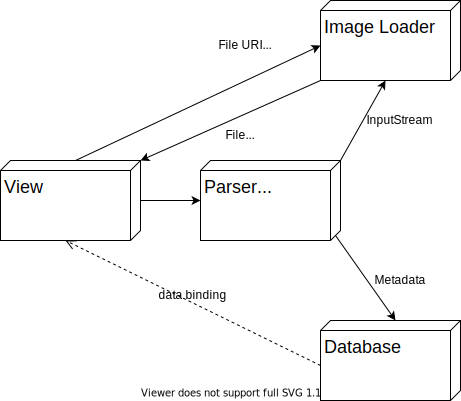

Hình 1: Kiến trúc tổng quan của yacv

Ở Chương 2, trong phần về MVVM, yacv được giới thiệu là có sử dụng kiến trúc
này. Tuy nhiên, MVVM chỉ là một phần nhỏ của ứng dụng, chủ yếu liên quan đến
việc hiển thị dữ liệu nên chỉ có ý nghĩa khi xét đến các thành phần trong module
**View**.

yacv chỉ thiết kế cho *một người dùng*, do đó có rất ít tương tác, dẫn đến kiến
trúc tối giản và rời rạc như trên. Các tiểu mục sau sẽ đi sâu vào các module
này.

### 4.1. Module Database <a name="P4.2-db-module"></a>

Thông thường mục này được tách riêng ra, xếp vào mục *Thiết kế cơ sở dữ liệu*,
ngang hàng với mục Thiết kế hướng đối tượng. Tuy nhiên, yacv còn cần xử lí dữ
liệu khác quan trọng không kém là dữ liệu ảnh. Do không còn có vai trò trung
tâm, duy nhất, phần cơ sở dữ liệu chỉ được coi là một module trong thiết kế
hướng đối tượng của ứng dụng.

yacv chọn SQLite vì đây là một cơ sở dữ liệu gọn nhẹ nhúng sẵn trong Android.
SQLite sử dụng mô hình quan hệ, do đó thiết kế bảng cần đảm bảo được chuẩn hóa
(normalization).

Do không cần quản lí người dùng, cơ sở dữ liệu của yacv chỉ dùng để *lưu thông
tin metadata*, cho phép ứng dụng quét dữ liệu ít lần hơn và tìm kiếm truyện.
Theo như yêu cầu về metadata ở hai Phụ lục, và sau khi chuẩn hóa, ta có lược đồ
cơ sở dữ liệu như sau:

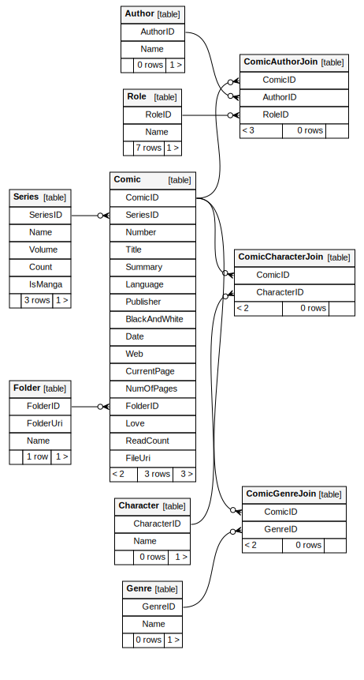
Hình 2: Lược đồ cơ sở dữ liệu của yacv

Các bảng thực thể gồm:

- `Comic`: lưu thông tin *tập truyện lẻ*, là bảng trung tâm
- `Series`: lưu thông tin *bộ truyện*
- `Author`: lưu tên tác giả
- `Role`: lưu vai trò của tác giả trong một tập truyện
- `Character`: lưu tên nhân vật
- `Genre`: lưu tên thể loại truyện

Một hạn chế quan trọng của các bảng `Character` và `Author` là chúng chỉ lưu
thông tin tên, và chỉ phân biệt với nhau bằng tên. Nếu có hai tác giả/nhân vật
trùng tên, yacv không thể phát hiện và hiển thị riêng.

Xét bảng trung tâm `Comic`. Bảng này có một số trường không phải metadata mà
dùng để lưu thông tin của riêng ứng dụng, gồm:

- `CurrentPage`: lưu trang đang đọc
- `Love`: lưu trạng thái Yêu thích
- `ReadCount`: lưu số lần đọc

Trong lược đồ, có nhiều trường nhìn qua không cần thiết nhưng thực tế có ích, do
thư viện SAF đã mô tả ở Chương 2:

- Trường `FileUri` trong `Comic`: Lưu đường dẫn của tệp truyện ở dạng URI.
- Trường `FolderUri` trong `Folder`: Lưu đường dẫn của thư mục ở dạng URI.
- Trường `Name` trong `Folder`: Tên thư mục. Thông thường nếu có đường dẫn, có
  thể tìm ra tên thư mục rất nhanh, tuy nhiên cũng do SAF mà việc này trở nên
  khó khăn, nên cần lưu riêng trường này.

Các trường URI đều cần có ràng buộc `UNIQUE`, do mỗi URI trỏ đích danh đến một
đối tượng.

Ta xem xét đến các bảng nối:

- `ComicCharacterJoin`:
    - Mỗi tập truyện có thể có nhiều nhân vật và ngược lại, do đó `Comic` và
       `Character` có quan hệ Nhiều - Nhiều.
    - Chú ý rằng các nhân vật có quan hệ với tập truyện chứ không phải bộ
      truyện, vì có nhân vật phụ (không xuất hiện trong mọi tập truyện).
- `ComicAuthorJoin`:
    - Mỗi tập truyện có thể có nhiều tác giả và ngược lại, do đó `Comic` và
      `Author` có quan hệ Nhiều - Nhiều.
    - Chú ý rằng các tác giả có quan hệ với tập truyện chứ không phải bộ truyện,
      vì mô hình xuất bản nhiều truyện tranh là nhà xuất bản sở hữu nhân vật và
      thuê người viết.
    - Đồng thời, một tác giả có thể giữ vai trò khác nhau trong các bộ truyện
      khác nhau, do đó bảng này còn nối với bảng `Role`.
- `ComicGenreJoin`: Mỗi tập truyện có thể có nhiều thể loại khác nhau và ngược
  lại, do đó `Comic` và `Genre` có quan hệ Nhiều - Nhiều.

Do dùng Room, mỗi bảng ứng với một lớp. Các truy vấn với bảng cần đóng gói dữ
liệu vào các lớp này, trước khi gửi đến hoặc nhận về từ *DAO* (Data Access
Object). Mỗi câu lệnh lại được chuyển thành một hàm trong DAO.

### 4.2. Module View <a name="P4.2-view-module></a>

Phần này tập trung vào các Màn hình, và phân tích chúng theo hướng MVVM.

Trong phần này có dùng nhiều biểu đồ tuần tự (sequence diagram) để minh họa
tương tác của ba thành phần MVVM (cùng với một số thành phần liên quan) trong
các ca sử dụng. Có một số điểm chung về các biểu đồ này:

- Trừ khi cần thiết, thành phần View sẽ được lược bỏ cho ngắn gọn.
- Đường thẳng nét đứt thể hiện tính năng data binding (tự động cập nhật View),
  và thường trỏ về ViewModel. Đáng ra, mũi tên này phải trỏ về View, nhưng do
  View bị ẩn đi, nên nó trỏ về ViewModel. Mặc dù không được đề cập đến trong
  phần giới thiệu về MVVM, đây thực ra là một chi tiết đúng về mặt kĩ thuật:
  ViewModel hoàn toàn đọc được luồng dữ liệu gửi đến View (hoặc ít nhất là đúng
  trong cách viết ứng dụng Android thông thường).

Các biểu đồ trạng thái cũng có một số chi tiết chung:

- Trừ khi nêu rõ, mọi trạng thái đều có thể là trạng thái bắt đầu (trạng thái
  khi mở ứng dụng) hoặc kết thúc (khi đóng ứng dụng).
- Mũi tên chuyển trạng thái tương ứng với *tương tác của người dùng*, do vậy
  thường được ánh xạ đến một phương thức trong View.
- Kí hiệu hình tròn đen chỉ dùng để tả trạng thái đầu *khi lần đầu dùng* yacv.

Biểu đồ lớp thường có một phương thức chung là "Get InputStream from ID". Cách
truy cập để lấy `InputStream` của ảnh từ `ComicID` có thể tham khảo từ Màn hình
Đọc truyện.

#### 4.2.1. Nguồn dữ liệu - Repository - DAO - ComicParser <a name="P4.2.1-mvvm-design">

Như đã đề cập ở Chương 2, yacv sử dụng Kiến trúc Google khuyên dùng, vốn dựa
trên MVVM. Phần này nêu rõ hơn cách triển khai MVVM của yacv trong phần nguồn dữ
liệu (Model/Repository).

Dựa vào Hình 9, ta thiết kế được 3 nguồn dữ liệu (model) sau:

|             | Thành phần tương đương | Mục đích                                                |
|:------------|:-----------------------|:--------------------------------------------------------|
| ComicParser | Remote Data Source     | Quét tệp để lấy metadata cập nhật nhất                  |
| DAO         | Model                  | Lấy metadata từ cơ sở dữ liệu để tránh quét đi quét lại |
| Repository  | Repository             | Tổng hợp hai nguồn trên                                 |

Bảng 3: Ba nguồn dữ liệu tương đương với Hình 9

Cụ thể hơn, *ComicParser* là bộ quét metadata tệp truyện (thuộc module Parser &
Scanner, sẽ được mô tả sau). Lớp này nhận vào URI rồi trả về metadata của tệp
truyện tương ứng dưới dạng đối tượng `Comic`.

Khi cần đọc dữ liệu metadata từ tệp truyện, ba thành phần này tương tác như sau:

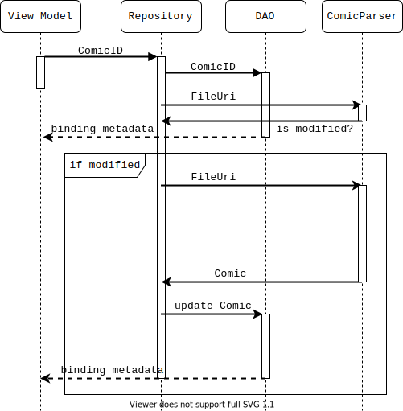

Hình 11: Tương tác của ba nguồn dữ liệu, mũi tên gạch đứt thể hiện tính năng data binding

Mấu chốt ở đây là ComicParser dù có dữ liệu chính xác (trong trường hợp một ứng
dụng khác sửa metadata tệp truyện) nhưng tốc độ rất chậm, còn cơ sở dữ liệu
không chính xác nhưng rất nhanh, do đó *cơ sở dữ liệu làm bộ đệm cho parser*.

Repository làm nhiệm vụ gọi cả hai nguồn dữ liệu trên và cập nhật cơ sở dữ liệu
(nếu cần) thay cho View/ViewModel. Hiện tại, Repository có thể không làm được
nhiều, tuy nhiên nó giúp ích cho *khả năng mở rộng* của ứng dụng. Ví dụ, trong
tương lai yacv có thể liên kết với một bên thứ ba cung cấp metadata cho truyện,
khi đó để tích hợp API thì chỉ cần sửa phần Repository.

Cũng cần chú ý rằng việc đọc metadata từ tệp tin không phải là yêu cầu của mọi
màn hình (cụ thể chỉ Màn hình Metadata cần), do đó trong đa số các ca sử dụng,
*DAO đóng vai trò Model*, thay cho Repository. Tương tác trong Hình 11 vẫn được
duy trì, tuy không có cả Repository lẫn ComicParser.

##### 4.2.2. Màn hình Quyền đọc <a name="P4.2.2-permission-design">

Do sự phức tạp trong việc xin quyền của Android, một màn hình riêng để xin quyền
đọc dữ liệu được tách ra khỏi Màn hình Thư viện, gọi là *Màn hình Quyền đọc*.
Màn hình này sẽ là *màn hình đầu tiên* hiển thị khi dùng ứng dụng.

- Nếu có quyền đọc: chuyển ngay sang Màn hình Thư viện
- Nếu không: nêu lí do cần quyền, gợi ý người dùng cấp quyền

Hình 12 mô tả trạng thái cấp quyền đọc của yacv (cũng như mọi quyền của một ứng
dụng Android cơ bản nói chung).


Hình 12: Trạng thái cấp quyền của yacv

Dựa theo Hình 12, ta có biểu đồ lớp của ViewModel và View như sau:


Hình 12: Biểu đồ lớp của Màn hình Quyền đọc

##### 4.2.3. Màn hình Thư viện <a name="P4.2.3-library-design">

Như đã phân tích ở [mục 3.3.2](#P3.3.2-show-library), Màn hình Thư viện cần hiển
thị cả lỗi và gợi ý, bên cạnh việc hiển thị danh sách thư mục và chọn thư mục
gốc. Do đó, phần này chia ra làm hai phần con tương ứng.

###### 4.2.3.1. Chọn thư mục gốc và hiển thị danh sách thư mục

Để chọn thư mục gốc, người dùng ấn nút Đổi thư mục gốc để kích hoạt hộp thoại
Chọn thư mục (picker), rồi chọn một thư mục trong đó. Luồng chạy của yacv như
sau (trường hợp ngoại lệ sẽ được nêu trong phần kế tiếp):

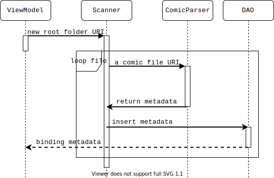

Hình 13: Quét tệp truyện khi thay đổi thư mục gốc và hiển thị

*Scanner* là đối tượng để quét dữ liệu. Scanner nhận vào URI của thư mục gốc,
rồi lặp qua từng tệp con, cháu,... Nếu đó là tệp truyện, nó gọi Parser để lấy
metadata, rồi lưu vào cơ sở dữ liệu qua DAO.

Quá trình quét tệp này giống như duyệt cây, do đó có hai cách cơ bản:

- Duyệt theo độ sâu (depth-first search, gọi tắt là DFS)
- Duyệt theo độ rộng (breadth-first search, gọi tắt là BFS)

Trong trường hợp cụ thể này, DFS được chọn. Lý do cho lựa chọn này là DFS có thể
phát hiện *thư mục* nhanh hơn nhiều so với BFS. Mỗi khi gặp thư mục, DFS xử lí
(đi xuống các thư mục con) ngay, thay vì thêm vào hàng đợi. Do phát hiện được
thư mục nhanh hơn BFS, Màn hình Thư viện, vốn hiển thị danh sách các *thư mục*,
cũng hiển thị sớm hơn. Dù thời gian quét tổng thể không thay đổi, người dùng
được thấy thư mục sớm hơn giúp tạo cảm giác ứng dụng khá nhanh.

###### 4.2.3.2. Ngoại lệ trong Màn hình Thư viện

Ngoại lệ ở đây chỉ cả trường hợp không tìm thấy thư mục, lẫn trường hợp không
quét được thư mục vì các lí do đã nêu trong [mục 3.1](#P3.3.1-scan). Khi này,
ứng dụng hiển thị một hàng chữ để gợi ý về việc nên làm.

Hình sau là biểu đồ trạng thái, cũng là mô tả về nội dung gợi ý. Riêng trạng
thái "Có truyện" là trạng thái hiển thị danh sách thư mục trong luồng cơ bản đã
nêu trên, tức thư mục được hiển thị đầy đủ thay vì chỉ hiện thông báo lỗi.


Hình 14: Trạng thái của Màn hình Thư viện

Tổng hợp lại, ta có biểu đồ lớp của Màn hình Thư viện như sau:

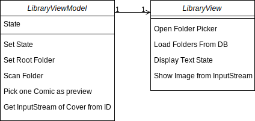

Hình 15: Biểu đồ lớp của Màn hình Thư viện

Nhắc lại, cách truy cập để lấy `InputStream` của ảnh từ `ComicID` có thể tham
khảo từ Màn hình Đọc truyện.

##### 4.2.4. Màn hình Thư mục <a name="P4.2.4-folder-design">

Trong khi phân tích yêu cầu, ta đã phân tích được rằng màn hình hiển thị danh
sách truyện - một phần trong ca sử dụng tìm kiếm - phải có giao diện giống Màn
hình Thư mục, vì đều hiển thị danh sách truyện. Do đó, hai màn hình này được gộp
lại, gọi chung là *Màn hình Danh sách truyện*, và sẽ được mô tả sau.

##### 4.2.5. Màn hình Đọc truyện <a name="P4.2.5-reader-design">

Để hiển thị các trang truyện, Màn hình Đọc truyện cần nhận `ComicID` (hoặc một
đối tượng `Comic` hoàn chỉnh, tuy nhiên cốt yếu vẫn là thông tin `ComicID`) của
một tệp truyện, sau đó đưa cho `ComicParser` để lấy luồng đọc cho từng trang
truyện. Biểu đồ luồng của màn hình này là như sau:

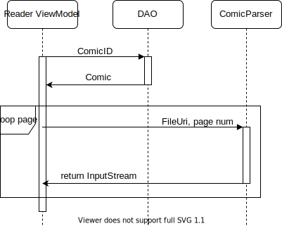

Hình 16: Biểu đồ tuần tự của Màn hình Đọc truyện

Ta cũng có biểu đồ lớp tương ứng:

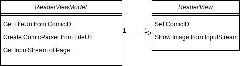

Hình 17: Biểu đồ lớp của Màn hình Đọc truyện

##### 4.2.6. Màn hình Metadata

Màn hình Metadata tuân theo biểu đồ tuần tự đã nêu ở Hình 11. Biểu đồ lớp tương
ứng của màn hình này như sau:

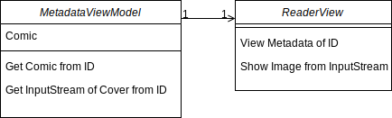

Hình 18: Biểu đồ lớp của Màn hình Metadata

##### 4.2.7. Màn hình Tìm kiếm

Màn hình Tìm kiếm là hai trong ba màn hình của ca sử dụng tìm kiếm truyện, bên
cạnh Màn hình Danh sách truyện (là tổng quát hóa của Màn hình Thư mục, đã nhắc ở
trên). Màn hình Danh sách truyện sẽ được thiết kế ở ngay mục sau, còn mục này
tập trung vào Màn hình Tìm kiếm.

Không khó để thấy thực ra Màn hình Tìm kiếm Tổng quan và Màn hình Tìm kiếm Chi
tiết thực ra là một màn hình, về mặt thị giác:

- Điểm giống:

    - Cả hai cùng hiển thị danh sách.
    - Các phần tử cùng loại trong hai màn hình có cách hiển thị giống nhau,
      chuyển đến các màn hình giống nhau.

- Điểm khác: Danh sách trong Màn hình Tìm kiếm Tổng quan có *thêm*:

    - Hiển thị bìa với một số kết quả
    - Có thanh ngăn cách
    - Có nút "Xem thêm"

Do vậy, nếu thiết kế phù hợp, hoàn toàn có thể gộp hai màn hình này. Tôi quyết
định gộp lại, và gọi chung là Màn hình Tìm kiếm. Thiết kế sau giúp thỏa mãn việc
gộp hai màn hình:

- Màn hình nhận vào một tham số chứa *câu truy vấn*. Tham số này thuộc một trong
  hai kiểu:

    - `QuerySingleType`: chứa câu truy vấn và *một* bảng để tìm kiếm
    - `QueryMultipleTypes`: chứa câu truy vấn và một *danh sách* bảng để tìm
      kiếm

    "Bảng để tìm kiếm" thực ra là một số quy định trước, ví dụ nếu là số `0` thì
    bảng được tìm là `Comic`,...

- ViewModel tìm kiếm dựa vào tham số truy vấn

    - Nếu tham số là `QuerySingleType`: truy vấn và hiển thị kết quả như thông
      thường
    - Nếu tham số là `QueryMultipleTypes`: truy vấn các bảng, gộp kết quả lại và
      thêm kiểu kết quả đặc biệt là *Placeholder* và *SeeMore* vào vị trí phù
      hợp để hiển thị lần lượt nhóm kết quả và nút "Xem thêm"

- Các kết quả, bao gồm hai dạng kết quả đặc biệt ở trên, cài đặt chung giao diện
  `Metadata`, để có thể được gộp thành một danh sách

Nói ngắn gọn, hai màn hình cùng hiển thị một danh sách, danh sách này có một số
phần tử đánh dấu đặc biệt. Ta dùng lại ví dụ về truy vấn `Watchmen` ở Chương 3
để minh họa:

- Truy vấn `QueryMultipleTypes` được gửi đến Màn hình Tìm kiếm. Câu truy vấn là
  `Watchmen`, các bảng cần tìm là mọi bảng.
- ViewModel tìm `Watchmen` trong mọi bảng, tìm được:

    - 3 tệp truyện trong bảng `Comic`
    - 2 bộ truyện trong bảng `Series`

- Màn hình hiển thị:

    1. Dòng `Truyện`, rồi 3 tệp truyện (cùng với ảnh bìa)
    2. Dòng `Bộ truyện`, 1 bộ truyện, rồi dòng `Xem thêm`

- Khi ấn vào:

    - Một trong ba tệp truyện: Đưa đến Màn hình Đọc truyện tương ứng.
    - Một bộ truyện: Chuyển đến Màn hình Danh sách truyện, chứa các truyện trong
      bộ đó.
    - Nút `Xem thêm`: Chuyển đến Màn hình Tìm kiếm, lần này tham số là một
      `QuerySingleType`, với câu truy vấn là `Watchmen`, còn bảng để tìm là
      `Series`. Hai bộ truyện kết quả được hiển thị đầy đủ. Chọn một bộ truyện
      lúc này giống với chọn bộ truyện ở trên (sang Màn hình Danh sách truyện).

Biểu đồ lớp của các đối tượng liên quan như sau:

| Hình 19a: Biểu đồ lớp `Query`          | Hình 19b: Biểu đồ lớp `Metadata`             |
|:---------------------------------------|:---------------------------------------------|
| 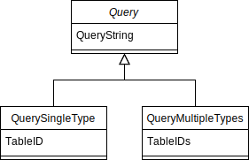 | 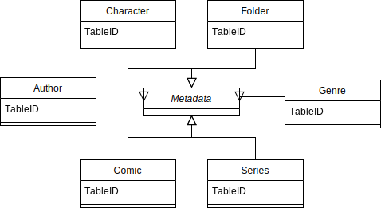 |

Hình 19: Biểu đồ các lớp liên quan đến Màn hình Tìm kiếm

Biểu đồ lớp của bản thân Màn hình Tìm kiếm như sau:

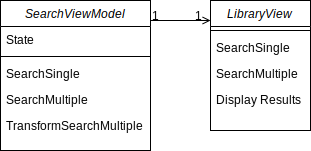

Hình 20: Biểu đồ lớp của Màn hình Tìm kiếm

Do mỗi DAO trả kết quả của bảng tương ứng về ở dạng danh sách, nên khi dùng
`QueryMultipleTypes`, các danh sách kết quả lẻ này tổng hợp, và thêm hai kiểu
kết quả đặc biệt. Hàm `TransformSearchMultiple()` là để "làm phẳng" mảng kết quả
hai chiều như trên.

##### 4.2.8. Màn hình Danh sách truyện

Màn hình này là màn hình thứ ba trong chuỗi các màn hình liên quan đến ca sử
dụng tìm kiếm, đồng thời đóng vai trò của Màn hình Thư mục (do là phiên bản tổng
quát hơn của nó).

Màn hình này nhận vào một tham số kiểu `Metadata` thay vì một `Query`, và trả về
danh sách các *tệp truyện* - `Comic` - có liên kết với tham số đầu vào.

Biểu đồ lớp của Màn hình Danh sách truyện như sau:

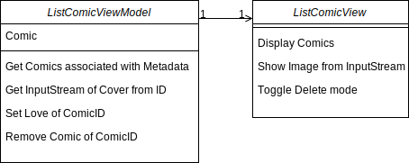

Hình 21: Biểu đồ lớp của Màn hình Danh sách truyện

#### 4.3. Module Parser & Scanner

##### 4.3.1. `ComicParser`

`ComicParser` là một trong các thành phần trung tâm của yacv. Lớp này nhận vào
URI trỏ đến một tệp truyện, và đọc nội dung tệp truyện đó ra. Cần gọi đủ tên là
`ComicParser`, vì phải phân biệt với hai parser (bộ đọc/giải mã) khác nhưng tích
hợp trong nó:

|         | Parser cho tệp nén | Parser cho metadata |
|:--------|:-------------------|:--------------------|
| Đầu vào | Tệp nén            | Tệp metadata        |
| Đầu ra  | Các tệp con hoặc tương đương (ví dụ như luồng đọc đến tệp con) | Đối tượng `Comic` |

Bảng 4: Hai kiểu parser trong `ComicParser`

`ComicParser` được thiết kế theo kiểu "lười", có nghĩa là không có thông tin nào
được đọc ra cho đến khi thực sự cần. Lý do vẫn là vấn đề về hiệu năng, vì gần
như mọi thao tác đọc trong SAF - hệ thống đọc ghi tệp của Android - đều rất
chậm.

###### 4.3.1.1. Parser cho tệp nén

Parser cho tệp nén hiện gồm một giao diện và hai lớp

- `ArchiveParser`: giao diện chung cho mọi parser tệp nén
- `CBZParser`: parser riêng cho tệp CBZ
- `ArchiveParserFactory`: giúp khởi tạo các parser

`ArchiveParser` là một giao diện (interface), định nghĩa một số phương thức
chung mọi parser cho tệp nén đều phải có. Do hiện tại yacv mới hỗ trợ định dạng
CBZ, chỉ có lớp `CBZParser` cài đặt giao diện này.

Trong `ArchiveParser`, có hai phương thức quan trọng:

- `getEntryOffsets()`: Phương thức này trả về một từ điển như sau:

    - Khóa: tên tệp lẻ
    - Giá trị: offset tệp lẻ, tức vị trí tệp lẻ trong tệp nén

- `readEntryAtOffset()`: Phương thức này nhận vào một offset, và trả về luồng
  đọc tương ứng với tệp lẻ ở offset đó bằng cách "nhảy cóc" đến đúng chỗ và đọc.

`ArchiveParserFactory` là một lớp theo mẫu thiết kế factory, nhận vào URI của
tệp truyện và trả về `ArchiveParser` để đọc loại tệp truyện đó (ví dụ, nếu URI
có đuôi CBZ thì trả về một đối tượng `CBZParser`). Do `ArchiveParser` cần một số
cài đặt khởi tạo riêng, nên mới cần một lớp riêng để tạo parser. Chữ "Factory"
thể hiện lớp này sử dụng mẫu thiết kế factory.

###### 4.3.1.2. Parser cho metadata

yacv hiện hỗ trợ định dạng ComicRack, được giới thiệu chi tiết trong Phụ lục 2.
Định dạng này là một tệp tin XML, do đó được đọc đơn giản bằng các thư viện XML
sẵn có.

Để mở rộng định dạng tệp đọc, có thể dùng mẫu thiết kế factory như đã dùng với
parser cho tệp. Theo cách này, các parser cần có hàm `parse()` trả về một đối
tượng `Comic` và nhận hai tham số:

- Nội dung tệp metadata: ở dạng chuỗi thông thường
- Tên tệp metadata: tên tệp giúp phân biệt các định dạng tệp với nhau

##### 4.3.2. `CBZParser`

`CBZParser` là lớp cài đặt giao diện `ArchiveParser`. Như đã phân tích ở Chương
2, hệ thống đọc ghi tệp SAF của Android chỉ cho phép đọc ghi tuần tự. Việc tạo
ra mảng offset không đơn giản, do phần mục lục của tệp ZIP nằm ở cuối, và có
nhiều thao tác cần dò ngược từ cuối lên.

Để giải quyết vấn đề danh sách offset, có hai cách đơn giản nhất:

- Chép toàn bộ tệp truyện vào phần bộ nhớ riêng của ứng dụng

    - Ưu: Phần bộ nhớ này vẫn được dùng API File của Java, do đó có thể đọc ghi
      ngẫu nhiên, cho phép đọc mục lục rất nhanh.

    - Nhược: Tệp truyện rất nặng (vài chục đến vài trăm MB) dẫn đến tốn cả dung
      lượng đĩa lẫn băng thông đọc/ghi. Ghi xóa liên tục cũng có hại cho bộ nhớ
      thể rắn của điện thoại.

- Đọc tệp ZIP ở chế độ đọc tuần tự

    - Ưu: Dùng ngay được với cơ chế đọc qua `InputStream` của SAF
    - Nhược: Do không có mục lục, dữ liệu phải được "dò" từ từ để đọc từng tệp
      lẻ một. Hậu quả là phương pháp này vừa tốn băng thông đọc, vừa tốn CPU để
      giải nén những tệp không cần thiết.

`CBZParse` giải quyết vấn đề này bằng cách làm giả một luồng đọc ngẫu nhiên,
được miêu tả rõ hơn trong Phụ lục 3. Cách làm đó có thể được tóm tắt như sau:

- Hai phần đầu tệp nén được lưu đệm trong RAM, do là hai phần có nhiều truy cập
  nhất trong khi đọc mục lục
- Các phần còn lại được đọc xuôi khi cần theo luồng nhập `InputStream`, nếu đọc
  ngược sẽ phải tạo mới luồng nhập

Kết quả là mục lục đọc được mà chỉ cần:

- Trung bình hai lần đọc tuần tự theo `InputStream`
- Không phải ghi ra đĩa
- Không phải giải nén những tệp không cần thiết

##### 4.3.3. Tổng hợp lại `ComicParser`

Tương tác trong một ca sử dụng hiển thị của `ComicParser` được mô tả như sau:


Hình 22: `ComicParser` và các thành phần của nó

Ở đây cần làm rõ chi tiết về việc sắp xếp tệp theo tên. Không có quy chuẩn cho
tên trang truyện, tuy nhiên đa số các tệp truyện đặt tên theo định dạng sau:

```text
X-Men Vol 40 1.jpg
|     |      |
|     |      Trang truyện số
|     Số Volume, Number,...
Tên tệp truyện
```

Vấn đề với định dạng này xuất hiện khi truyện có nhiều hơn 10 trang. Khi sắp
xếp tệp ảnh theo ABC, các trang sẽ có thứ tự như sau:

```text
X-Men Vol 40 1.jpg
X-Men Vol 40 10.jpg
X-Men Vol 40 11.jpg
...
X-Men Vol 40 19.jpg
X-Men Vol 40 2.jpg
...
```

Ta thấy ngay rằng thứ tự tệp ảnh bị đảo lộn. Để giải quyết vấn đề này, cần viết
hàm so sánh riêng cho tên tệp ảnh. Ý tưởng ở đây là gom những kí tự số liên tiếp
với nhau thành một "kí tự" rồi mới so sánh. Đoạn mã giả sau trình bày thuật toán:

```text
def compare(str1, str2):
    arrs = []

    for str in [str1, str2]:
        arrtmp = []
        acc = []

        for char in str:
            if is_number(char):
                acc.append(char)
            else:
                if len(acc) != 0:
                    acc = ''.join(acc)
                    acc = to_num(acc)
                    arrtmp.append(acc)
                    acc = 0
                arrtmp.append(to_codepoint(char))

    return compare_left_to_right(arrs[0], arrs[1])
```

#### 4.4. Module Image Loader

Module Image Loader chịu trách nhiệm trích xuất và lưu đệm (cache) tệp ảnh.
Module này gồm hai phần như sau:

##### 4.4.1. Image Extractor

Đây thực chất là một lớp đóng gói quanh `ComicParser`. Bản thân chức năng trích
xuất được thực hiện trong `ComicParser` (qua các đối tượng `ArchiveParser`), tuy
nhiên Image Extractor thực hiện một số tối ưu giúp việc hiển thị ảnh nhanh chóng
hơn.

Ở các mục trước, ta đã tệp lẻ trang truyện không được lưu theo thứ tự đọc. Do
đó, cần mục lục tệp nén để có thể nhảy cóc đến trang truyện theo yêu cầu. Tuy
nhiên, việc tải ảnh còn có thể tối ưu hơn nữa. Ta xét ví dụ sau:

| Thứ tự trong tệp nén | Tên tệp ảnh | Dung lượng |
|:---------------------|:------------|:-----------|
| 1                    | `7.jpg`     | 100KB      |
| 2                    | `6.jpg`     | 100KB      |
| 3                    | `8.jpg`     | 100KB      |
| 4                    | `1.jpg`     | 100KB      |
| 5                    | `3.jpg`     | 100KB      |
| 6                    | `4.jpg`     | 100KB      |
| 7                    | `2.jpg`     | 100KB      |
| 8                    | `5.jpg`     | 100KB      |

Bảng 3: Danh sách các tệp ảnh trong một tệp truyện nén

Hiển nhiên, thứ tự ảnh cần xem là từ tệp `1.jpg` đến tệp `8.jpg`. Ta xem xét và
cải tiến các chiến lược tải ảnh qua các tiểu mục tiếp theo.

###### 4.4.1.1. Tải theo yêu cầu

Ảnh được tải theo đúng yêu cầu ngay lúc đó. Quá trình đọc tệp tin như sau:

- Đọc `1.jpg`: 100KB (bản thân ảnh) + 300KB (do trước khi đọc được `1.jpg` cần
  đi qua 3 ảnh `7.jpg`, `6.jpg`, `8.jpg`)
- Đọc `2.jpg`: 100KB + 600KB
- ...

Vậy để đọc hết truyện, cần đọc 4500KB. Chưa hết, luồng đọc phải được tạo mới mỗi
lần đọc (tức bằng số trang truyện), gây ra nhiều overhead. Lý do là bản thân SAF
là một Content Provider, do đó nó nằm ở một tiến trình (process) riêng, và cần
cơ chế liên lạc xuyên tiến trình (IPC) - vốn đắt đỏ về mặt tính toán trên mọi hệ
điều hành - để gọi.

Nguyên nhân của cả hai điểm yếu trên là việc không sử dụng lại luồng đọc (mỗi
luồng chỉ đọc một ảnh). Phương án tiếp theo cần xử lí được điểm yếu này.

###### 4.4.1.2. Tối thiểu hóa số luồng đọc

Để giảm số luồng đọc, ta cần kiểm soát một vài luồng đọc, và phân mỗi trang
truyện cho một luồng đọc cụ thể. Để tối thiểu hóa số luồng đọc, ta cần dùng thêm
thuật toán *chuỗi con tăng dài nhất* (longest increasing subsequence). Thuật
toán cuối cùng thể hiện bằng mã giả như sau:

```text
def minStream(pages):
    stream_count = 0
    map_idx_to_stream = []    # Từ điển ánh xạ số trang - số luồng

    while len(pages) != 0:
        # Dây trang tiến lên
        lis = longest_increasing_subsequence(pages)

        for page in lis:
            pages.remove_at(page)    # Bỏ trang trong dây khỏi danh sách
            map_idx_to_stream[page] = stream_count    # Gán số luồng hiện tại

        stream_count += 1

    return map_idx_to_stream
```

Thuật toán nhận vào một mảng `pages` là *thứ tự trong tệp nén* của từng trang
truyện. Thuật toán trả về một từ điển như sau:

- Khóa: trang truyện số (bắt đầu từ trang 1)
- Giá trị: số luồng

Ta nhận thấy thuật toán hiển nhiên cho (xấp xỉ) số luồng ít nhất có thể, vì mỗi
lần chia trang cho các luồng, ta chọn một bộ trang tăng dần dài nhất lúc đó.

Áp dụng vào ví dụ đang dùng, ta có:

- Luồng 0: đọc trang 1, 3, 4, 5
- Luồng 1: đọc trang 7, 8
- Luồng 2: đọc trang 6
- Luồng 3: đọc trang 2

Vậy để đọc hết truyện, cần đọc 2000KB, và 4 lần tạo mới luồng đọc, khá tốt so
với phương pháp đầu. Tới đây chỉ cần một số chỉnh sửa nhỏ:

- Giới hạn số luồng đọc: Trường hợp xấu nhất là thứ tự trong tệp ZIP ngược với
  thứ tự đọc, do đó có nhiều luồng mà mỗi luồng chỉ phục vụ một trang truyện.
  yacv tránh điều này bằng cách giới hạn chỉ có 4 luồng đọc cùng lúc. Những
  trang không ở trong phạm vi của các luồng này quay về cách đọc nhảy cóc thông
  thường, không dùng lại luồng đọc chờ sẵn.

##### 4.4.2. Image Cache

Bản thân Image Cache *không* phải là một đoạn mã, đối tượng, mà chỉ là một thư
mục. Thư viện hiển thị ảnh sẽ tự động nhận luồng đọc ảnh, ghi vào thư mục cache,
và xóa ảnh để giải phóng dung lượng.

yacv có 2 loại/thư mục cache, cho hai trường hợp hiển thị:

- Cache ảnh bìa
- Cache trang truyện

Lý do cần đến hai bộ cache khác nhau là vì dung lượng lớn của truyện. Các thư
viện cache ảnh chọn mốc 100-200MB cho thư mục cache ảnh, đồng thời dùng cố định
phương pháp thay thế LRU (nếu cache đầy sẽ xóa ảnh lâu nhất không được dùng).
Khi đọc một bộ truyện dung lượng lớn hơn mốc này, toàn bộ ảnh trong cache sẽ sớm
bị thay thế bởi ảnh của trang truyện. Sau khi đọc, quay về các màn hình, ảnh bìa
dùng để hiển thị trong hai màn hình duyệt truyện bị mất, gây suy giảm trải
nghiệm người dùng. Do đó, cần phải tách hai thư mục cache này ra để tránh ảnh
hưởng đến cache trang bìa.

###### 4.4.2.1. Cache trang truyện

Cache trang truyện có liên quan chặt chẽ đến Image Extractor. Khi đọc một trang
truyện, 3 trang kế và 1 trang trước được đảm bảo nằm sẵn trong cache.

yacv chọn mốc 200MB để cache trang truyện. Android có thể xóa thư mục cache này
khi nào cần thêm dung lượng bộ nhớ.

###### 4.4.2.2. Cache trang bìa

Khác với cache trang truyện, cache trang bìa *không* có liên quan tới Image
Loader. Thực ra ảnh bìa thì cũng được trích xuất bởi `ComicParser`, tuy nhiên
với mỗi tệp truyện chỉ cần trích ra một ảnh bìa, do đó không cần cơ chế tái sử
dụng luồng đọc phức tạp của Image Loader.

Cache trang bìa lại gồm 2 thư mục cache:

1. Cache ảnh hiển thị thực tế

    Cache ảnh được hiển thị bởi `ImageView`. Ảnh này là ảnh bìa đã được cắt (xem
    phần thiết kế màn hình duyệt truyện) và được thu phóng về chính xác kích cỡ
    khung nhìn. Dung lượng cache là 100MB.

2. Cache ảnh bìa thu nhỏ

    Cache ảnh bìa thu nhỏ, khoảng 50KB mỗi ảnh, chưa bị cắt. Dung lượng cache là
    10MB.

Lí do riêng phần bìa cần hai thư mục cache là vì cache ảnh hiển thị thực tế,
giống với cache trang truyện, có thể bị xóa bất cứ lúc nào. Do đó cần có một
cache rất nhỏ gọn, nằm ở thư mục riêng mà Android không xóa được, chứa ảnh bìa
chất lượng thấp, để khi ảnh bìa bị xóa vẫn có một bản bìa nhỏ để hiển thị trong
khi chờ ảnh bìa chất lượng cao, có cắt cúp phù hợp được sinh lại.

## 5. Chương 5: Lập trình & Kiểm thử <a name="P5-implementation"></a>

### 5.1. Lập trình <a name="P5.1-coding"></a>

<!-- Mô tả một số phần quan trọng trong source -->

### 5.2. Kiểm thử <a name="P5.2-testing"></a>

#### 5.2.1 Unit test. E2E test, auto + manual test <a name="P5.2.1-functional-test"></a>

#### 4.2.2 Kiểm thử phi chức năng <a name="P5.2.2-non-functional-test"></a>

<!-- Bench nhanh chậm -->

### 5.3 Đánh giá người dùng <a name="P5.3-user-reviews"></a>

<!-- Hình ảnh sản phẩm. -->

## 6. Chương 6: Kết luận <a name="P6-comclusion"></a>

<!-- 1-2 trang -->

## 7. Tài liệu tham khảo

  [1]: https://play.google.com/store/apps/details?id=com.viewer.comicscreen&hl=en&gl=US
  [2]: https://play.google.com/store/apps/details?id=com.aerilys.acr.android&hl=en&gl=US
  [3]: https://github.com/tachiyomiorg/tachiyomi
  [4]: https://github.com/tachiyomiorg/tachiyomi/issues/1745
  [5]: https://play.google.com/store/apps/details?id=br.com.kurotoshiro.leitor_manga&hl=en&gl=US
  [6]: https://material.io/
